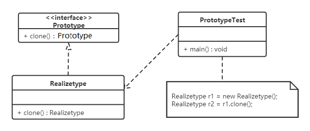

# 1.目录说明
## principles 原则
- demo1 开闭原则（皮肤） 
- demo2 里氏代换原则测试（正方形）
- demo3 依赖倒转原则（硬盘）
- demo4 接口隔离原则(最小依赖)（安全门）
- demo5 迪米特法则(最少知识原则)（明星与经纪人）

## pattern 创造者模式
singleton  单例模式 只能创建一个实例的类
- demo01    饿汉式-方式1（静态变量方式） 饿汉式：类加载就会导致该单实例对象被创建
- demo02    饿汉式-方式2（静态代码块方式）
- demo03    懒汉式-方式1（线程不安全）   懒汉式：类加载不会创建实例，而是首次使用该对象时才会创建
- demo04    懒汉式-方式2（线程安全，同步方法）  
- demo05    懒汉式-方式3 (DCL双重检查锁定)
- demo06    懒汉式-方式4（静态内部类方式）
- demo07    枚举方式(饿汉式),不会被破坏
- demo08    序列化破坏单例模式 及解决
- demo09    反射破坏单例模式 及解决
- demo10    runtime 测试

factory     工厂模式
- simple_factory    简单工厂模式，不是23种设计模式之一
- static_factory    静态工厂模式，不是23种设计模式之一
- factory_method    工厂方法模式
- abstract_factory  抽象工厂模式，产品族
- config_factory    简单工厂+配置文件方式  最常用

prototype   原型模式  克隆
- demo     原型模式demo
- test      测试demo/浅克隆
- test1     深克隆测试

build   建造者模式

## pattern2 结构型模式
proxy   代理模式
- static_proxy      静态代理
- jdk_proxy         jdk动态代理
- cglib_proxy       cglib动态代理

# 2.补充
## 软件设计原则
- 开闭原则
- 里氏代换原则
- 依赖倒转原则
- 接口隔离原则
- 迪米特法则
- 合成复用原则
- 单一职责原则

## 创建型设计模式
- 单例模式
- 工厂方法模式

- 抽象工厂模式

- 原型模式

- 建造者模式

## 结构型模式
- 代理模式
- 适配器模式
- 装饰者模式
- 桥接模式
- 外观模式
- 组合模式
- 享元模式