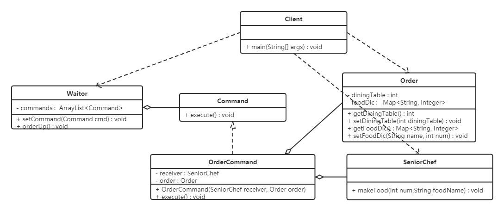

# 参考地址
https://www.bilibili.com/video/BV1Np4y1z7BU
https://blog.csdn.net/A1342772/article/details/91349142

# 1.目录说明
## principles 原则
- demo1 开闭原则（皮肤） 
- demo2 里氏代换原则测试（正方形）
- demo3 依赖倒转原则（硬盘）
- demo4 接口隔离原则(最小依赖)（安全门）
- demo5 迪米特法则(最少知识原则)（明星与经纪人）

## pattern 创造者模式
### singleton  单例模式 
只能创建一个实例的类
- demo01    饿汉式-方式1（静态变量方式） 饿汉式：类加载就会导致该单实例对象被创建
- demo02    饿汉式-方式2（静态代码块方式）
- demo03    懒汉式-方式1（线程不安全）   懒汉式：类加载不会创建实例，而是首次使用该对象时才会创建
- demo04    懒汉式-方式2（线程安全，同步方法）  
- demo05    懒汉式-方式3 (DCL双重检查锁定)
- demo06    懒汉式-方式4（静态内部类方式）
- demo07    枚举方式(饿汉式),不会被破坏
- demo08    序列化破坏单例模式 及解决
- demo09    反射破坏单例模式 及解决
- demo10    runtime 测试

### factory     工厂模式
- simple_factory    简单工厂模式，不是23种设计模式之一
- static_factory    静态工厂模式，不是23种设计模式之一
- factory_method    工厂方法模式
- abstract_factory  抽象工厂模式，产品族
- config_factory    简单工厂+配置文件方式  最常用

### prototype   原型模式  
克隆
- demo     原型模式demo
- test      测试demo/浅克隆
- test1     深克隆测试

### build   建造者模式

## pattern2 结构型模式
### proxy   代理模式
- static_proxy      静态代理
- jdk_proxy         jdk动态代理
- cglib_proxy       cglib动态代理

### adapter    适配器模式
将一种接口转换为另一种接口
- class_adapter     类适配器
- object_adapter    对象适配器

### decorator   装饰者模式
增加额外功能,包装自己,增强对象

### bridge    桥接模式

### facade    外观模式
也叫门面模式，为子系统提供统一的一致接口

### combination    组合模式
部分整体模式，针对树形结构
- 透明组合模式：抽象根节点角色中声明了所有用于管理成员对象的方法
- 安全组合模式：在抽象构件角色中没有声明任何用于管理成员对象的方法

### flyweight   享元模式
- 内部状态，即不会随着环境的改变而改变的可共享部分
- 外部状态，指随环境改变而改变的不可以共享的部分

## pattern3 行为型模式
行为型模式分为类行为模式和对象行为模式，前者采用继承机制来在类间分派行为，后者采用组合或聚合在对象间分配行为。

### template 模板方法模式
算法的整体步骤很固定，但其中个别部分易变时

### strategy 策略模式
可用来减少if else

### command 命令模式
通过命令将调用者和请求接收者解耦

### responsibility 责任链模式
- demo 责任链模式示例
- jdkfilter 模拟FilterChain职责链

### state 状态模式
对有状态的对象，把复杂的“判断逻辑”提取到不同的状态对象中，允许状态对象在其内部状态发生改变时改变其行为

### observer 观察者模式
也叫发布订阅模式

# 2.补充
## 软件设计原则
- 开闭原则
- 里氏代换原则
- 依赖倒转原则
- 接口隔离原则
- 迪米特法则
- 合成复用原则
- 单一职责原则

## 创建型设计模式
- 单例模式
- 工厂方法模式

- 抽象工厂模式

- 原型模式

- 建造者模式

## 结构型模式
- 代理模式

- 适配器模式
    - 类适配器
    
    - 对象适配器
    
- 装饰者模式

- 桥接模式

- 外观模式

- 组合模式

安全组合模式

- 享元模式

## 行为型模式
- 模板方法模式

- 策略模式

- 命令模式

- 职责链模式/责任链模式

- 状态模式

- 观察者模式

- 中介者模式
- 迭代器模式
- 访问者模式
- 备忘录模式
- 解释器模式
