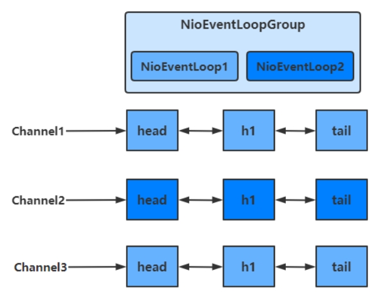
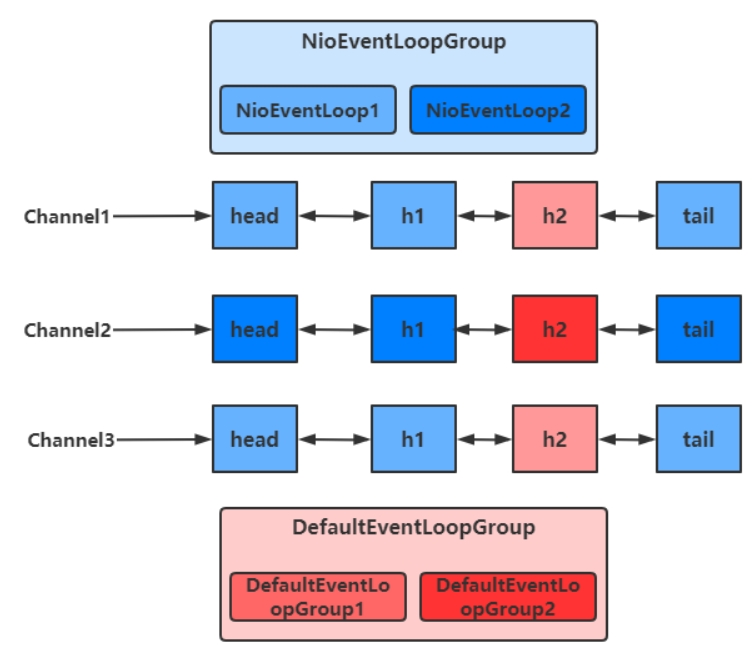

# 1.概述
Netty 是一个异步的、基于事件驱动的网络应用框架，用于快速开发可维护、高性能的网络服务器和客户端

# 2.Netty的优势
- 传统NIO工作量大，使用麻烦
- Netty 对 API 进行增强，使之更易用，如
    - FastThreadLocal => ThreadLocal
    - ByteBuf => ByteBuffer

# 3.组件
## 3.1 EventLoop
事件循环对象 EventLoop
- 本质是一个单线程执行器（同时维护了一个 Selector），里面有 run 方法处理一个或多个 Channel 上源源不断的 io 事件

事件循环组 EventLoopGroup
- 一组 EventLoop，Channel 一般会调用 EventLoopGroup 的 register 方法来绑定其中一个 EventLoop
- 后续这个 Channel 上的 io 事件都由此 EventLoop 来处理（保证了 io 事件处理时的线程安全）

绑定多个NioEventLoopGroup

绑定自定义EventLoopGroup

