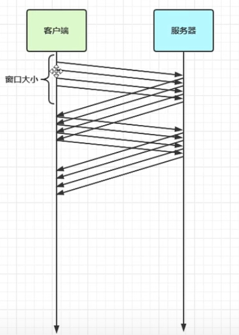
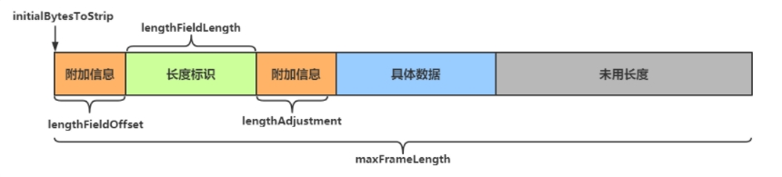

# 1.滑动窗口

- 解决TCP每次发送一个段就应答(ack)的问题
- 滑动窗口实际上是一个缓冲区，同时也能起到流量控制的作用

# 2.现象分析 test01
本质：发生粘包与半包现象的本质是因为 TCP 是流式协议，消息无边界

## 粘包
- 现象
    - 发送 abc def，接收 abcdef
- 原因
    - 应用层
        - 接收方 ByteBuf 设置太大（Netty 默认 1024）
    - 传输层-网络层
        - 滑动窗口：假设发送方 256 bytes 表示一个完整报文，但由于接收方处理不及时且窗口大小足够大（大于256 bytes），这 256 bytes 字节就会缓冲在接收方的滑动窗口中，当滑动窗口中缓冲了多个报文就会粘包
        - Nagle 算法：会造成粘包

## 半包
- 现象
    - 发送 abcdef，接收 abc def
- 原因
    - 应用层
        - 接收方 ByteBuf 小于实际发送数据量
    - 传输层-网络层
        - 滑动窗口：假设接收方的窗口只剩了 128 bytes，发送方的报文大小是 256 bytes，只能先发送一半
    - 数据链路层
        - MSS 限制：当发送的数据超过 MSS 限制后，会将数据切分发送，就会造成半包

# 3. 解决方案
## 3.1 短链接 test02
客户端每次向服务器发送数据以后，就与服务器断开连接，此时的消息边界为连接建立到连接断开
- 可以解决粘包
- 无法解决半包现象

## 3.2 定长解码器 test03
- 客户端于服务器约定一个最大长度，保证客户端每次发送的数据长度都不会大于该长度。若发送数据长度不足则需要补齐至该长度
- 服务器接收数据时，将接收到的数据按照约定的最大长度进行拆分，即使发送过程中产生了粘包，也可以通过定长解码器将数据正确地进行拆分
- 服务端需要用到FixedLengthFrameDecoder对数据进行定长解码

## 3.3 行解码器 test04
- 行解码器的是通过分隔符对数据进行拆分来解决粘包半包问题的
- `LineBasedFrameDecoder(int maxLength)`来拆分以换行符(\n)为分隔符的数据
- `DelimiterBasedFrameDecoder(int maxFrameLength, ByteBuf... delimiters)`自定义分隔符来拆分数据（可以传入多个分隔符）
- 两种解码器都需要传入数据的最大长度，若超出最大长度，会抛出TooLongFrameException异常
- 效率较低

## 3.4 长度字段解码器 test05
在传送数据时可以在数据中添加一个用于表示有用数据长度的字段

LengthFieldBasedFrameDecoder解码器参数
- maxFrameLength 数据最大长度
- lengthFieldOffset 数据长度标识的起始偏移量
    - 用于指明数据第几个字节开始是用于标识有用字节长度的，因为前面可能还有其他附加信息
- lengthFieldLength 数据长度标识所占字节数（用于指明有用数据的长度）
    - 数据中用于表示有用数据长度的标识所占的字节数
- lengthAdjustment 长度表示与有用数据的偏移量
    - 用于指明数据长度标识和有用数据之间的距离，因为两者之间还可能有附加信息
- initialBytesToStrip 数据读取起点
    - 读取起点，不读取 0 ~ initialBytesToStrip 之间的数据
    
参数图解：

