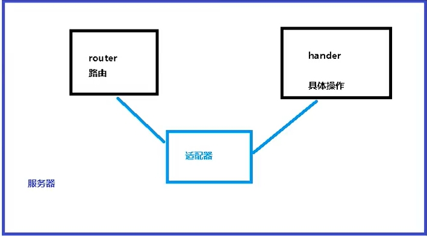

# 1.WebFlux概述
https://blog.csdn.net/weixin_45496190/article/details/107121416

Webflux 是一种异步非阻塞的框架，异步非阻塞的框架在 Servlet3.1 以后才支持，核心是基于 Reactor 的相关 API 实现的

Webflux 特点
- 非阻塞式：在有限资源下，提高系统吞吐量和伸缩性，以 Reactor 为基础实现响应式编程
- 函数式编程：Spring5 框架基于 java8，Webflux 使用 Java8 函数式编程方式实现路由请求

SpringMVC和Webflux之间区别
- 相同：两个框架都可以使用注解方式，都运行在 Tomcat 等容器中
- 不同：SpringMVC 采用命令式编程，Webflux 采用异步响应式编程

# 2.响应式编程（Reactor 实现）
TestReactor类
1. 响应式编程操作中，Reactor 是满足 Reactive 规范框架
2. Reactor 有两个核心类，Mono 和 Flux，这两个类实现接口 Publisher，提供丰富操作符
    - Flux 对象实现发布者，返回 N 个元素
    - Mono 实现发布者，返回 0 或者 1 个元素
3. Flux 和 Mono 可以发布三种信号： 元素值，错误信号，完成信号 
    - ① 错误信号和完成信号都是终止信号，不能共存的
    - ② 如果没有发送任何元素值，而是直接发送错误或者完成信号，表示是空数据流
    - ③ 如果没有错误信号，没有完成信号，表示是无限数据流
4. 调用 just 或者其他方法只是声明数据流，数据流并没有发出，只有进行订阅之后才会触发数据流，不订阅什么都不会发生
5. 操作符：对数据流进行处理
    - map 元素映射为新元素
    - flatMap 元素映射为流；把每个元素转换流，把转换之后多个流合并大的流

# 3.SpringWebflux 执行流程和核心 API
1. SpringWebflux 基于 Reactor，默认使用容器是 Netty，Netty 是高性能的 NIO 框架，异步非阻塞的框架
2. SpringWebflux 核心控制器 DispatchHandler，实现接口 WebHandler 接口
    - SpringWebflux 里面 DispatcherHandler负责请求的处理
    - HandlerMapping请求查询到处理的方法
    - HandlerAdapter真正负责请求处理
    - HandlerResultHandler响应结果处理
3. SpringWebflux 实现函数式编程，两个接口：
    - RouterFunction（路由处理）
    - HandlerFunction（处理函数）

# 4.WebFlux 注解编程模型
参考代码spring5-demo07
- 与SpringMVC使用方式类似

# 5.WebFlux 函数式编程模型
1. 在使用函数式编程模型操作时候，需要自己初始化服务器
2. 两个核心接口：
    - RouterFunction（实现路由功能，请求转发 给对应的 handler）
    - HandlerFunction（处理请求生成响应的函数）
3. SpringWebflux 请求和响应不再是 ServletRequest 和 ServletResponse
    - 而是 ServerRequest 和 ServerResponse
 

使用流程：
- 编写Handler
- 编写Router
- 创建适配器 ReactorHttpHandlerAdapter
- 创建Server
 
WebClient
- webflux提供的调用客户端