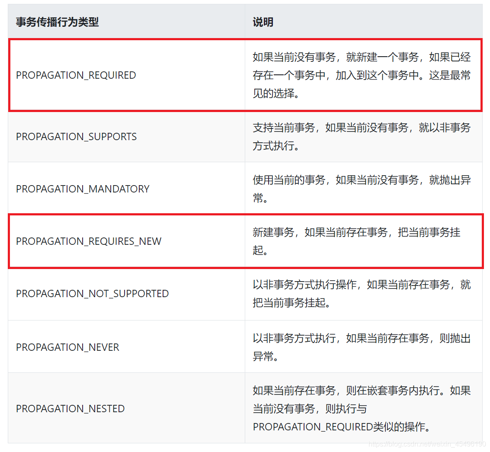

# 1.IOC
## 1.1 基础
- 把对象创建和对象之间的调用过程，交给Spring进行管理
- IOC容器实现的两种方式：
    - BeanFactory
    - ApplicationContext
- bean配置两种方式：xml配置，注解
- DI：依赖注入，有以下方式
    - set方法
    - 构造器
    - p空间
    - 属性
    
## 1.2 XML方式管理Bean
FactoryBean：参考spring5-demo01 MyBean
- Spring 有两种类型 bean，一种普通 bean，另外一种工厂 bean（FactoryBean）
- 种工厂 bean 在配置文件定义 bean 类型可以和返回类型不一样
   
bean 作用域：
- singleton 单实例，prototype 多实例
- scope 值是 singleton 时候，加载 spring 配置文件时候就会创建单实例对象
- 值是 prototype 时候，在调用 getBean 方法时候创建多实例对象

bean 生命周期：
- （1）通过构造器创建 bean 实例（无参数构造）
- （2）为 bean 的属性设置值和对其他 bean 引用（调用 set 方法）
- （3）调用 bean 的初始化的方法（需要进行配置初始化的方法）
- （4）bean 可以使用了（对象获取到了）
- （5）当容器关闭时候，调用 bean 的销毁的方法（需要进行配置销毁的方法）

Spring自动装配，不需要使用property标签
- byname按属性名称注入
- bytype按属性类型注入

## 1.2 注解方式管理Bean
创建Bean实例的四个注解：
- @Component
- @Service
- @Controller
- @Repository

相关注解：
- `@Autowired`：根据属性类型进行自动装配
- `@Qualifier`：根据名称进行注入，这个@Qualifier 注解的使用，和上面@Autowired 一起使用
- `@Resource`：可以根据类型注入，也可以根据名称注入（它属于javax包下的注解，不推荐使用！）
- `@Value`：注入普通类型属性

完全注解开发：创建配置类，替代 xml 配置文件
- `@Configuration` //作为配置类，替代 xml 配置文件
- `@ComponentScan(basePackages = {"com.kenshine.demo02"})`

# 2.AOP 面向切面编程
AOP底层原理
- AOP 底层使用动态代理，两种情况
    - 有接口情况，使用 JDK 动态代理
    - 没有接口情况，使用 CGLIB 动态代理.

AOP术语
- a）连接点：类里面哪些方法可以被增强，这些方法称为连接点
- b）切入点：实际被真正增强的方法称为切入点
- c）通知（增强）：实际增强的逻辑部分称为通知，且分为以下五种类型：
- 1）前置通知 2）后置通知 3）环绕通知 4）异常通知 5）最终通知
- d）切面：把通知应用到切入点过程

Spring 框架一般都是基于 AspectJ 实现 AOP 操作

相关注解：
- @Aspect：生成代理对象
- @Pointcut：切入点表达式
- @Before：前置通知
- @AfterReturning：后置返回
- @After：最终通知
- @AfterThrowing：异常通知
- @Around：环绕通知

# 3.事务
## 3.1 事务基础
事务是数据库操作最基本单元，逻辑上一组操作，要么都成功，如果有一个失败所有操 作都失败

事务四个特性（ACID）（Atomicity：原子性；Consistency：一致性；Isolation：隔离性；Durability：持久性）
- 原子性：要么全部成功，要么失败回滚
- 一致性：指的是事务执行操作的前后，必须保证数据的一致
- 隔离性： 隔离性是为了保证每一个用户在开启并使用事务时，不被其他事务操作所干扰
- 持久性： 比如一个事务一旦提交以后，那么对数据库表的操作改变就是永久的

Spring事务管理两种方式：编程式，声明式
- 声明式两种方式：注解方式，XML方式
- 底层原理：AOP

相关接口：platformTransactionManager
- Spring 事务管理 API ：提供一个接口，代表事务管理器，这个接口针对不同的框架提供不同的实现类

@Transactional注解属性：
- propagation：事务传播行为，多事务方法直接进行调用，这个过程中事务是如何进行管理的
    - 事务方法：会更改数据库数据的方法
- ioslation：事务隔离级别
- timeout：超时时间
    - 事务需要在一定时间内进行提交，如果不提交进行回滚 
    - 默认值是 -1（不超时）,设置时间以秒单位进行计算
- readOnly：是否只读(查询)
- rollbackFor：出现哪些异常进行回滚
- noRollbackFor：设置出现哪些异常不进行事务回滚

## 3.2 Spring事务传播7种行为示意图：

- 常用的传播行为只有三种：REQUIRED、REQUIRES_NEW和NESTED
- NESTED 播行为会沿用当前事务的隔离级别和锁等特性，而REQUIRES_NEW 则可以拥有自己独立的隔离级别和锁等特性
- 直接调用本类方法会导致传播行为失效（@Transactional 自调用失效问题）

## 3.3 事务隔离级别
https://blog.csdn.net/qq_24732379/article/details/99705815

可能会产生的问题：
- 脏读： 一个未提交事务读取到另一个事务未提交的数据
- 不可重复读： 一个未提交事务读取到另一提交事务修改数据
- 虚读(幻读)： 一个未提交事务读取到另一提交事务添加数据
    

事务隔离级别：
- 未提交读(read uncommit)：最低的隔离级别，其含义是允许一个事务读取另外一个事务没有提交的数据
    - 适合那些对数据一致性没有要求而追求高并发的场景, 会产生脏读
- 读写提交(read committed)：一个事务只能读取另外一个事务已经提交的数据
    - 可以解决脏读，读写提交会导致不可重复读
- 可重复读：可重复读的目标是克服读写提交中出现的不可重复读的现象，因为在读写提交的时候，可能出些值的变化， 影响当前事务的执行
    - 但是它会产生幻读，读取到另一事务添加的数据
    - 幻读针对多条记录，而可重复读是针对单条记录
- 串行化（Serializable）：数据库最高的隔离级别，它会要求所有的 SQL 都会按照顺序执行

# 4.Spring5新特性
- Spring 5.0 框架自带了通用的日志封装
- Spring5 框架核心容器支持@Nullable 注解
- Spring5 核心容器支持函数式风格
    - GenericApplicationContext
- 支持整合Junit5框架
- Webflux响应式编程框架

