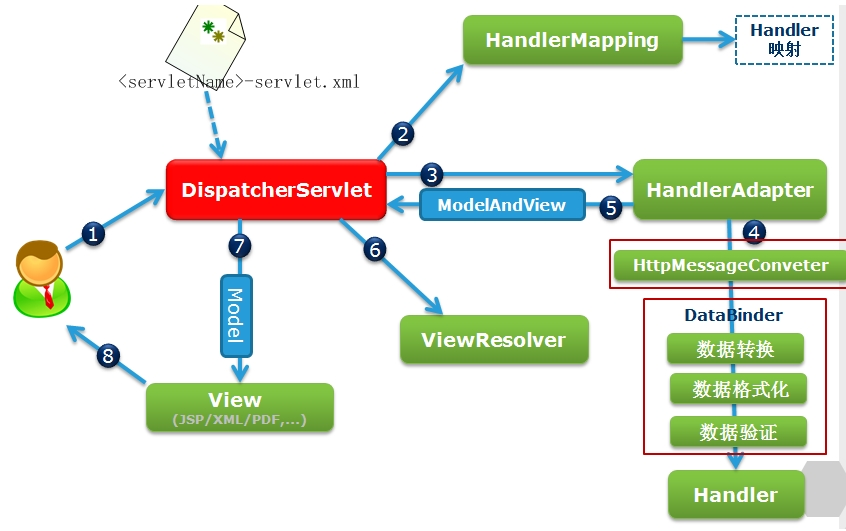

# 1.相关注解
- `@Controller`
- `@RequestMapping`
- `@PathVariable`：占位符
- `@RequestParam`
- `@RequestHeader`：从请求头中获取数据
- `@CookieValue`：从cookie中获取数据
- `@RequestBody`
- `@ResponseBody`

# 2.@RequestMapping注解属性
@RequestMapping
- `value`：请求地址，可为数组
- `method`：请求方式
- `params`：可以通过四种表达式设置请求参数和请求映射的匹配关系
- `headers`：通过请求的请求头信息匹配请求映射

# 3.过滤器
- CharacterEncodingFilter：编码过滤器

# 3.域对象共享数据相关 
springboot-demo03 ScopeController
- ServletAPI 向request域对象共享数据
- ModelAndView 向request域对象共享数据
- Model
- map
- ModelMap
- session域共享
- application域共享

# 4.视图
springboot-demo03 ViewController
- ThymeleafView：Thymeleaf的视图解析器解析的视图
- 转发视图：默认的转发视图是InternalResourceView
    - `forward:`
- 重定向视图：SpringMVC中默认的重定向视图是RedirectView
    - `redirect:`
- 视图控制器：view-controller
    - 当SpringMVC中设置任何一个view-controller时，其他控制器中的请求映射将全部失效,需要开启注解驱动解决

# 5.RESTFul
- HiddenHttpMethodFilter：将 POST 请求转换为 DELETE 或 PUT 请求
    - SpringMVC中提供了两个过滤器：CharacterEncodingFilter和HiddenHttpMethodFilter
    - 在web.xml中注册时，必须先注册CharacterEncodingFilter，再注册HiddenHttpMethodFilter
- 开放静态

# 6.HttpMessageConverter 消息转换器
- HttpMessageConverter，报文信息转换器，将请求报文转换为Java对象，或将Java对象转换为响应报文
- HttpMessageConverter提供了两个注解和两个类型：
    - @RequestBody，@ResponseBody
    - RequestEntity，ResponseEntity
- RequestEntity可以获取请求头和请求体信息

# 7.拦截器
SpringMVC中的拦截器需要实现HandlerInterceptor

# 8.异常处理器
- HandlerExceptionResolver接口
    - DefaultHandlerExceptionResolver
    - SimpleMappingExceptionResolver
- `@ControllerAdvice`：将当前类标识为异常处理的组件
- `@ExceptionHandler(ArithmeticException.class)`：用于设置所标识方法处理的异常

# 9.SpringMVC执行流程
## 9.1 SpringMVC常用组件
1. DispatcherServlet：前端控制器
    - 统一处理请求和响应，整个流程控制的中心，由它调用其它组件处理用户的请求
2. HandlerMapping：处理器映射器
    - 根据请求的url、method等信息查找Handler，即控制器方法
3. Handler：处理器，需要工程师开发
    - 在DispatcherServlet的控制下Handler对具体的用户请求进行处理
4. HandlerAdapter：处理器适配器
    - 通过HandlerAdapter对处理器（控制器方法）进行执行
5. ViewResolver：视图解析器
    - 进行视图解析，得到相应的视图
6. View：视图
    - 将模型数据通过页面展示给用户

## 9.2 DispatcherServlet初始化过程
DispatcherServlet 本质上是一个 Servlet，所以天然的遵循 Servlet 的生命周期。所以宏观上是 Servlet 生命周期来进行调度
- 初始化WebApplicationContext
- 创建WebApplicationContext
- 刷新容器，选择DispatcherServlet初始化策略，初始化DispatcherServlet的各个组件

## 9.3 DispatcherServlet调用组件处理请求
- `processRequest()`
- `doService()`
- `doDispatch()`
- `processDispatchResult()`

## 9.4 SpringMVC的执行流程

1. 用户向服务器发送请求，请求被Spring 前端控制Servelt DispatcherServlet捕获；
2. DispatcherServlet对请求URL进行解析，得到请求资源标识符（URI）。然后根据该URI，调用HandlerMapping获得该Handler配置的所有相关的对象（包括Handler对象以及Handler对象对应的拦截器），最后以HandlerExecutionChain对象的形式返回；
3. DispatcherServlet 根据获得的Handler，选择一个合适的HandlerAdapter。（附注：如果成功获得HandlerAdapter后，此时将开始执行拦截器的preHandler(...)方法）
4. 提取Request中的模型数据，填充Handler入参，开始执行Handler（Controller)。 在填充Handler的入参过程中，根据你的配置，Spring将帮你做一些额外的工作：
    - HttpMessageConveter： 将请求消息（如Json、xml等数据）转换成一个对象，将对象转换为指定的响应信息
    - 数据转换：对请求消息进行数据转换。如String转换成Integer、Double等
    - 数据根式化：对请求消息进行数据格式化。 如将字符串转换成格式化数字或格式化日期等
    - 数据验证： 验证数据的有效性（长度、格式等），验证结果存储到BindingResult或Error中
5. Handler 执行完成后，向DispatcherServlet 返回一个ModelAndView对象
6. 根据返回的ModelAndView，选择一个适合的ViewResolver（必须是已经注册到Spring容器中的 ViewResolver)返回给DispatcherServlet ；
7. ViewResolver 结合Model和View，来渲染视图
8. 将渲染结果返回给客户端。