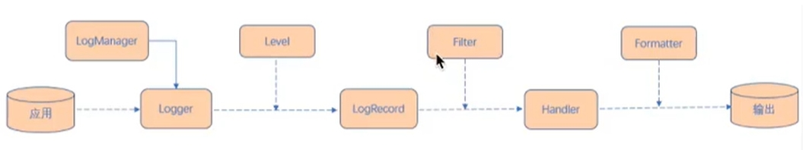

# JUL流程

原理：
- 初始化LogManager：
    - LogManager 加载 logging.propreties 配置
	- 添加 Logger 到 LogManager
- 从单例 LoggerManager获取 Logger
- 设置级别Level，并指定日志记录LogRecord
- Filter提供了日志级别之外更细粒度的控制
- Handler是用来处理日志输出位置
- Formatter时用力格式化LogRecord的

