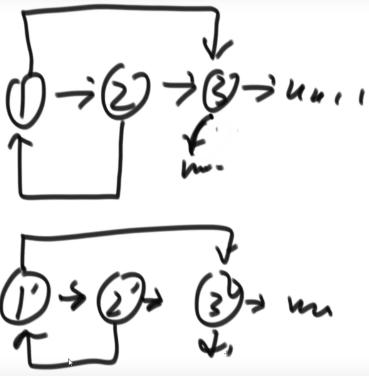
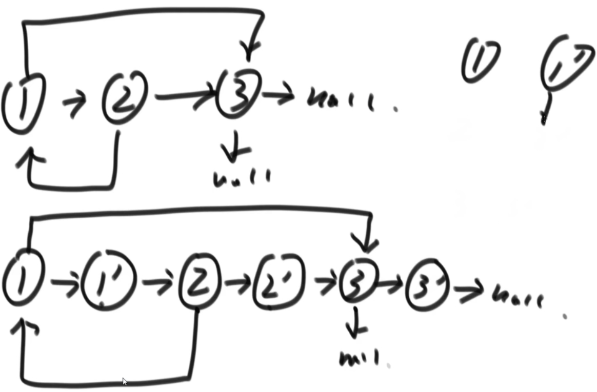

# 1.哈希表的简单介绍
1. 哈希表在使用层面上可以理解为一种集合结构
2. 如果只有key，没有伴随数据value，可以使用HashSet结构(C++中叫UnOrderedSet)
3. 如果既有key，又有伴随数据value，可以使用HashMap结构(C++中叫UnOrderedMap)
4. 有无伴随数据，是HashMap和HashSet唯一的区别，底层的实际结构是一回事
5. 使用哈希表增(put)、删(remove)、改(put)和查(get)的操作，可以认为时间复杂度为O(1)，但是常数时间比较大
6. 放入哈希表的东西，如果是基础类型，内部按值传递，内存占用就是这个东西的大小
7. 放入哈希表的东西，如果不是基础类型，内部按引用传递，内存占用是这个东西内存地址的大小

# 2.有序表的简单介绍
1. 有序表在使用层面上可以理解为一种集合结构
2. 如果只有key，没有伴随数据value，可以使用TreeSet结构(C++中叫OrderedSet)
3. 如果既有key，又有伴随数据value，可以使用TreeMap结构(C++中叫OrderedMap)
4. 有无伴随数据，是TreeSet和TreeMap唯一的区别，底层的实际结构是一回事
5. 有序表和哈希表的区别是，有序表把key按照顺序组织起来，而哈希表完全不组织
6. 红黑树、AVL树、size-balance-tree和跳表等都属于有序表结构，只是底层具体实现不同
7. 放入有序表的东西，如果是基础类型，内部按值传递，内存占用就是这个东西的大小
8. 放入有序表的东西，如果不是基础类型，必须提供比较器，内部按引用传递，内存占用是这个东西内存地址的大小
9. 不管是什么底层具体实现，只要是有序表，都有以下固定的基本功能和固定的时间复杂度
    - 1）void put(K key, V value)：将一个（key，value）记录加入到表中，或者将key的记录更新成value。
    - 2）V get(K key)：根据给定的key，查询value并返回。
    - 3）void remove(K key)：移除key的记录。
    - 4）boolean containsKey(K key)：询问是否有关于key的记录。
    - 5）K firstKey()：返回所有键值的排序结果中，最左（最小）的那个。
    - 6）K lastKey()：返回所有键值的排序结果中，最右（最大）的那个。
    - 7）K floorKey(K key)：如果表中存入过key，返回key；否则返回所有键值的排序结果中，key的前一个。
    - 8）K ceilingKey(K key)：如果表中存入过key，返回key；否则返回所有键值的排序结果中，key的后一个。

代码：Test01_HashAndTree

# 3.链表结构
单链表结构
```
Class Node<V>{
    V value;
    Node next;
}
Class Node<V>{
    V value;
    Node next;
    Node last;
}
```

题目：实现翻转单向链表和双向链表的函数 Test02_ReverseList
- 反转单向和双向链表
- 分别实现反转单向链表和反转双向链表的函数
- 如果链表长度为N，时间复杂度要求为O(N)，额外空间复杂度要求为O(1)

题目：打印两个有序链表的公共部分 Test03_PrintCommonPart
- 给定两个有序链表的头指针head1和head2，打印两个链表的公共部分
- 如果两个链表的长度之和为N，时间复杂度要求为O(N)，额外空间复杂度要求为O(1)
- 如两个链表
    - 1 2 5 ...
      ↑ 
      a
    - 0 2 3 5 ...
      ↑
      b
- 两个指针：b比a小，b右移;a比b小，a右移;ab相等，打印，同时右移

面试时链表解题方法论：
1. 笔试时，不用在乎空间复杂度，一切为了时间复杂度
2. 面试时，时间复杂度依然放在第一位，但是一定要找到最省空间的方法

重要技巧
- 额外数据结构记录（哈希表等）
- 快慢指针

题目：判断一个链表是否是回文结构  Test05_IsPalindromeList
- 回文：正着和反着念一样，或者认为存在镜像关系
- 思路1：使用栈存放所有数据，弹出一个和原来链表正向比较
- 思路2：栈中只存放一半的数据，快慢指针确定中间位置
- 思路3: f快指针，s慢指针, a为起始引用
  ``` 
    1->2->3->2->1
    ↑     ↑     ↑
    a     s     f
   将s~f位置reverse，s.next设置为null
   1->2->3<-2<-1
   ↑     ↑     ↑
   a     s     f 
   a和f比较，相同，分别向s靠拢，不同，表示不是回表
   a和b有一个走到为null的位置时
   将右边部分逆序回来，结束
  ```
  
快慢指针：不是绝对的，可以自定义快慢指针速度 Test04_SlowFastPoint
- 快指针一次走两步
- 慢指针一次走一步
    - 1 2 3 2 1 ：快指针走完，慢指针在3位置
    - 1 2 3 3 2 1: 快指针走完，慢指针在第一个3位置

题目：将单向链表按某值划分成左边小、中间相等、右边大的形式  Test06_SmallerEqualBigger
- 【要求】调整后所有小于pivot的节点之间的相对顺序和调整前一样
- 【要求】调整后所有等于pivot的节点之间的相对顺序和调整前一样
- 【要求】调整后所有大于pivot的节点之间的相对顺序和调整前一样
- 【要求】时间复杂度请达到O(N)，额外空间复杂度请达到O(1)。

题目：复制含有随机指针节点的链表 Test07_CopyListWithRandom

- 只用N1的解法：


题目：两个链表相交问题(共用节点)  Test08_FindFirstIntersectNode
- 给定两个可能有环也可能无环的单链表，头节点head1和head2。请实现一个函数，如果两个链表相交，请返回相交的 第一个节点。如果不相交，返回null
