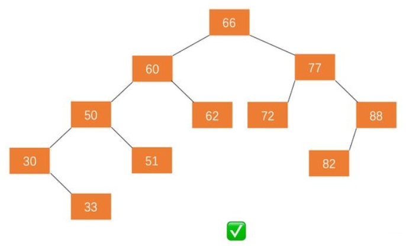

# 1. 二叉树
```
class Node<V>{
    V value;
    Node left;
    Node right;
}
```

二叉树遍历：先序，中序，后续表示头节点顺序
```
      1
     /\
    2  3
   /\  /\
  4  56  7
```
先序遍历：1 2 4 5 3 6 7
- 头节点
- 左子树所有节点
- 右子树所有节点

中序遍历：4 2 5 1 6 3 7
- 左树所有节点
- 头节点
- 右树所有节点

后序遍历：4 5 2 6 7 3 1
- 左树所有节点
- 右树所有节点
- 头节点

两种遍历方式：Test01_PreInPosTraversal
- 递归实现
- 非递归实现

打印二叉树的方法：Test02_PrintBinaryTree

二叉树宽度优先遍历：宽度遍历用队列 Test03_TreeMaxWidth中的WidthTraversal
```
      1
     / \
    2   3
   /\   /\
  n  5 6   n
    /\/\
   6 78 9
```
- 1 2 3 4 5 6 7 8 9
- 求一棵二叉树的宽度：Test03_TreeMaxWidth
- 需要知道当前在二叉树第几层
   - 思路一：使用一个map，key为节点，value为层数来记录每个节点的层数
   - 思路二：见代码Test03_TreeMaxWidth

# 2.二叉树概念及判断
二叉搜索树：左子树节点<头节点<右子树节点
```
       5
      /\
     3  7
    /\ /\
   2 46  8 
  /
 1
```
- 如何验证：中序遍历是有序的
- Test04_IsBST

完全二叉树：只有最后一层可以不满，且是从左到右连续的
```
       1
      /\
     2  3
    /\ /
   4 56  
```
宽度优先遍历：
1. 任意一个节点，有右无左，false
2. 1不违规的情况下，遇到第一个左右子节点不全的节点，后续节点都为叶节点

满二叉树：
```
       1
      /\
     2  3
    /\  /\
   4 5 6  7
```
- 节点个数：N
- 最大深度：L
- 满足关系：N=2^L-1

平衡二叉树：AVL

- 可以是空树
- 假如不是空树，任何一个结点的左子树与右子树都是平衡二叉树
    - 并且高度之差的绝对值不超过1

二叉树题目套路：可以解决一切树形DP(动态规划)问题
- 递归套路：可以向左子树和右子树要信息时，可以递归

搜索二叉树递归套路实现：
- 当前节点X，左子树max节点<x，右子树min节点>x
- 左子树和右子树都必须是搜索二叉树
- 左子树需要返回值：是否是二叉搜索树，max值
- 右子树需要返回值：是否是二叉搜索树，min值
- 左右子树统一递归返回值：是否是二叉搜索树，max值，min值

# 3.题目
题目：给定两个二叉树的节点node1和node2，找到他们的最低公共祖先节点
```
       A
      /\
     B  C
    /\  /\
   D E G  H
     | 
     F
```
- 如：D和F节点的最低公共祖先节点是B
- E和F的最低公共祖先是E
- 思路：遍历二叉树，将node及父node存在map中
    - 遍历map，将o1节点所有父节点放在set中
    - o2根据map往上找，能够找到最低公共祖先节点

题目：在二叉树中找到一个节点的后继节点

