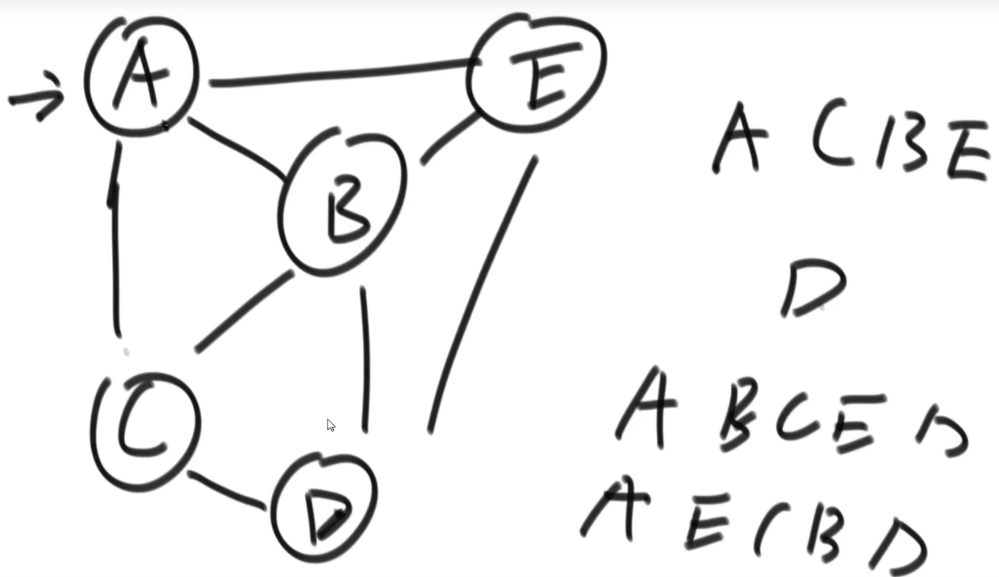
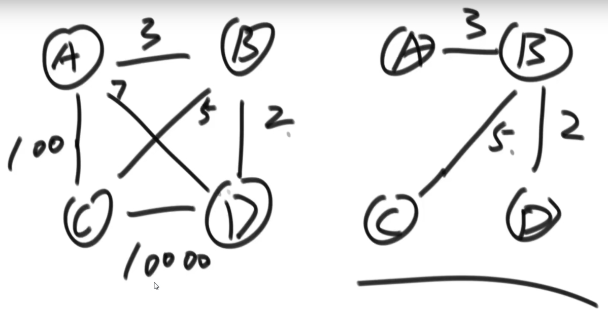
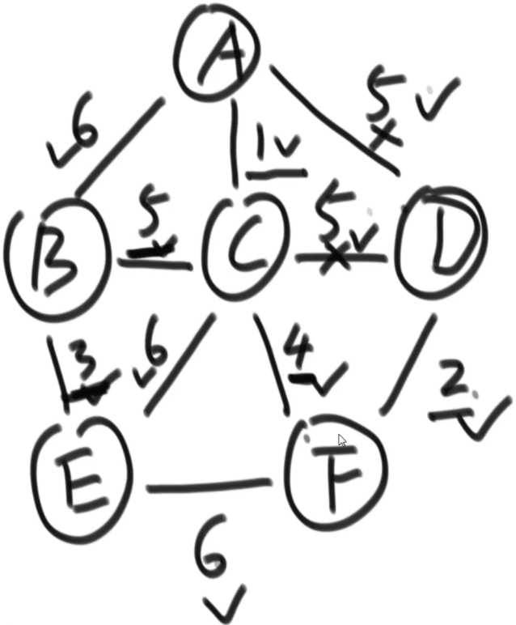
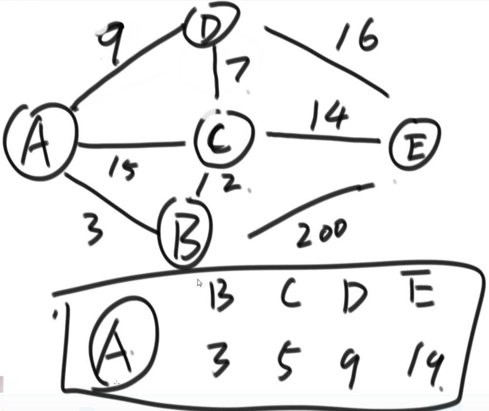

# 1.图的表示方式
邻接表法：
```
    A  B
    |\/
    |/\
    C--D
```
- A-C权值7，B~C权值2，A~D权值3，C~D权值5
- 邻接表法：以点为单位，只写直接邻居
    - A：C D
    - B：C
    - C：A B D
    - D：A C

邻接矩阵：
```
点  A  B  C  D
    0  1  2  3
A 0 0  ∞  7  3   
B 1 ∞  0  2  ∞
C 2 7  2  0  5
D 3 3  ∞  5  0
```

图的表示：Test04_Graph中的
- Edge：边
- Graph：图
- GraphGenerator：图生成
- Node：节点

# 2.题目
宽度(广度)优先遍历 BFS Test01_BFS
1. 利用队列实现
2. 从源节点开始依次按照宽度进队列，然后弹出
3. 每弹出一个点，把该节点所有没有进过队列的邻接点放入队列
4. 直到队列变空    


深度优先遍历 DFS：一条路走到死，再返回走其他路 Test02_DFS
1. 利用栈实现
2. 从源节点开始把节点按照深度放入栈，然后弹出
3. 每弹出一个点，把该节点下一个没有进过栈的邻接点放入栈
4. 直到栈变空


拓扑排序算法 Test03_TopologySort
- 适用范围：要求有向图，且有入度为0的节点，且没有环
    ```
    ↑----------→↓   
    A ——> B ——> C ——> D
          ↓----------→↑
    ```
- A的入度为0，输出A，擦掉A及A的影响
    ```
    B ——> C ——> D
    ↓----------→↑
    ```
- B的入度为0，输出B，擦掉B及B的影响
    ```
    C ——> D
    ```
- 以此类推，最终输出：A B C D


求最小生成树，要求无向图


Kruskal算法：克鲁斯卡尔算法 Test04_Kruskal Test05_Kruskal02
- 从最小边开始考虑，加上后有环则不要（唯一问题，如何知道成不成环）
- 如何判断有环：并查集结构
  
    - 每个节点分别为一个集合
    - 添加AC边，AC不处在一个集合，将AC集合合并 {AC} {B} {D} {E}
    - 添加CD边，CD不在一个集合，将CD集合合并 {ACD} {B} {E}
    - 添加AB边，AB不在一个集合，将AB所在集合合并 {ABCD} {E}
    - 添加AD边，AD在一个集合，表示有环，丢弃该边
    - 以此类推，知道所有边都处理完毕


Prim算法：随机选择一个点，放到集合中，解锁该点相连的所有边 Test06_Prim
- 集合：{A}，边1 5 6，选择最短的边对应的节点加入集合，解锁新的边
- 集合：{AC}，边5 5 5 6 6 4
- 集合：{ACF}，边5 5 5 6 6 6 2
- 集合：{ACFD}，边5 5 5 6 6 6，没有解锁新的边
- 集合：{ACFDB}，边5 5 6 6 6 3
- 集合：{ACFDBE}


Dijkstra算法：获取A到BCDE各点的最短路径 Test07_Dijkstra（扩展：A*算法）
- 默认到ABCDE距离为：0 ∞ ∞ ∞ ∞，选中点A，边AB,AC,AD,并更新相应距离
- 最短距离为：0 3 15 9 ∞，选中B，边BA,BC,BD,更新相应距离
- 最短距离为：0 3 5 9 200，选中C，边CA,CB,CD,CE,更新距离
- 最短距离：0 3 5 9 19，以此类推，选中D，选中E
- 要求，没有为负数的边


