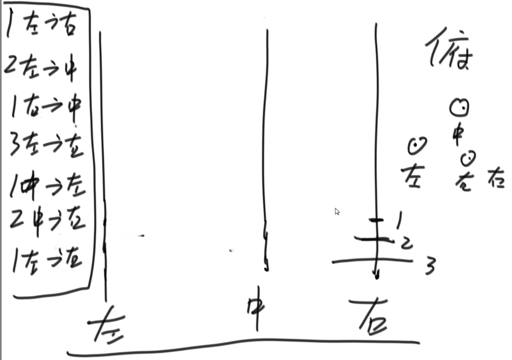

# 1.暴力递归
暴力递归就是尝试
1. 把问题转化为规模缩小了的同类问题的子问题
2. 有明确的不需要继续进行递归的条件(base case)
3. 有当得到了子问题的结果之后的决策过程
4. 不记录每一个子问题的解

# 2.题目
题目：汉诺塔问题  Test02_Hanoi

- 打印n层汉诺塔从最左边移动到最右边的全部过程，小的不能放在大的下面
- 思路：i层塔，最下面的盘为i，从左移到右
    - 第一步：将1~i-1移动到中(递归)
    - 第二步：将i移动到右
    - 第三步：将1~i-1从中移动到右(递归)

题目：打印一个字符串的全部子序列，包括空字符串 Test03_PrintAllSubsquences

- 尝试：从左往右，每个字符要和不要做决策

题目：打印一个字符串的全部排列，要求不要出现重复的排列 
- Test04_PrintAllPermutations
- 尝试：参考代码注释

题目：给定一个整型数组arr，代表数值不同的纸牌排成一条线。
- 玩家A和玩家B依次拿走每张纸牌，规定玩家A先拿，玩家B后拿，但是每个玩家每次只能拿走最左或最右的纸牌
- 玩家A和玩家B都绝顶聪明。请返回最后获胜者的分数
- Test05_CardsInLine：示例

题目：给你一个栈，请你逆序这个栈，不能申请额外的数据结构，只能使用递归函数。如何实现?
- Test06_ReverseStack

题目：规定1和A对应、2和B对应、3和C对应... 
- 那么一个数字字符串比如"111"，就可以转化为"AAA"、"KA"和"AK"
- 给定一个只有数字字符组成的字符串str，返回有多少种转化结果
- Test07_ConvertToLetterString

题目：给定两个长度都为N的数组weights和values，weights[i]和values[i]分别代表i号物品的重量和价值。
- 给定一个正数bag，表示一个载重bag的袋子，你装的物品不能超过这个重量。返回你能装下最多的价值是多少？
- Test08_Knapsack

题目：N皇后问题
- N皇后问题是指在N*N的棋盘上要摆N个皇后，要求任何两个皇后不同行、不同列，也不在同一条斜线上。
- 给定一个整数n，返回n皇后的摆法有多少种。
- Test01_NQueens

