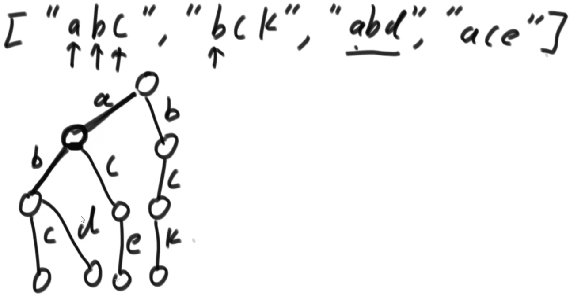
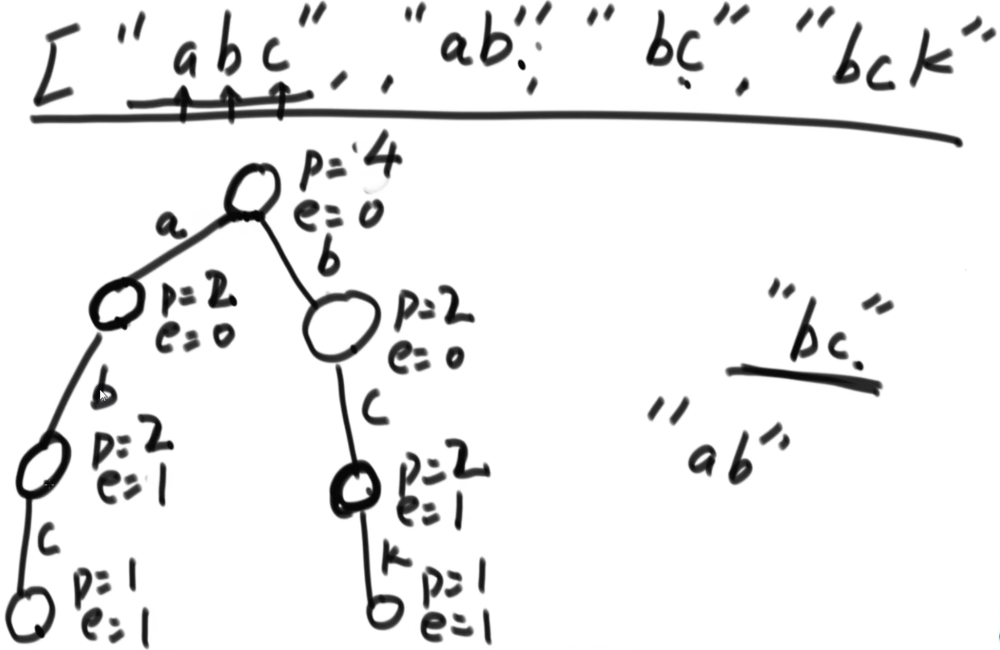

# 1.前缀树
经典前缀树（字典树）

- 从前到后依次填充，数据放在边上
- 节点上没有数据

前缀树改进：在节点上存数据 Test01_TrieTree

- E：多少节点以它结束
- P：多少节点经历过它
- nexts[]：下一个节点列表

# 2.贪心算法
概念：
- 在某一个标准下，优先考虑最满足标准的样本，最后考虑最不满足标准的样本，最终得到一个答案的算法，叫作贪心算法。
- 也就是说，不从整体最优上加以考虑，所做出的是在某种意义上的局部最优解。
- 局部最优 -?-> 整体最优

题目：一些项目要占用一个会议室宣讲，会议室不能同时容纳两个项目的宣讲。
给你每一个项目开始的时间和结束的时间(给你一个数 组，里面是一个个具体的项目)，你来安排宣讲的日程，要求会议室进行的宣讲的场次最多。
返回这个最多的宣讲场次
- Test03_BestArrange
- 以结束时间最早排序，依次放入能放入的会议

贪心算法的在笔试时的解题套路：千万不要证明贪心算法是可行的，用暴力解法测试
1. 实现一个不依靠贪心策略的解法X，可以用最暴力的尝试
2. 脑补出贪心策略A、贪心策略B、贪心策略C...
3. 用解法X和对数器，去验证每一个贪心策略，用实验的方式得知哪个贪心策略正确
4. 不要去纠结贪心策略的证明

题目：给定一个字符串类型的数组strs，找到一种拼接方式，使得把所有字符串拼起来之后形成的字符串具有最小的字典序
- Test04_LowestLexicography
- 有效比较策略：有传递性
- 无效比较策略：没有传递性

贪心策略在实现时，经常使用到的技巧：
- 根据某标准建立一个比较器来排序
- 根据某标准建立一个比较器来组成堆

题目：分金条问题 Test05_LessMoneySplitGold

题目：项目花费与利润 Test06_IPO

题目：一个数据流中，随时可以取得中位数 Test07_MadianQuick