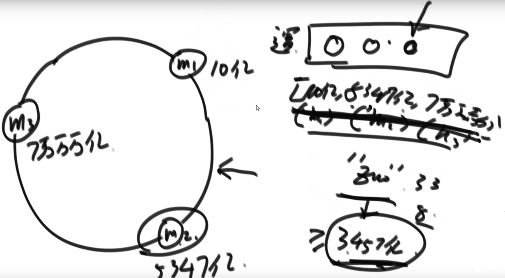

# 1.哈希函数特征
1. 输入无穷大，输出是有限的
2. 输入相同时，输出也是相同的，不是随机的
3. 哈希碰撞：输入不同时，输出也可能相同(概率极小)
4. 离散，均匀，分布是平均的

哈希函数有上百种实现，不需要掌握如何实现

输入——(f哈希函数)——>hash输出——(%m)——>最终值
- hash输出在s范围上均匀分布，则最终值在0~m-1范围上均匀分布

# 2.经典哈希表的实现  Test01_HashMap

- 没有扩容时：增删改一个数据时间复杂度，在使用阶段O(1)
- 翻倍扩容：添加N个数，扩容logN次
    - 扩容后需要重新Hash，O(N)的代价
    - 总的扩容代价O(N*logN)，单词扩容代价O(logN)

# 3.题目
题目：查找出现次数最多的数
- 无符号整数：范围0~2^32-1，这样的数有40亿个
- 仅有1G内存，返回出现次数最多的数是哪个
- 经典方法：HashMap统计，key为值，value为次数
    - key为4Byte,value为4Byte,起码需要32GB空间，内存不足
- 思路：40亿个数hash后再%100，得到的数都是0~99范围的数，作为不同的文件号
    - 每个文件大小为32GB/100(哈希分布均匀)，将数放到对应的文件中，相同的数一定进相同文件
    - 每次处理一个文件，处理完成后释放掉内存

题目：设计RandomPool结构，在该结构中有如下三个功能: Test02_RandomPool
- insert(key):将某个key加入到该结构，做到不重复加入
- delete(key):将原本在结构中的某个key移除
- getRandom(): 等概率随机返回结构中的任何一个key。
- 【要求】Insert、delete和getRandom方法的时间复杂度都是O(1)
- 思路：两个Map，一个index-value，一个value-key
    - insert：是否重复，重复则不添加
    - delete：删除一个元素，用最后一个值填补该元素，而不是移动所有值
    - getRandom：随机获取一个index

题目：布隆过滤器
- 有100亿个url的黑名单，每个url最多64字节（集合结构，没有删除行为）
- 用户提供一个url，系统判断该url是否在黑名单中，可以给用户访问
- 经典方法：HashSet，需要内存640G内存，而且速度很慢，不能满足
- 布隆过滤器：允许一定程度失误率，可以极大的减少内存的使用
    - 需要使用位图：bitMap

## 位图  Test03_BitMap

- 基础类型数组，一个元素4字节(int)或者8字节(long)
- bitmap，一个元素1 bit = 1/32 int= 1/64 long
- 如何实现bit数组：使用基础类型拼接

布隆过滤器原理：

- 添加url1：使用k个hash函数hash后模m，对应位置bit置为1
- 添加url2：使用k个hash函数hash后模m，对应位置bit置为1
- 判断url3是否在黑名单中：使用k个hash函数计算url3后%m，bitmap中所有位置均为1，则在黑名单中
- k值和m值如何确定：
    - n：样本量，p：预期失误率
    - m=-n*lnP/(ln2)^2
    - k=ln2*m/n/0.7*m/n
    - P真=1-e^(-n*k真/m真)
    
# 4.一致性哈希
经典hash结构模的问题：
- 服务器增加机器时(%3变为%4),数据迁移是全量的
- 一致性hash中没有模%

一致性hash：

- 三台机器m1,m2,m3呈环状分布
- 数据hash后与机器hash做对比，由>=该值的最左机器处理
- 如果hash值比最大值机器大，则交由最小值机器处理(环状)
- 增加机器和减少机器不用迁移大量数据
- 存在两个问题：
   - 数量很少是如何确保hash值均匀
   - 增加机器时如何确保负载均衡
   - 解决：虚拟节点技术

虚拟节点技术：

- m1:1000个节点
- m2:1000个节点
- m3:1000个节点
- 均匀分布在环上

