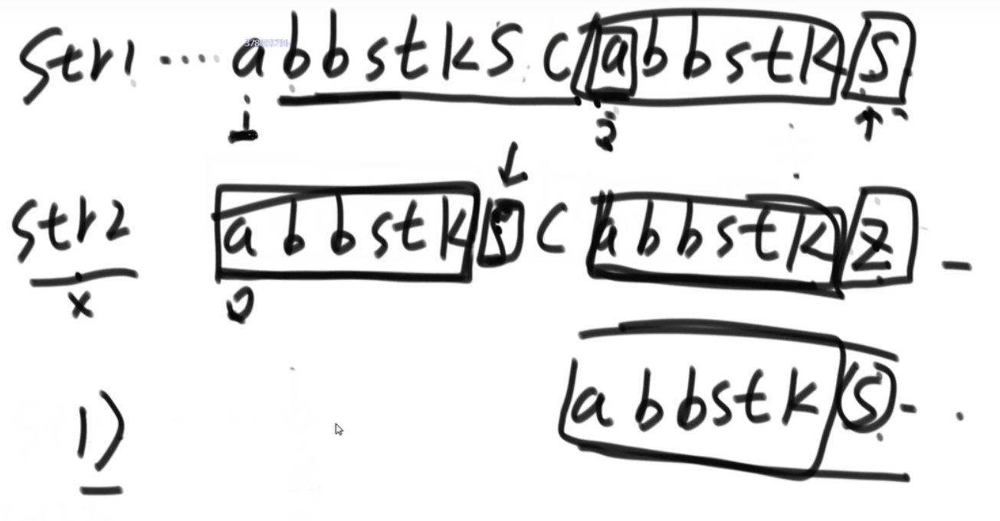

chapter2/Test02_Set
# 1.岛问题 Test01_Islands
【题目】
- 一个矩阵中只有0和1两种值，每个位置都可以和自己的上、下、左、右 四个位置相连，如果有一片1连在一起，这个部分叫做一个岛，求一个矩阵中有多少个岛?

【举例】
```
001010
111010
100100
000000
```
- 这个矩阵中有三个岛

思路：
- 按行遍历，从左往右，遍历到1时，调用感染方法，将相连的区域都设置为2
- 继续向下遍历，直到所有1都变为2，返回一共调用了几次感染方法

【进阶】
- 如何设计一个并行算法解决这个问题
- 并查集的应用

- 原本只有一个岛，用两个CPU(虚线分开)，计算并合并会得到四个岛
- 解决：对每个岛边界进行编号，A B C D，边界相碰且不是同一个岛则合并集合，岛数量-1
    - 需要第三个CPU进行处理


# 2.并查集 Test02_UnionFind
{a}{b}{c}{d}{e}，需要实现两个方法：
- isSameSet(a,b)：ab是否在同一个Set中
- union(a,b)：合并ab集合
- 需要一种结构，使得查找和合并时间复杂度为O(1)

并查集结构：

- 往上查找到不能再往上，节点相同，则在相同Set中
- 合并(数量少的集合顶部连接到数量多的集合顶部)
    - 之后扁平化：将合并路径中所有节点父节点设置为head节点

# 3.KMP
KMP算法解决的问题
- 字符串str1和str2，str1是否包含str2，如果包含返回str2在str1中开始的位置，不包含返回-1
- str1：ABC1234de
- str2：1234e
- 如何做到时间复杂度O(N)完成？

经典解法：暴力解法
- str1从左往右遍历，每个开头都判断是否包含str2子串


- 每个字符包含k信息，k值为该位置前的字符串前后缀相等且最长的值，这里是3(不能与长度相等)
- 对于str2，每个字符都去求K值（首位为-1，没有为0），称为next arr

执行流程：

- str1和str2从头开始往后移，移动到不同的字符上
    - str1到S，str2到Z
- S不动，Z的K值为6，则str2指针回到6位置，再一起向后比较
- 仅对首尾相同的字符串进行了优化

求nextArr：

- 求i的K值，i-1位置值为a,k值为20
- 将21位置的值与i-1位置的值做比较，相同则i位置k值为i-1位置的k值+1
- 不同，21位置的k值为7，则将7+1位置的值与i-1比较，相同则i位置k值为7+1=8
- 以此类推，直到求得k值
