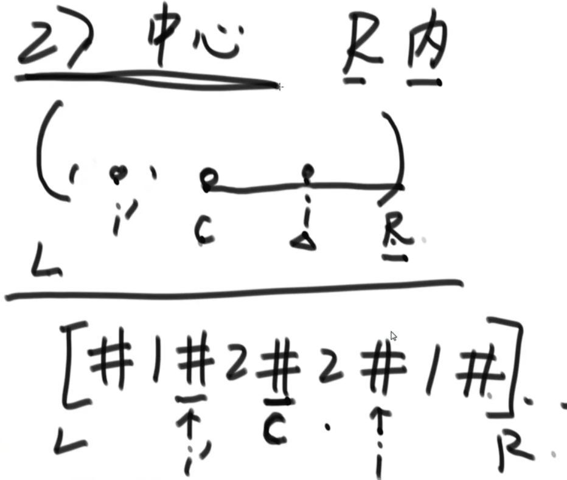
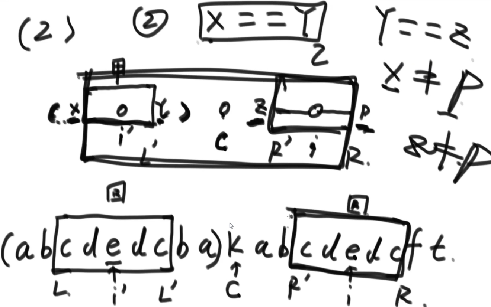
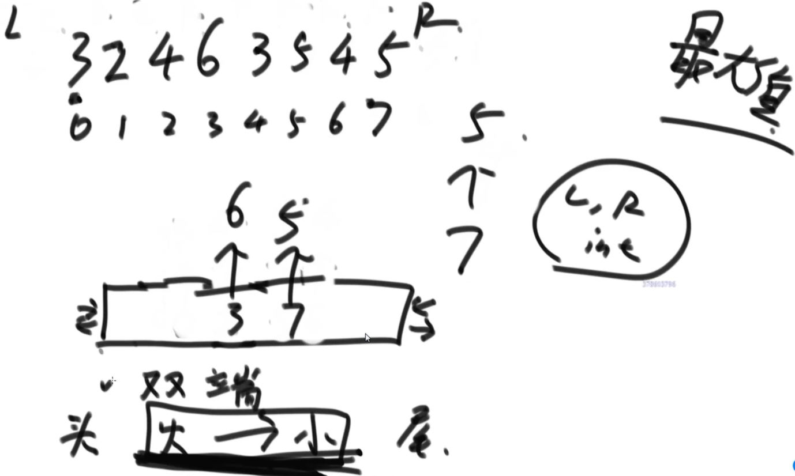
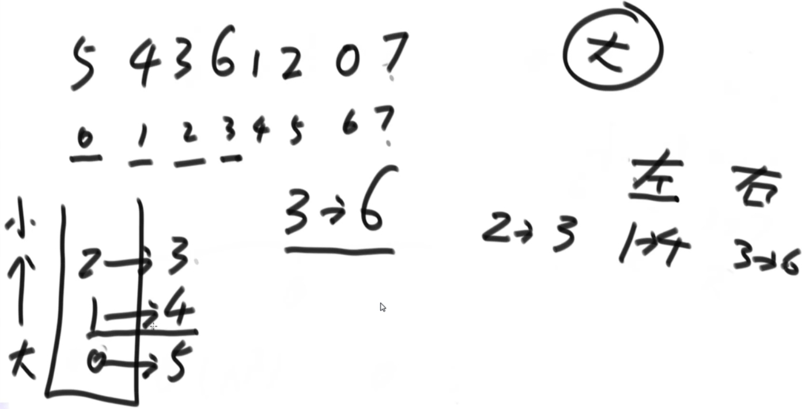
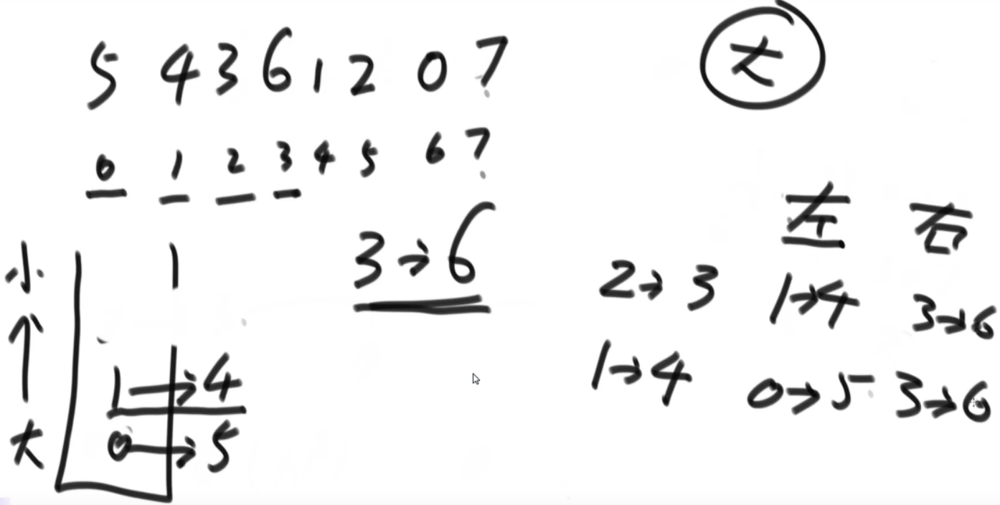
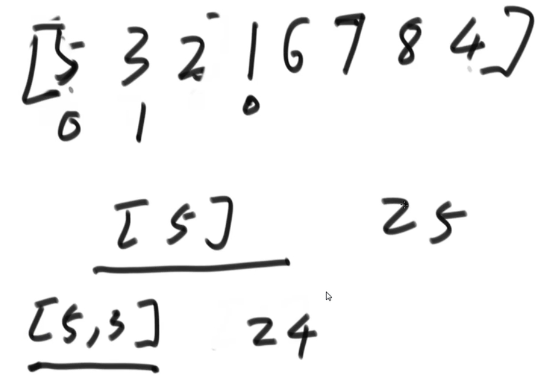

# 1.Manacher(马拉车)算法 Test01_Manacher
解决问题：
- 字符串str中，最长回文(正反念一样)子串的长度如何求解？
- 如何做到时间复杂度O(N)完成？
- 如字符串：abc12320de1，最长回文子串为232

包含偶数串的回文子串：122131221
- 经典解法，添加特殊字符：#1#2#2#1#3#1#2#2#1#，
- 经典解法时间复杂度O(n^2)

概念：#a#1#2#1#b#，以2为中心
- 回文直径：7
- 回文半径：4
- 回文半径数组：从左往右遍历每个字符的回文半径组成的数组
- 之前遍历过程中回文所到达的最右边界 R
- 取得最右边界的中心点：C
- 当前中心点：i

扩充时的情况：
1. i>R：当前中心点不在最右边界内，暴力扩展，从C向两边尝试
2. i<=R：中心点在最右边界内
    
    - R：最右边界;L：对称的最左边界;C：中心点;i：当前中心点;i'：对称的中心点
    - 状况1：i'的回文区域在L~R范围内，i的回文半径与i'相同
    - 状况2：i'的回文区域左侧在L左边，
       
       - i的回文半径为i'-L=R-i
    - 状况3：压线，i'回文区域左侧和L重合
        - i~R一定是回文，需要验证i~R往外是否是回文

# 2.滑动窗口 Test02_SlidingWindowMaxArray
有一个整型数组arr和一个大小为w的窗口从数组的最左边滑到最右边，窗口每次 向右边滑一个位置

例如，数组为[4,3,5,4,3,3,6,7]，窗口大小为3时:
```
[4 3 5]4 3 3 6 7    窗口中最大值为5 
4[3 5 4]3 3 6 7     窗口中最大值为5
4 3[5 4 3]3 6 7     窗口中最大值为5
4 3 5[4 3 3]6 7     窗口中最大值为4
4 3 5 4[3 3 6]7     窗口中最大值为6
4 3 5 4 3[3 6 7]    窗口中最大值为7
```
- 如果数组长度为n，窗口大小为w，则一共产生n-w+1个窗口的最大值
- 请实现一个函数：
    - 输入:整型数组arr，窗口大小为w
    - 输出:一个长度为n-w+1的数组res，res[i]表示每一种窗口状态下的最大值
        - 以本题为例，结果应该返回{5,5,5,4,6,7}
- 暴力解法：多次遍历

窗口只能右边界或左边界向右滑的情况下，维持窗口内部最大值或者最小值快速更新的结构：

- 双端队列，队列头为最大值，从大到小（求最小值时从小到大的队列）
- R向右动，如果当前值比队列头大，弹出队列所有值，当前值从队列尾加入
- L向右动，和队列头比较，相等则弹出队列头
- 平均更新代价O(1)

# 3.单调栈 Test03_DandiaoStack
- 在数组中想找到一个数，左边和右边比这个数大、且离这个数最近的位置。
- 如：5 4 3 6 1 2 0 7 ，如3的数为4和6，2的数为6和7
- 如果对每一个数都想求这样的信息，能不能整体代价达到O(N)？
- 需要使用到单调栈结构



- 栈底到栈顶值从大到小，存放数组索引
- 数组从左往右依次遍历，如果当前数比栈顶大，则栈顶弹出并生成数据
    - 左边比弹出数大的数是压在下面的数据，右边比该数大的数是待加入的数据
    - 弹出所有比当前小的数并生成数据
- 遍历完成后，弹出所有数并生成数据
- 时间复杂度O(N)，每个数只进出栈一次

单调栈的应用：Test04_AllTimesMinToMax

- 定义：正数数组，数组中累积和与最小值的乘积，假设叫做指标A。
- 给定一个数组，请返回子数组中，指标A最大的值。
- 思路：从左往右依次遍历，每个数求最大可扩充范围
    - 最大范围边界的左边和右边都是比该数小的值
    - 就是求该数左右两侧比该数小且离该数最近的值
