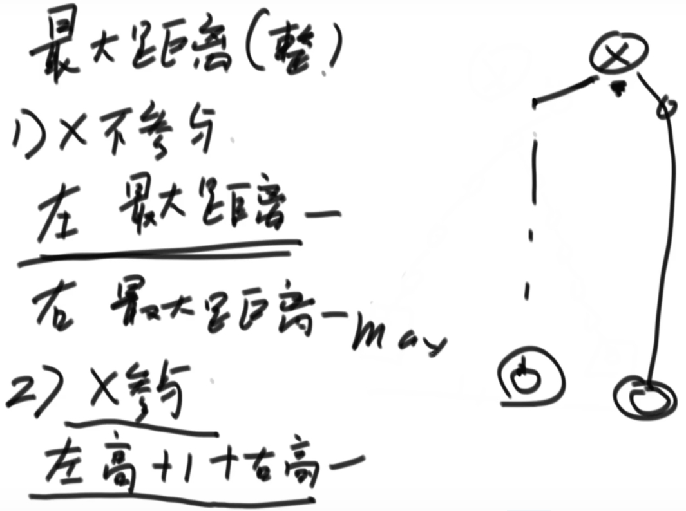
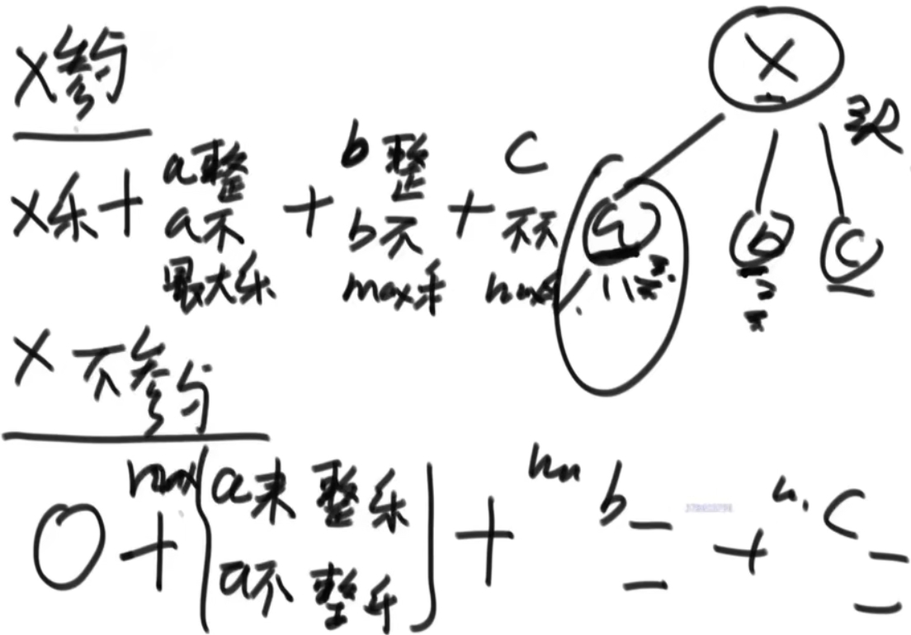
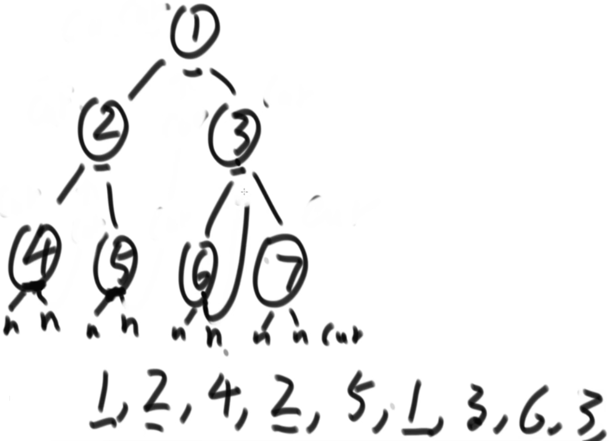
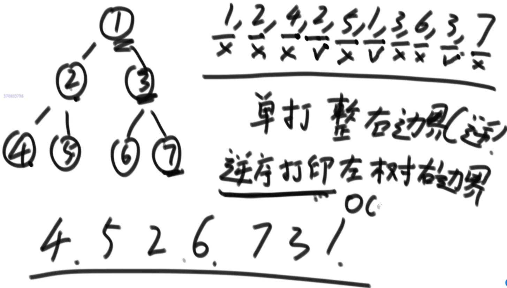

# 1.树形dp套路
树形dp套路使用前提：
- 如果题目求解目标是S规则，则求解流程可以定成以每一个节点为头节点的子树在S规则下的每一个答案，并且最终答案一定在其中

树形dp套路第一步：
- 以某个节点X为头节点的子树中，分析答案有哪些可能性，并且这种分析是以X的左子树、X的右子树和X整棵树的角度来考虑可能性的

树形dp套路第二步：
- 根据第一步的可能性分析，列出所有需要的信息

树形dp套路第三步：
- 合并第二步的信息，对左树和右树提出同样的要求，并写出信息结构

树形dp套路第四步：
- 设计递归函数，递归函数是处理以X为头节点的情况下的答案。
- 包括设计递归的basecase，默认直接得到左树和右树的所有信息，以及把可能性做整合，并且要返回第三步的信息结构这四个小步骤

题目：二叉树节点间的最大距离问题 Test01_MaxDistanceInTree
- 从二叉树的节点a出发，可以向上或者向下走，但沿途的节点只能经过一次，到达节点b时路径上的节点个数叫作a到b的距离
- 那么二叉树任何两个节点之间都有距离，求整棵树上的最大距离。

- 分为头节点X是否参与两种情况考虑(很多题目都这样考虑)
- 左右子树统一返回两个值：最大距离，高度
 
# 2.派对的最大快乐值问题 Test02_MaxHappy
员工信息的定义如下:
```
class Employee {
    public int happy; // 这名员工可以带来的快乐值
    List<Employee> subordinates; // 这名员工有哪些直接下级
}
```
公司的每个员工都符合 Employee 类的描述。整个公司的人员结构可以看作是一棵标准的、 没有环的多叉树。树的头节点是公司唯一的老板。除老板之外的每个员工都有唯一的直接上级。
叶节点是没有任何下属的基层员工(subordinates列表为空)，除基层员工外，每个员工都有一个或多个直接下级。
- 这个公司现在要办party，你可以决定哪些员工来，哪些员工不来。但是要遵循如下规则。
    1. 如果某个员工来了，那么这个员工的所有直接下级都不能来
    2. 派对的整体快乐值是所有到场员工快乐值的累加
    3. 你的目标是让派对的整体快乐值尽量大
- 给定一棵多叉树的头节点boss，请返回派对的最大快乐值。

- 分为头节点来与不来情况下的最大快乐值

# 3.Morris遍历
一种遍历二叉树的方式，并且时间复杂度O(N)，额外空间复杂度O(1)
- 通过利用原树中大量空闲指针的方式，达到节省空间的目的

Morris遍历细节
假设来到当前节点cur，开始时cur来到头节点位置
1. 如果cur没有左孩子，cur向右移动(cur = cur.right)
2. 如果cur有左孩子，找到左子树上最右的节点mostRight：
    - a.如果mostRight的右指针指向空，让其指向cur，然后cur向左移动(cur = cur.left)
    - b.如果mostRight的右指针指向cur，让其指向null，然后cur向右移动(cur = cur.right)
3. cur为空时遍历停止


Morris先序：
- 一个节点只到达一次，直接打印
- 到达两次，第一次打印节点

Morris中序：
- 一个节点只到达一次，直接打印
- 到达两次，第二次打印节点

Morris后序：

- 到达一次的节点先不处理
- 到达两次的节点，第二次到达时逆序打印左树右边界
- 最后逆序打印整棵树的右边界

# 4.位图问题
32位无符号整数的范围是0~4,294,967,295，现在有一个正好包含40亿个无符号整数的文件，所以在整个范围中必然存在没出现过的数。
- 可以使用最多1GB的内存，怎么找到所有未出现过的数？

【进阶】
- 内存限制为 10MB，但是只用找到一个没出现过的数即可
- 一个数字 `4字节，10MB/4=512，int[512]` 进行词频统计，40亿/512=8388608
- 40亿/8388608得到的结果对应数组进行词频统计，最终不满8388608的数组范围存在没出现过的数
- 再在这个范围内分为512份，继续划分范围，以此类推，总能定位到一个没出现过的数字


