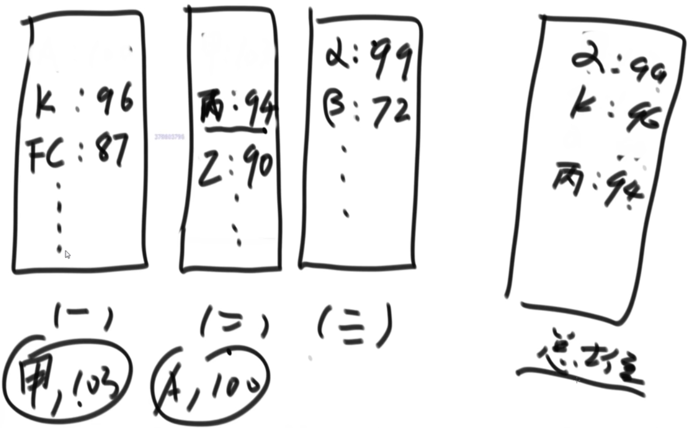
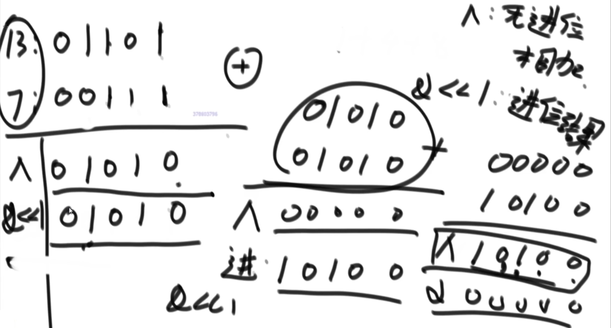
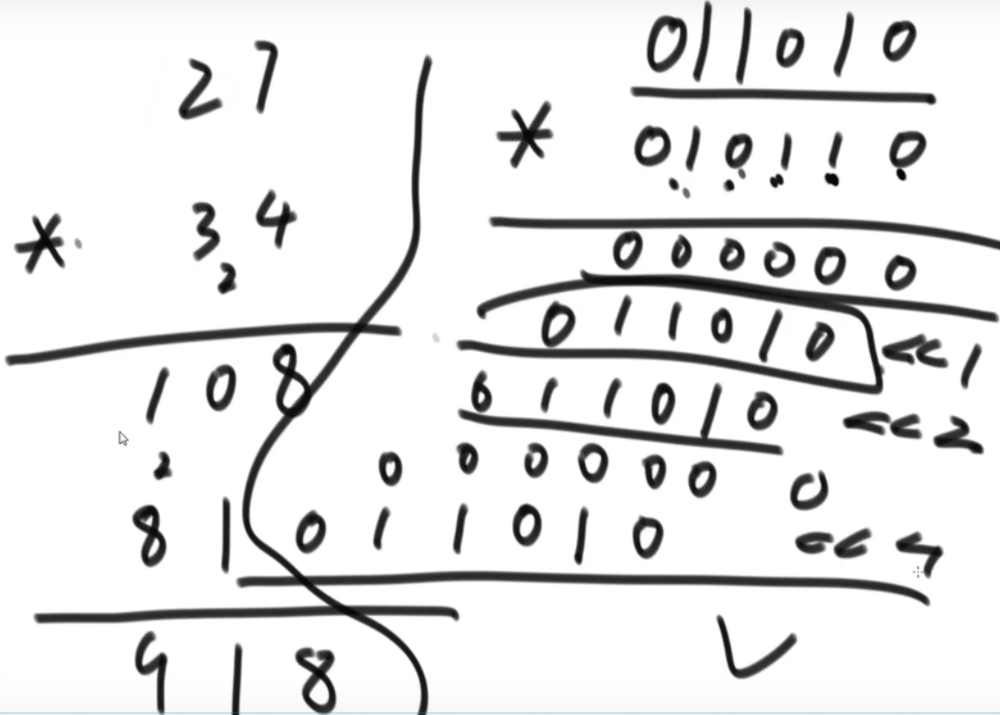
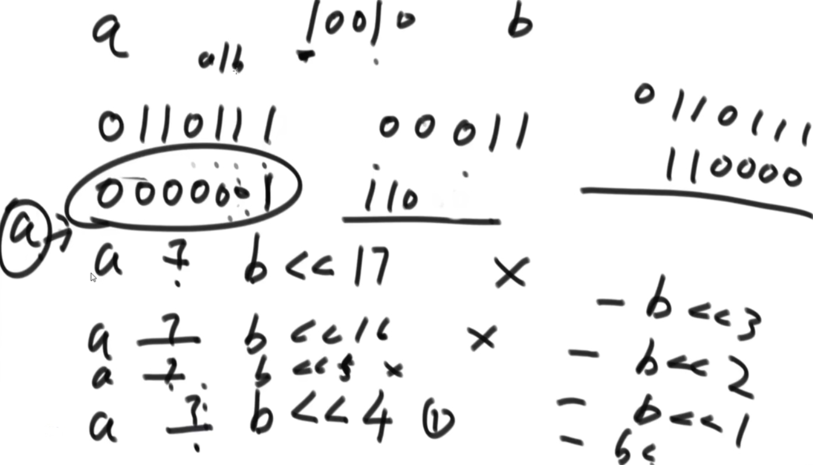

# 1.大数据题目解题技巧
1. 哈希函数可以把数据按照种类均匀分流
2. 布隆过滤器用于集合的建立与查询，并可以节省大量空间
3. 一致性哈希解决数据服务器的负载管理问题
4. 利用并查集结构做岛问题的并行计算
5. 位图解决某一范围上数字的出现情况，并可以节省大量空间
6. 利用分段统计思想、并进一步节省大量空间
7. 利用堆、外排序来做多个处理单元的结果合并

# 2.堆合并
有一个包含100亿个URL的大文件，假设每个URL占用64B，请找出其中所有重复的URL
- 思路：hash分流到几个小文件，再依次处理小文件找到重复的URL

【补充】
某搜索公司一天的用户搜索词汇是海量的(百亿数据量)，请设计一种求出每天热门Top100词汇的可行办法

- 思路：利用大根堆做结果合并
- 每个小的大根堆的堆顶弹出到总大根堆
- 大根堆堆顶弹出最大值后，再从对应小的大根堆弹出一个数放到大根堆
- 直到弹出100个数据

# 3.分段统计
32位无符号整数的范围是0~4294967295，现在有40亿个无符号整数，可以使用最多1GB的内存，找出所有出现了两次的数。
- 思路1：哈希函数分流，然后依次处理每个小文件
- 思路2：使用位图，00表示出现0次，01表示出现一次，10表示出现两次，11表示出现两次以上
    - 需要空间 2^32*2/8 字节

【补充】
可以使用最多10KB的内存，怎么找到这40亿个整数的中位数？
- 使用范围统计思想
- 分为很多个小范围词频数组，每个范围的数据范围大小为10KB/4=2500，最近的2^n数为2048，则每份数量为2048
- 等分成40亿/2048组，从小到大统计这些数的词频，词频相加刚好>20亿的数组中有中位数
- 再在这个数组中查找中位数

# 4.题目
10G文件，每个文件都是一个有符号整数，且是无序的，有重复的
- 要求：给你5G内存，输出一个文件，且是有序的
- 方法一：（分段+堆合并）将数据分散到多个范围中，每个范围都是大根堆，节点为（数据，词频）形式，以数据大小排
    - 然后使用一个额外的大根堆进行合并输出
- 方法二：使用一个大根堆，多次读取整个文件并依次输出
    - 第一次：只读取并输出0~i范围的数(根据有的内存进行计算)
    - 第二次：只读取并输出i~j范围的数
    - ...

# 5.位运算题目一 Test01_GetMax
给定两个有符号32位整数a和b，返回a和b中较大的。

【要求】
- 不用做任何比较判断。

# 6.位运算题目二  Test01_GetMax
判断一个32位正数是不是2的幂、4的幂
- 2的幂：二进制状态中只有1个1
- 方法1：把1取出来
- 方法2：X-1把1打散
    - X&(x-1)==0

是否是4的幂：1在0 2 4 8...位
- 第一步：判断X是否只有一个1
- 第二步：与上0101010101
    - =0：不是4的幂
    - !=0：是4的幂

# 7.位运算题目三  Test03_AddMinusMultiDivideByBit
给定两个有符号32位整数a和b，不能使用算术运算符，分别实现a和b的加、减、乘、除运算

【要求】
- 如果给定a、b执行加减乘除的运算结果就会导致数据的溢出，那么你实现的函数不必对此负责，除此之外请保证计算过程不发生溢出

加法：

- 加法 = ^+&<<1
- 没有进位信息时就是最终答案

减法：a-b=a+(-b)

乘法：用加法实现

- 左移累加

除法：减法实现

- 左移，能够被减后相减
