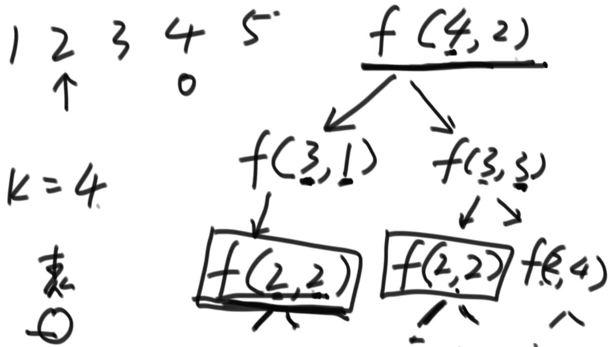
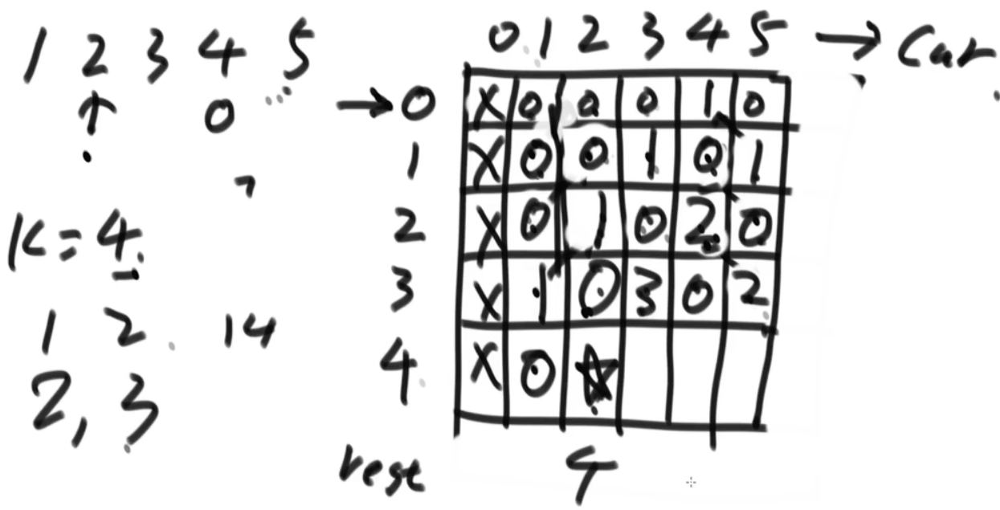

# 1.递归到动态规划的优化
- 尝试阶段：使用递归套路
- 记忆化搜索dp
- 严格表结构dp
- 严格表结构dp优化

动态规划就是暴力尝试减少重复计算的技巧而已，这种技巧就是一个大型套路

是怎么把尝试的版本，优化成动态规划，是有固定套路的，大体步骤如下
1. 找到什么可变参数可以代表一个递归状态，也就是哪些参数一旦确定，返回值就确定了
2. 把可变参数的所有组合映射成一张表，有 1 个可变参数就是一维表，2 个可变参数就是二维表，......
3. 最终答案要的是表中的哪个位置，在表中标出
4. 根据递归过程的 base case，把这张表的最简单、不需要依赖其他位置的那些位置填好值
5. 根据递归过程非base case的部分，也就是分析表中的普遍位置需要怎么计算得到，那么这张表的填写顺序也就确定了
6. 填好表，返回最终答案在表中位置的值

# 2.机器人达到指定位置方法数 Test01_RobotWalk
【题目】
- 假设有排成一行的 N 个位置，记为 1~N，N 一定大于或等于 2
    - 开始时机器人在其中的 M 位置上(M 一定是 1~N 中的一个)，机器人可以往左走或者往右走，
    - 如果机器人来到 1 位置， 那么下一步只能往右来到 2 位置;
    - 如果机器人来到 N 位置，那么下一步只能往左来到 N-1 位置。
- 规定机器人必须走 K 步，最终能来到 P 位置(P 也一定是 1~N 中的一个)的方法有多少种。
- 给定四个参数 N、M、K、P，返回方法数

【举例】
N=5,M=2,K=3,P=3
- 上面的参数代表所有位置为 1 2 3 4 5。机器人最开始在 2 位置上，必须经过 3 步，最后到达 3 位置。走的方法只有如下 3 种: 
    - 1)从2到1，从1到2，从2到3 
    - 2)从2到3，从3到2，从2到3
    - 3)从2到3，从3到4，从4到3
- 所以返回方法数 3

- 如方法f(2,2)在递归中会多次调用
- 可以使用一张表记录该结果，不用重复计算
- 记忆化搜索，不用考虑表位置之间的关系
- 时间复杂度O(2^K)

- 需要考虑表位置之间的关系
- 时间复杂度O(K*N)

# 3.换钱的最少货币数 Test02_CoinsMin
【题目】
给定数组 arr，arr 中所有的值都为正数且不重复。每个值代表一种面值的货币，每种面值的货币可以使用任意张
- 再给定一个整数 aim，代表要找的钱数，求组成 aim 的最少货币数。

【举例】
- arr=[5,2,3]，aim=20。
    - 4 张 5 元可以组成 20 元，其他的找钱方案都要使用更多张的货币，所以返回 4。
- arr=[5,2,3]，aim=0。
    - 不用任何货币就可以组成 0 元，返回 0。
- arr=[3,5]，aim=2。
    - 根本无法组成 

# 4.排成一条线的纸牌博弈问题 Test03_CardInLine
【题目】
- 给定一个整型数组 arr，代表数值不同的纸牌排成一条线。玩家 A 和玩家 B 依次拿走每张纸牌，
- 规定玩家 A 先拿，玩家 B 后拿，但是每个玩家每次只能拿走最左或最右的纸牌，玩家 A 和 玩家 B 都绝顶聪明。
- 请返回最后获胜者的分数。

# 5.象棋中马的跳法 Test04_HorseJump
【题目】
- 请同学们自行搜索或者想象一个象棋的棋盘，然后把整个棋盘放入第一象限，棋盘的最左下角是(0,0)位置。那么整个棋盘就是横坐标上9条线、纵坐标上10条线的一个区域。给你三个
- 参数，x，y，k，返回如果“马”从(0,0)位置出发，必须走k步，最后落在(x,y)上的方法数
- 有多少种？

# 6.Bob的生存概率问题 Test05_BobDie
【题目】
- 给定五个参数n,m,i,j,k。表示在一个N*M的区域，Bob处在(i,j)点，每次Bob等概率的向上、下、左、右四个方向移动一步，Bob必须走K步。
- 如果走完之后，Bob还停留在这个区域上，就算Bob存活，否则就算Bob死亡。
- 请求解Bob的生存概率，返回字符串表示分数的方式。

