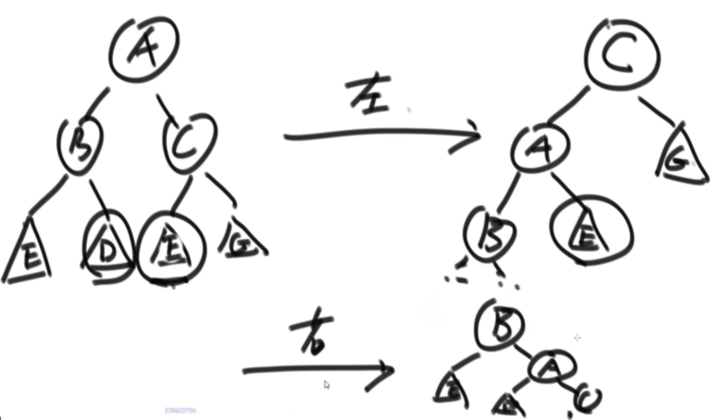
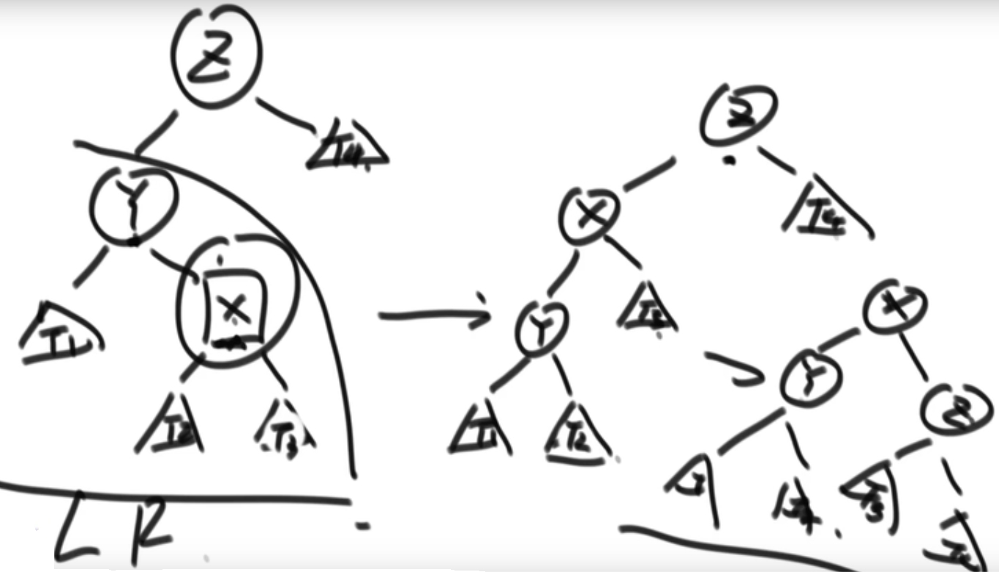
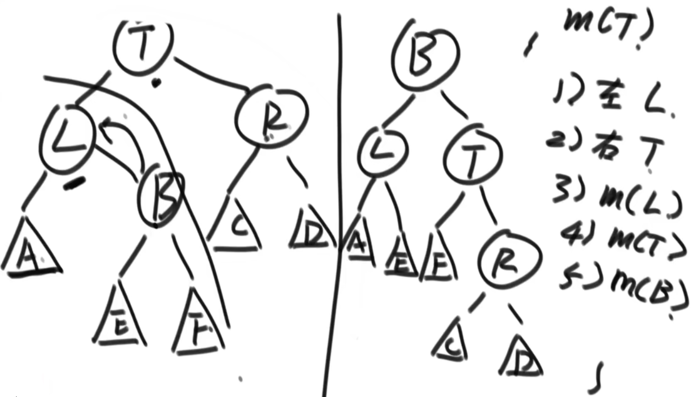
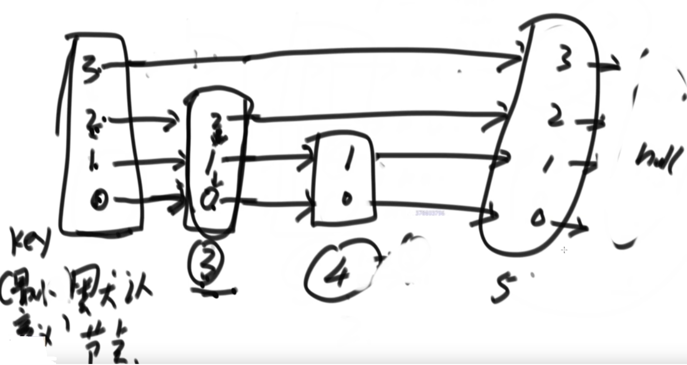

# 1.有序表
实现有序表的结构：
- 平衡搜索二叉树(BST)
    - 红黑树
    - AVL树
    - SB树(SizeBalance)
- 跳表SkipList
- 时间复杂度都是O(logN)

# 2.AVL树
平衡性：
- 保证左树和右树的高度差不超过1

左旋与右旋：
- 头节点倒向哪边就是往哪边旋

当插入或者删除一个节点时，可能会让整棵AVL不平衡。
- 此时，只需要把最小不平衡子树调整即可恢复整体的平衡性

判断平衡性是否被破坏：
- LL型：左树左边过长，右旋
- RR型：右树右边过长，左旋
- LR型：左树右树过长，先左旋再右旋

- RL型：右树左边过长，先右旋再左旋

# 3.SB树
平衡性：
- 每棵子树的大小，不小于其兄弟的子树大小
- 既每棵叔叔树的大小，不小于其任何侄子树的大小

LL型：左孩子的左孩子大小比右孩子大(节点个数多)

- A子树比R子树大
- 左旋右旋的操作与AVL树相同，需要递归判断每个子树变化的节点
- 有不满足SB树平衡性的节点依次调整

# 4.红黑树 RedBlackTree
1. 每个节点不是红就是黑
2. 头节点和叶节点(最底层空节点)必须为黑
3. 任何两个红节点不能相邻
4. 当前头到达叶节点的每一条路径要求黑节点数量一样
    - (其实是为了保证路径长度的倍数关系)

# 5.跳表 Code03_SkipListMap

- 每个节点随机0~n个指针
- 默认节点指针与最多的指针相同
- 有序添加一个数，从最高节点开始往下找，找到小于等于该数的最右节点，并在右边插入

