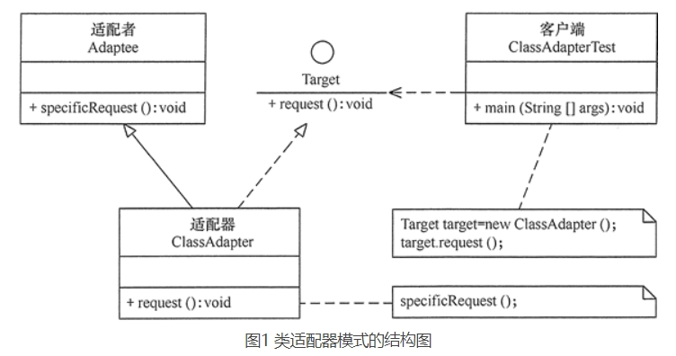
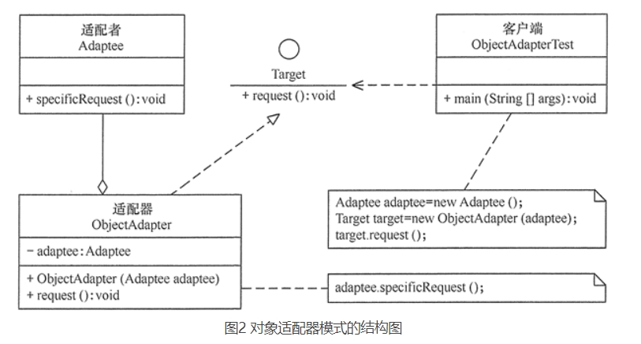

# 1.概述
定义一个包装类，用于包装不兼容接口的对象
- 包装类 = 适配器Adapter；
- 被包装对象 = 适配者Adaptee = 被适配的类

将一个类的接口转换成客户希望的另外一个接口，使得原本由于接口不兼容而不能一起工作的那些类能一起工作

Java中有三种适配器模式
- 类适配器模式
- 对象适配器模式
- 接口适配器模式

# 2.示意图
类适配器示意图

对象适配器示意图
