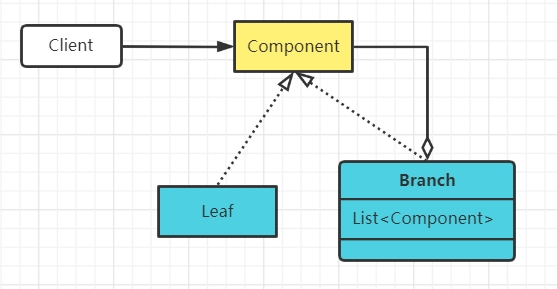

# 1.组合（Composite Pattern）模式定义
又叫作整体-部分（Part-Whole）模式，它是一种将对象组合成树状的层次结构的模式，用来表示“整体-部分”的关系

示意图：

# 2.使用场景
部分、整体场景，如树形菜单，文件、文件夹的管理

# 3.组合模式分类
组合模式极简示意图：

## 透明组合模式
Component接口中包含 Add()、Remove() 及 GetChild() 等管理节点方法
- Leaf叶子节点中不需要这些方法，不安全

## 安全组合模式
Component接口中不包含管理方法，而在每个Branch树枝构件中实现

