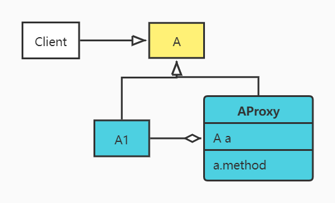

# 1.代理模式
是指客户端(Client)并不直接调用实际的对象，而是通过调用代理(Proxy)，来间接的调用实际的对象

# 2.示意图：

A1：真实对象

# 3.应用场景
1. 日志的采集
2. 权限控制
3. 实现aop
4. Mybatis mapper
5. Spring的事务
6. 全局捕获异常
7. Rpc远程调用接口
8. 分布式事务原理代理数据源

# 4.静态代理与动态代理
静态代理
- 优点：
    - 易于理解和实现
    - 代理类和真实类的关系是编译期静态决定的，和下文马上要介绍的动态代理比较起来，执行时没有任何额外开销
- 缺点：
    - 每一个真实类都需要一个创建新的代理类，增加额外开销

动态代理
- Java动态代理实现方式一：InvocationHandler
- Java动态代理实现方式二：CGLIB
- Java动态代理实现方式三：通过编译期提供的API动态创建代理类
