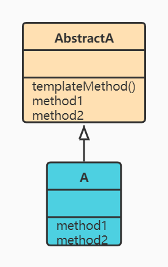

# 1.模板方法模式概述
- 定义一个操作中的算法的骨架，而将一些步骤延迟到子类中，使得子类可以不改变一个算法的结构即可重定义该算法的某些特定步骤
- 通过抽象类来定义一个逻辑模板，逻辑框架、逻辑原型，然后将无法决定的部分抽象成抽象类交由子类来实现
- 为防恶意操作，一般模板方法都加上final关键字

# 2.模板方法模式简图

# 3.使用场景
有多个子类共有的方法，且逻辑相同
- 做试卷，大家题目都是一样的，只是答案不同
- 对于汽车，车从发动到停车的顺序是相同的，不同的是引擎声、鸣笛声等
- 造房时，地基、走线、水管都一样，只有在建筑后期才有差异

