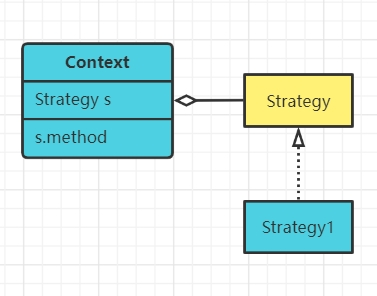

 # 1.策略模式概述
 - 一个系统有许多类，而区分它们的只是他们直接的行为时
 - 将这些算法封装成一个一个的类，任意的替换
 
 优点：
 - 算法可以自由切换
 - 避免使用多重条件判断（如果不用策略模式我们可能会使用多重条件语句，不利于维护）
 - 扩展性良好，增加一个策略只需实现接口即可
 
 缺点：
 - 策略类数量会增多，每个策略都是一个类，复用的可能性很小
 - 所有的策略类都需要对外暴露
 
 # 2.策略模式示意图
 
 
 # 3.使用场景
- 出行方式，自行车、汽车等，每一种出行方式都是一个策略
- 商场促销方式，打折、满减等
- Java AWT中的LayoutManager，即布局管理器
 