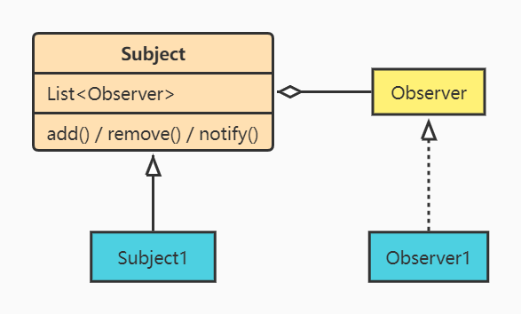

# 1.观察者模式概述
指多个对象间存在一对多的依赖关系，当一个对象的状态发生改变时，所有依赖于它的对象都得到通知并被自动更新。
- 这种模式有时又称作发布-订阅模式、模型-视图模式

# 2.示意图

# 3.优缺点
优点：
- 降低了目标与观察者之间的耦合关系，两者之间是抽象耦合关系。符合依赖倒置原则。
- 目标与观察者之间建立了一套触发机制。

缺点：
- 目标与观察者之间的依赖关系并没有完全解除，而且有可能出现循环引用。
- 当观察者对象很多时，通知的发布会花费很多时间，影响程序的效率。

# 4.使用场景
- 关联行为场景，需要注意的是，关联行为是可拆分的，而不是“组合”关系。
- 事件多级触发场景。
- 跨系统的消息交换场景，如消息队列、事件总线的处理机制

