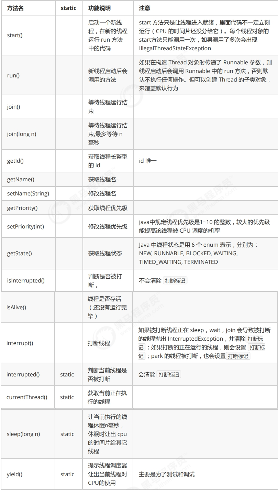
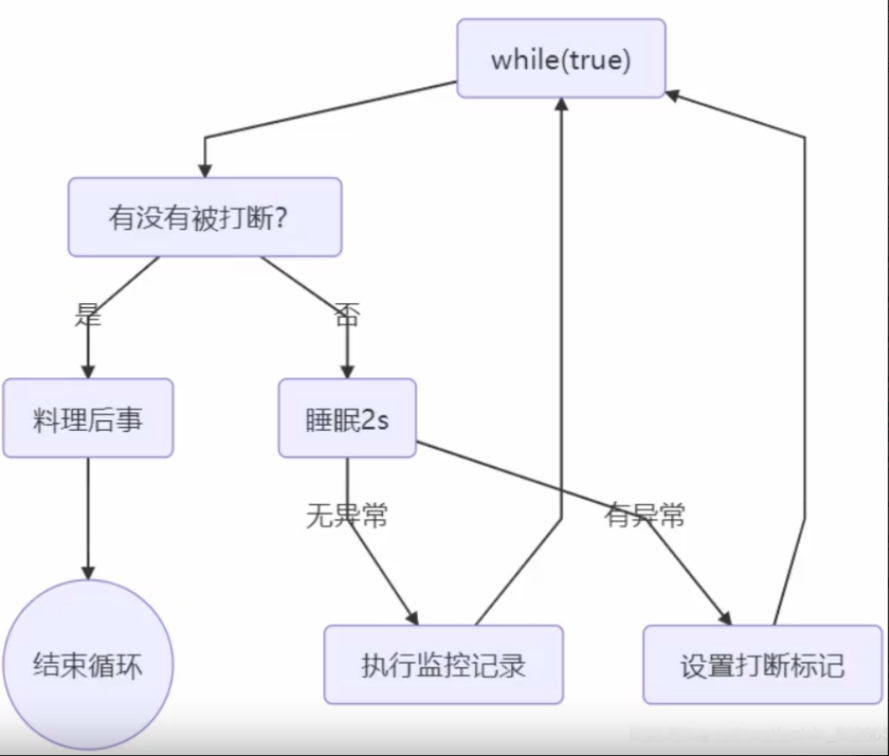

# 地址
https://zhangc233.github.io/2021/05/21/%E5%A4%9A%E7%BA%BF%E7%A8%8B%E4%B8%8E%E9%AB%98%E5%B9%B6%E5%8F%91%E2%80%94%E7%BA%BF%E7%A8%8B%E5%9F%BA%E7%A1%80%E3%80%81%E7%BA%BF%E7%A8%8B%E6%96%B9%E6%B3%95/#Java%E7%BA%BF%E7%A8%8B

# 线程常见方法

# 两阶段终止
监控程序流程：

# 不推荐使用的方法
还有一些不推荐使用的方法，这些方法已过时，容易破坏同步代码块，造成线程死锁
- stop()：停止线程运行。
- suspend() ：挂起（暂停）线程运行。
- resume()：恢复线程运行
