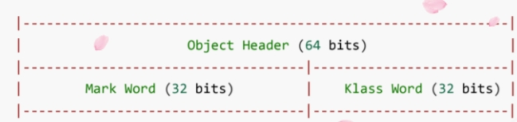
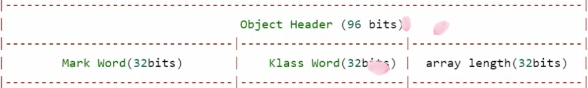
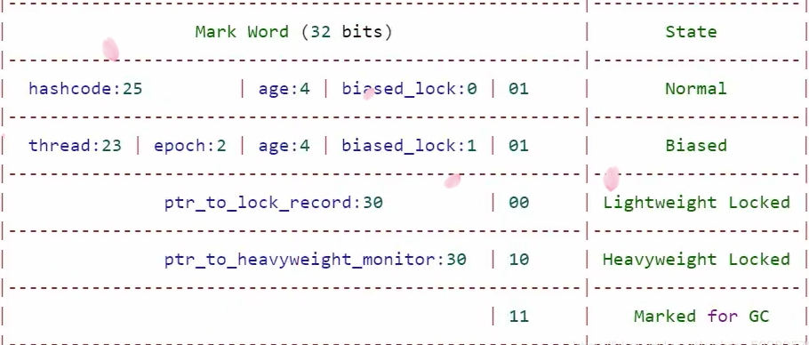
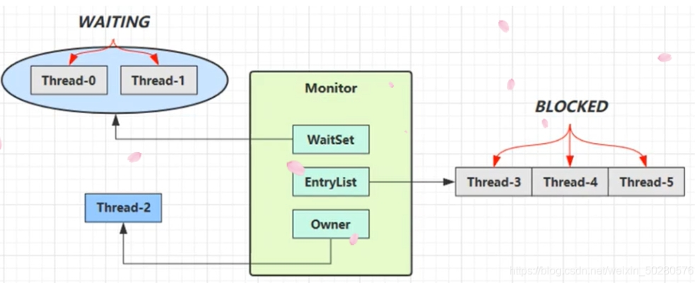
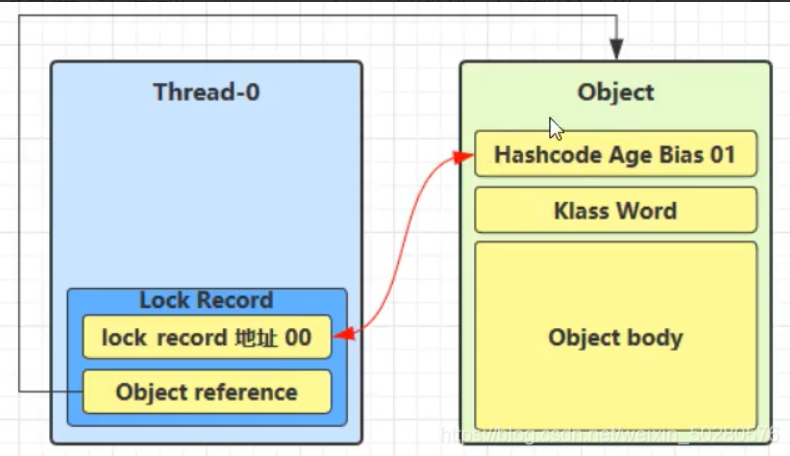
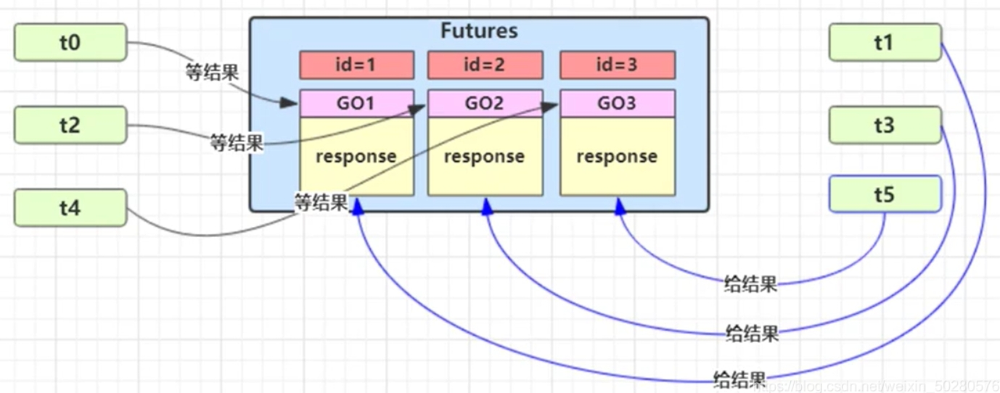
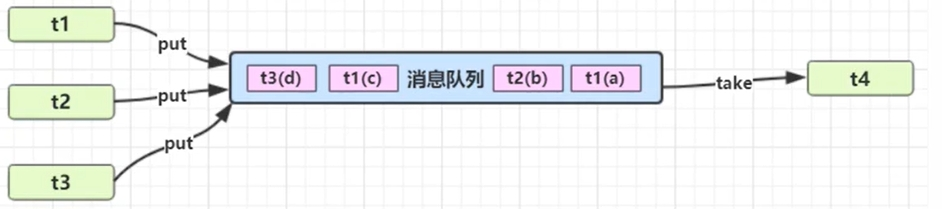
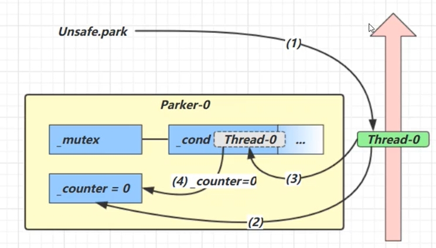
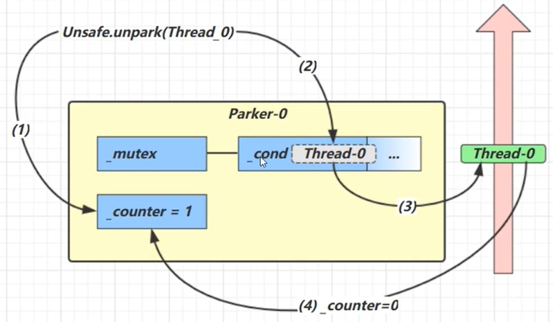
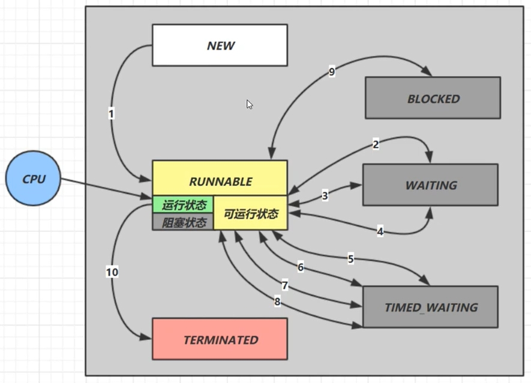

# 参考
https://zhangc233.github.io/2021/05/26/%E5%A4%9A%E7%BA%BF%E7%A8%8B%E4%B8%8E%E9%AB%98%E5%B9%B6%E5%8F%91%E2%80%94%E5%85%B1%E4%BA%AB%E6%A8%A1%E5%9E%8B%E4%B9%8B%E7%AE%A1%E7%A8%8B/

# 1.概念
1. 临界区：一段代码块内如果存在对共享资源的多线程读写操作，称这段代码块为临界区
2. 竞态条件：多个线程在临界区内执行，由于代码的执行序列不同而导致结果无法预测，称之为发生了竞态条件

# 2.synchronized 解决方案
避免临界区中的竞态条件发生，由多种手段可以达到
- 阻塞式解决方案：synchronized 、Lock
- 非阻塞式解决方案：原子变量

Synchronized加在方法上：
- 成员方法，锁对象
- 静态方法，锁类

# 3.变量的线程安全分析
## 3.1 成员变量和静态变量的线程安全分析
- 如果它们没有共享，则线程安全。
- 如果它们被共享了，根据它们的状态是否能够改变，又分两种情况：
   - 如果只有读操作，则线程安全；
   - 如果有读写操作，则这段代码是临界区，需要考虑线程安全。

## 3.2 局部变量线程安全分析 Test04
- 局部变量是线程安全的。
- 但局部变量引用的对象则未必：
    - 如果该对象没有逃离方法的作用范围，它是线程安全的；
    - 如果该对象逃离方法的作用范围，需要考虑线程安全

## 3.3 常见线程安全类
- String
- Integer
- StringBuffer
- Random
- Vector （List 的线程安全实现类）
- Hashtable （Hash 的线程安全实现类）
- java.util.concurrent 包下的类

# 4. Monitor管程
## 4.1 Java对象头
普通对象头：

数组对象头：

MarkWord结构：

## 4.2 Monitor
每个 java 对象都可以关联一个 Monitor，如果使用 synchronized 给对象上锁（重量级），该对象头的 Mark Word 中就被设置为指向 Monitor 对象的指针

- WaitSet：之前获得过锁，但条件不满足进入 WAITING 状态的线程
- EntryList：阻塞队列
- Owner：执行同步代码块的线程，只能有一个

# 5. Synchronized锁优化
## 5.1 轻量级锁

- 在线程中开辟一块LockRecord来复制MarkWord
- CAS比较并交换LockRecord地址和MarkWord地址
- 失败的两种情况：
    - 其他线程已持有，则变为自旋锁，自旋一定数量后，失败则进入锁膨胀阶段
    - 本线程已持有，添加一个地址为null的LockRecord，锁重入
- 解锁：如果获取的锁记录取值不为 null，那么使用 cas 将 Mark Word 的值恢复给对象
    - 成功则解锁成功
    - 失败，则说明轻量级锁进行了锁膨胀或已经升级为重量级锁，进入重量级锁解锁流程。

## 5.2 锁膨胀

- 引入Monitor锁，Thread1进入阻塞队列

## 5.3 自旋优化
- 重量级锁竞争的时候，还可以使用自旋来进行优化，如果当前线程自旋成功（即在自旋的时候持锁的线程释放了锁），那么当前线程就可以不用进行上下文切换就获得了锁
- 自旋会占用 CPU 时间，单核 CPU 自旋就是浪费，多核 CPU 自旋才能发挥优势

## 5.4 偏向锁 Biased_Lock 
- 在轻量级锁中可以发现，如果同一个线程对同一个对象进行重入锁时，也需要执行 CAS 操作，也有耗时
- Java6 开始引入了偏向锁，只有第一次使用 CAS 时将对象的 Mark Word 头设置为偏向线程 ID，之后这个入锁线程再进行重入锁时，发现线程 ID 是自己的，那么就不用再进行 CAS 了
- 轻量级锁用LockRecord替换MarkWord
- 偏向锁用ThreadID替换MarkWord

撤销偏向锁：
- hashcode方法
- 其它线程使用对象
- 调用 wait/notify

批量重偏向：修改ThreadID
- 如果对象虽然被多个线程访问，但是线程间不存在竞争，这时偏向 t1 的对象仍有机会重新偏向 t2 (重偏向会重置 Thread ID)。
- 当撤销超过 20 次后（超过阈值），JVM 会觉得是不是偏向错了，这时会在给对象加锁时，重新偏向至加锁线程
 
批量撤销
- 当撤销偏向锁的阈值超过 40 以后，就会将整个类的对象都改为不可偏向的
 
## 5.5 锁消除
JIT会对synchronized进行优化，消除一些不必要的同步锁
- `-XX:+EliminateLocks`开启锁消除

# 6. Wait/notify

## 6.1 wait 和 notify
- obj.wait () 让进入 object 监视器的线程到 waitSet 等待。
- obj.notify () 在 object 上正在 waitSet 等待的线程中挑一个唤醒。
- obj.notifyAll () 让 object 上正在 waitSet 等待的线程全部唤醒。

## 6.2 Wait 与 Sleep 的区别
- Sleep 是 Thread 类的静态方法，Wait 是 Object 的方法，Object 又是所有类的父类，所以所有类都有 Wait 方法。
- Sleep 在阻塞的时候不会释放锁，而 Wait 在阻塞的时候会释放锁，它们都会释放 CPU 资源。
- Sleep 不需要与 synchronized 一起使用，而 Wait 需要与 synchronized 一起使用（对象被锁以后才能使用）
- 使用 wait 一般需要搭配 notify 或者 notifyAll 来使用，不然会让线程一直等待。

# 7.保护性暂停 GuardedObject
用于一个线程等待另一个线程的执行结果时 
- 有一个结果需要从一个线程传递到另一个线程，让他们关联同一个 GuardedObject
- 如果有结果不断从一个线程到另一个线程那么可以使用消息队列（见生产者 / 消费者）
- Future，join的实现原理

示意图：

# 8.生产者/消费者模式 
示意图： Test09_Productor

- 与前面的保护性暂停中的 GuardObject 不同，不需要产生结果和消费结果的线程一一对应。
- 消费队列可以用来平衡生产和消费的线程资源。
- 生产者仅负责产生结果数据，不关心数据该如何处理，而消费者专心处理结果数据。
- 消息队列是有容量限制的，满时不会再加入数据，空时不会再消耗数据。
- JDK 中各种阻塞队列，采用的就是这种模式

# 9.LockSupport
park & unpark 是 LockSupport 线程通信工具类的静态方法
- LockSupport.park(); // 暂停当前线程
- LockSupport.unpark; // 恢复某个线程的运行
 
park unpark原理：
每个线程都有自己的一个 Parker 对象，由三部分组成 _counter， _cond 和 _mutex
- _counter：0为阻塞，1为唤醒
- _cond：等待队列
- _mutex：互斥锁

- 当前线程调用 Unsafe.park()方法；
- 检查 _counter，本情况为 0，这时获得 _mutex 互斥锁 (mutex 对象有个等待队列 _cond)；
- 线程进入 _cond 条件变量阻塞；
- 设置 _counter = 0。

- 调用 Unsafe.unpark (Thread_0) 方法，设置 _counter 为 1；
- 唤醒 _cond 条件变量中的 Thread_0；
- Thread_0 恢复运行；
- 设置 _counter 为 0

# 9.线程状态转换

1. NEW –> RUNNABLE：start方法
2. RUNNABLE <–> WAITING
    - wait方法，t 线程从 RUNNABLE –> WAITING
    - 调用 obj.notify() ， obj.notifyAll() ， t.interrupt() 时，出现竞争
        - 竞争锁成功，t线程从 WAITING –> RUNNABLE
        - 竞争锁失败，t线程从 WAITING –> BLOCKED
3. RUNNABLE <–> WAITING
    - join方法，当前线程从 RUNNABLE –> WAITING
    - t 线程运行结束，或调用了当前线程的 interrupt () 时，当前线程从 WAITING –> RUNNABLE
4. RUNNABLE <–> WAITING
    - LockSupport.park()
    - LockSupport.unpark(t1)，或调用了当前线程的 interrupt () 时
5. RUNNABLE <–> TIMED_WAITING
    - wait (long n)
    - t 线程等待时间超过了 n 毫秒，或调用 obj.notify()，obj.notifyAll()， t.interrupt()
        - 竞争锁成功，t 线程从 TIMED_WAITING –> RUNNABLE
        - 竞争锁失败，t 线程从 TIMED_WAITING –> BLOCKED
6. RUNNABLE <–> TIMED_WAITING
    - join (long n)
    - 线程等待时间超过了 n 毫秒，或 t 线程运行结束，或调用了当前线程的 interrupt () 时
7. RUNNABLE <–> TIMED_WAITING
    - Thread.sleep (long n) 
    - 当前线程等待时间超过了 n 毫秒
8. RUNNABLE <–> TIMED_WAITING
    -  LockSupport.parkNanos (long nanos) 或 LockSupport.parkUntil (long millis)
    -  LockSupport.unpark(t1) 或调用了线程 的 interrupt () ，或是等待超时
9. RUNNABLE <–> BLOCKED
    - t 线程用 synchronized (obj) 获取了对象锁时如果竞争失败
10. RUNNABLE <–> TERMINATED
    - 当前线程所有代码运行完毕，进入 TERMINATED

# 10.多个锁
增加并发度，Test11

# 11.线程活跃性
定义：线程因为某些原因，导致代码一直无法执行完毕，这种的现象叫做活跃性
## 11.1 死锁
发生死锁的必要条件
- 互斥条件：在一段时间内，一种资源只能被一个进程所使用。
- 请求和保持条件：进程已经拥有了至少一种资源，同时又去申请其他资源。因为其他资源被别的进程所使用，该进程进入阻塞状态，并且不释放自己已有的资源。
- 不可抢占条件：进程对已获得的资源在未使用完成前不能被强占，只能在进程使用完后自己释放。
- 循环等待条件：发生死锁时，必然存在一个进程 —— 资源的循环链

定位死锁的方法
- 检测死锁可以使用 jconsole 工具；
- 或者使用 jps 定位进程 id，再用 jstack 根据进程 id 定位死锁

避免死锁的方法
- 打破任一条件即可
- 在线程使用锁对象时，顺序加锁即可避免死锁

## 11.2 活锁
活锁出现在两个线程互相改变对方的结束条件，谁也无法结束
避免：添加随机睡眠时间

## 11.3 饥饿
某些线程因为优先级太低，导致一直无法获得资源的现象。在使用顺序加锁时，可能会出现饥饿现象

# 12.ReentrantLock
相对于 synchronized 它具备如下特点：
- 可中断
- 可以设置超时时间
- 可以设置为公平锁
- 支持多个条件变量
与 synchronized 一样，都支持可重入

## 12.1 可重入
- 可重入是指同一个线程如果首次获得了这把锁，那么因为它是这把锁的拥有者，因此有权利再次获取这把锁
- 如果是不可重入锁，那么第二次获得锁时，自己也会被锁挡住
- 参考TestReentrant

## 12.2 可中断
- 使用 `lock.lockInterruptibly();` 加锁
- 如果某个线程处于阻塞状态，可以调用其 interrupt 方法让其停止阻塞，获得锁失败。
- 如果是不可中断模式，那么即使使用了 interrupt 也不会让等待中断
- 参考TestInterrupt

## 12.3 锁超时
- 使用 lock.tryLock 方法会返回获取锁是否成功。如果成功则返回 true ，反之则返回 false
- tryLock 方法可以指定等待时间，参数为：tryLock (long timeout, TimeUnit unit)
- 参考TestTimeout
- tryLock解决哲学家就餐问题：Test14_DeadLock3

## 12.4 公平锁
在线程获取锁失败，进入阻塞队列时，先进入的会在锁被释放后先获得锁。这样的获取方式就是公平的
- 公平锁一般没有必要，会降低并发度
- 参考TestFair
- `ReentrantLock lock = new ReentrantLock(true);`

## 12.5 条件变量 Condition
- Synchronized只支持一个条件变量，唤醒时会唤醒这个锁上所有线程
- ReentrantLock 支持多条件变量，可以只唤醒一部分线程
- 参考：TestCondition

使用要点
- await 前需要获得锁。
- await 执行后，会释放锁，进入 conditionObject 等待。
- await 的线程被唤醒（或打断、或超时）时重新竞争 lock 锁。
- 竞争 lock 锁成功后，从 await 后继续执行

# 13.线程顺序控制
顺序输出：
- 参考Test15_Order
- Wait/Notify 实现
- park/unpary 实现

交替输出
- 参考Test15_Inturn
- Wait/Notify 实现
- park/unpary 实现
- await/signal 实现

