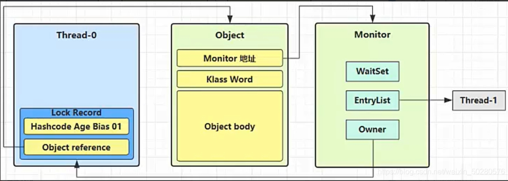

# 参考
https://zhangc233.github.io/2021/05/26/%E5%A4%9A%E7%BA%BF%E7%A8%8B%E4%B8%8E%E9%AB%98%E5%B9%B6%E5%8F%91%E2%80%94%E5%85%B1%E4%BA%AB%E6%A8%A1%E5%9E%8B%E4%B9%8B%E7%AE%A1%E7%A8%8B/

# 1.概念
1. 临界区：一段代码块内如果存在对共享资源的多线程读写操作，称这段代码块为临界区
2. 竞态条件：多个线程在临界区内执行，由于代码的执行序列不同而导致结果无法预测，称之为发生了竞态条件

# 2.synchronized 解决方案
避免临界区中的竞态条件发生，由多种手段可以达到
- 阻塞式解决方案：synchronized 、Lock
- 非阻塞式解决方案：原子变量

Synchronized加在方法上：
- 成员方法，锁对象
- 静态方法，锁类

# 3.变量的线程安全分析
## 3.1 成员变量和静态变量的线程安全分析
- 如果它们没有共享，则线程安全。
- 如果它们被共享了，根据它们的状态是否能够改变，又分两种情况：
   - 如果只有读操作，则线程安全；
   - 如果有读写操作，则这段代码是临界区，需要考虑线程安全。

## 3.2 局部变量线程安全分析 Test04
- 局部变量是线程安全的。
- 但局部变量引用的对象则未必：
    - 如果该对象没有逃离方法的作用范围，它是线程安全的；
    - 如果该对象逃离方法的作用范围，需要考虑线程安全

## 3.3 常见线程安全类
- String
- Integer
- StringBuffer
- Random
- Vector （List 的线程安全实现类）
- Hashtable （Hash 的线程安全实现类）
- java.util.concurrent 包下的类

# 4. Monitor管程
## 4.1 Java对象头
普通对象头：

数组对象头：

MarkWord结构：

## 4.2 Monitor
每个 java 对象都可以关联一个 Monitor，如果使用 synchronized 给对象上锁（重量级），该对象头的 Mark Word 中就被设置为指向 Monitor 对象的指针

- WaitSet：之前获得过锁，但条件不满足进入 WAITING 状态的线程
- EntryList：阻塞队列
- Owner：执行同步代码块的线程，只能有一个

# 5. Synchronized锁优化
## 5.1 轻量级锁

- 在线程中开辟一块LockRecord来复制MarkWord
- CAS比较并交换LockRecord地址和MarkWord地址
- 失败的两种情况：
    - 其他线程已持有，则变为自旋锁，自旋一定数量后，失败则进入锁膨胀阶段
    - 本线程已持有，添加一个地址为null的LockRecord，锁重入
- 解锁：如果获取的锁记录取值不为 null，那么使用 cas 将 Mark Word 的值恢复给对象
    - 成功则解锁成功
    - 失败，则说明轻量级锁进行了锁膨胀或已经升级为重量级锁，进入重量级锁解锁流程。

## 5.2 锁膨胀

- 引入Monitor锁，Thread1进入阻塞队列

## 5.3 自旋优化
- 重量级锁竞争的时候，还可以使用自旋来进行优化，如果当前线程自旋成功（即在自旋的时候持锁的线程释放了锁），那么当前线程就可以不用进行上下文切换就获得了锁
- 自旋会占用 CPU 时间，单核 CPU 自旋就是浪费，多核 CPU 自旋才能发挥优势

## 5.4 偏向锁 Biased_Lock 
- 在轻量级锁中可以发现，如果同一个线程对同一个对象进行重入锁时，也需要执行 CAS 操作，也有耗时
- Java6 开始引入了偏向锁，只有第一次使用 CAS 时将对象的 Mark Word 头设置为偏向线程 ID，之后这个入锁线程再进行重入锁时，发现线程 ID 是自己的，那么就不用再进行 CAS 了
- 轻量级锁用LockRecord替换MarkWord
- 偏向锁用ThreadID替换MarkWord

撤销偏向锁：
- hashcode方法
- 其它线程使用对象
- 调用 wait/notify

批量重偏向：修改ThreadID
- 如果对象虽然被多个线程访问，但是线程间不存在竞争，这时偏向 t1 的对象仍有机会重新偏向 t2 (重偏向会重置 Thread ID)。
- 当撤销超过 20 次后（超过阈值），JVM 会觉得是不是偏向错了，这时会在给对象加锁时，重新偏向至加锁线程
 
批量撤销
- 当撤销偏向锁的阈值超过 40 以后，就会将整个类的对象都改为不可偏向的
 
## 5.5 锁消除
JIT会对synchronized进行优化，消除一些不必要的同步锁
- `-XX:+EliminateLocks`
  

