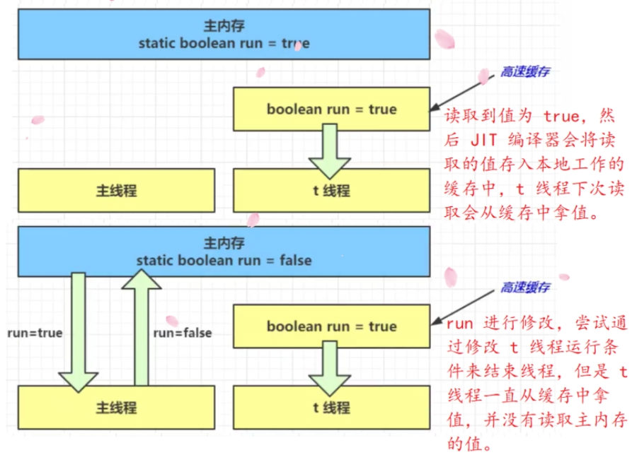
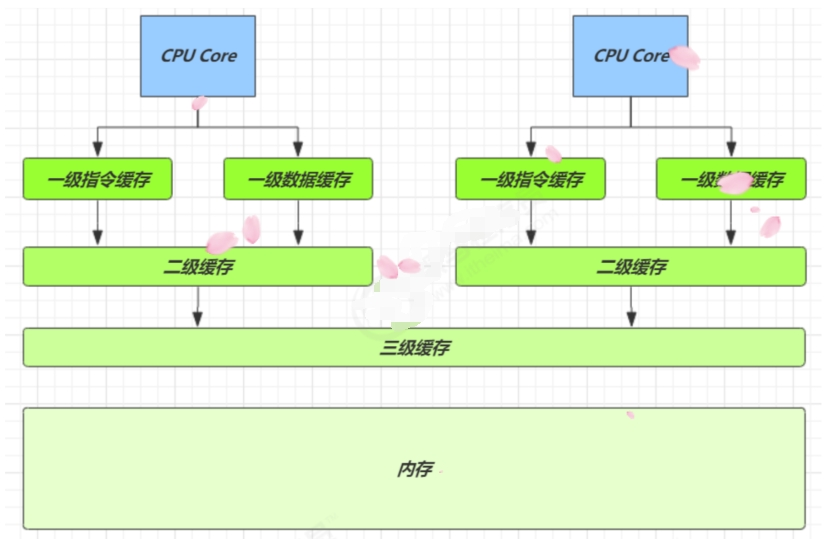
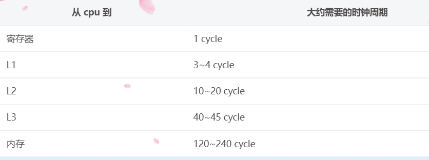

# 1.JMM
JMM 即 Java Memory Model，它定义了主存（共享内存）、工作内存（线程私有）的抽象概念，底层对应着 CPU 寄存器、缓存、硬件内存、 CPU 指令优化等。

JMM 体现在以下几个方面：
- 原子性 - 保证指令不会受到线程上下文切换的影响。
- 可见性 - 保证指令不会受 cpu 缓存的影响。
- 有序性 - 保证指令不会受 cpu 指令并行优化的影响。

# 2.可见性
参考Test01_Volatile

示意图：

可见性 vs 原子性
- synchronized 语句块既可以保证代码块的原子性，也同时保证代码块内变量的可见性。但缺点是 synchronized 是属于重量级操作，性能相对更低
- volatile保证的是在多个线程之间，一个线程对 volatile 变量的修改对另一个线程可见，但不能保证原子性，仅用在一个写线程，多个读线程的情况

# 3.Volatile实现两阶段终止
参考 Test02_twoparsestop

# 4.Balking 犹豫模式
Balking （犹豫）模式用在一个线程发现另一个线程或本线程已经做了某一件相同的事，那么本线程就无需再做 了，直接结束返回，有点类似单例
- 用一个标记来判断该任务是否已经被执行过了；
- 需要避免线程安全问题；
- 加锁的代码块要尽量的小，以保证性能。

# 5.CPU缓存结构原理
## 5.1 CPU缓存结构

速度比较：

## 5.2 CPU缓存读
读取数据流程如下：
- 根据低位，计算在缓存中的索引；
- 判断是否有效：
    - 0 去内存读取新数据更新缓存行；
    - 1 再对比高位组标记是否一致：
        - 一致，根据偏移量返回缓存数据；
        - 不一致，去内存读取新数据更新缓存行

## 5.3 内存屏障
Memory Barrier（Memory Fence）：
- 可见性
    - 写屏障（sfence）保证在该屏障之前的，对共享变量的改动，都同步到主存当中。
    - 而读屏障（lfence）保证在该屏障之后，对共享变量的读取，加载的是主存中最新数据。
- 有序性
    - 写屏障会确保指令重排序时，不会将写屏障之前的代码排在写屏障之后。
    - 读屏障会确保指令重排序时，不会将读屏障之后的代码排在读屏障之前。

# 6.volatile 原理
volatile 的底层实现原理是内存屏障，Memory Barrier
- 对 volatile 变量的写指令后会加入写屏障。
- 对 volatile 变量的读指令前会加入读屏障。

如何保证可见性：
- 写屏障（sfence）保证在该屏障之前的，对共享变量的改动，都同步到主存中
- 读屏障（lfence）保证在该屏障之后，对共享变量的读取，加载的是主存中最新数据

如何保证有序性
- 写屏障会确保指令重排时，不会将写屏障之前的代码排在写屏障之后
- 读屏障会确保指令重排时，不会将读屏障之后的代码排在读屏障之前

DCL双重检查锁定
- 参考Test04_Singleton

# 7.happens-before 先行性原则
1. 程序顺序规则：一个线程内的任意操作，先于该线程中任意后续操作
2. 锁规则：对一个锁的解锁先于之后对这个锁的加锁
3. volatile变量规则：对一个volatile变量的写， 先于之后对该变量的读
4. 传递规则：A先于B，B先于C，则A先于C
5. 线程启动原则：Thread对象的start()方法先于对该线程的任何操作
6. 线程中断原则：线程执行interrupt操作先于获取到中断信息
7. 线程终结规则：线程的所有操作先于线程死亡
8. 对象终结规则：一个对象的初始化完成先于finalize()方法
9. join规则：ThreadB.join()，B线程中任意操作先于B线程返回

# 8.其他
- Test05_exercise：练习

