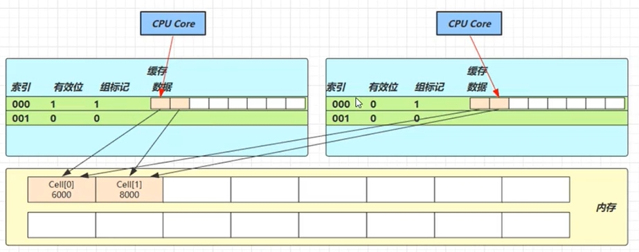
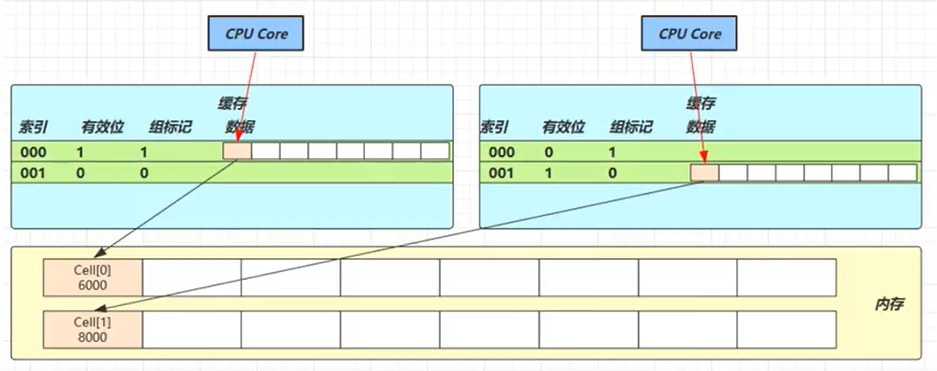
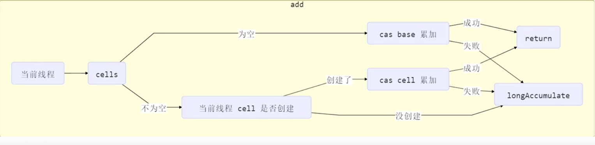

# 1.CAS与Volatile
## 1.1 CAS
参考：Test01_Account

CAS：compareAndSet/CompareAndSwap，它必须是原子操作

CAS实现原理：
- CAS 的底层是 lock cmpxchg 指令（X86 架构），在单核 CPU 和多核 CPU 下都能够保证【比较-交换】的原子性。
- 在多核状态下，某个核执行到带 lock 的指令时，CPU 会让总线锁住，当这个核把此指令执行完毕，再开启总线。
    - 这个过程中不会被线程的调度机制所打断，保证了多个线程对内存操作的准确性，是原子的 。

## 1.2 volatile
- CAS操作需要volatile支持
- 获取共享变量时，为了保证该变量的可见性，需要使用 volatile 修饰

## 1.3 为什么无锁并发效率高
- 无锁情况下，即使重试失败，线程始终在高速运行，没有停歇，而 synchronized 会让线程在没有获得锁的时候，发生上下文切换，进入阻塞
- 但无锁情况下，因为线程要保持运行，需要额外 CPU 的支持
    - CPU不足仍然会导致上下文切换

## 1.4 CAS特点
结合 CAS 和 volatile 可以实现无锁并发，适用于线程数少、多核 CPU 的场景下
- CAS 是基于乐观锁的思想：最乐观的估计，不怕别的线程来修改共享变量
- synchronized 是基于悲观锁的思想：最悲观的估计，得防着其它线程来修改共享变量
- CAS 体现的是无锁并发、无阻塞并发，请仔细体会这两句话的意思。
    - 因为没有使用 synchronized，所以线程不会陷入阻塞，这是效率提升的因素之一。
    - 但如果竞争激烈(写操作多)，可以想到重试必然频繁发生，反而效率会受影响

# 2.原子整数
JUC 并发包提供了一些并发工具类，这里把它分成五类，分别是：
- 原子类
    - AtomicInteger：整型原子类
    - AtomicLong：长整型原子类
    - AtomicBoolean ：布尔型原子类
- 原子引用
- 原子数组
- 字段更新器
- 原子累加器

# 3.原子引用
为什么需要原子引用类型
- 保证引用类型的共享变量是线程安全的（确保这个原子引用没有引用过别人）。
- 基本类型原子类只能更新一个变量，如果需要原子更新多个变量，需要使用引用类型原子类

原子引用：
- AtomicReference：引用类型原子类。
- AtomicStampedReference：原子更新带有版本号的引用类型，该类将整数值与引用关联起来，可以解决使用 CAS 进行原子更新时可能出现的 ABA 问题。
- AtomicMarkableReference ：原子更新带有标记的引用类型。该类将 boolean 标记与引用关联起来
- 参考：Test03_DecimalAccount.java

## ABA问题
AtomicReference主线程仅能判断出共享变量的值与最初值 A 是否相同，不能感知到这种从 A 改为 B 又改回 A 的情况
解决：
- AtomicStampedReference：版本号
- AtomicMarkableReference：是否更改

# 4.原子数组
使用原子的方式更新数组里的某个元素：
- AtomicIntegerArray：整形数组原子类
- AtomicLongArray：长整形数组原子类
- AtomicReferenceArray ：引用类型数组原子类
- 使用原子数组可以保证元素的线程安全
- 参考 Test07_AtomicIntegerArray

# 5.原子字段更新器
- AtomicReferenceFieldUpdater // 域 字段
- AtomicIntegerFieldUpdater
- AtomicLongFieldUpdater
- 利用字段更新器，可以针对对象的某个域（Field）进行原子操作，只能配合 volatile 修饰的字段使用，否则会出现异常

# 6.原子累加器
LongAdder
- 参考：Test09_LongAdder

## 6.1 LongAdder原理
关键域：
- cells：累加单元数组
- base：基础值，没有竞争则累加这个域
- cellsBusy：cells创建或扩容时，置为1，表示加锁

CAS加锁
- 参考：Test10_LockCAS

## 6.2 缓存行伪共享

- 两个线程都需要`cell[0]`和`cell[1]`数据
- 一个线程更新了`cell[0]`,另一个线程缓存失效，整个缓存行重新加载

解决：

- `@sun.misc.Contended`注解
- 使用此注解的对象或字段的前后各增加 128 字节大小的padding，从而让 CPU 将对象预读至缓存时占用不同的缓存行，这样，不会造成对方缓存行的失效

## 6.3 add方法实现

longAccumulate见：Test11_LongAdderSource

# 7.Unsafe方法
## 7.1 Unsafe 对象的获取
Unsafe 对象提供了非常底层的操作内存、线程的方法，Unsafe 对象不能直接调用，只能通过反射获得。LockSupport 的 park 方法，CAS 相关的方法底层都是通过Unsafe类来实现的
- Test12_Unsafe01

## 7.2 Unsafe 模拟实现 cas 操作
- Test12_Unsafe02

## 7.3 Unsafe 模拟实现原子整数
- Test12_Unsafe03

