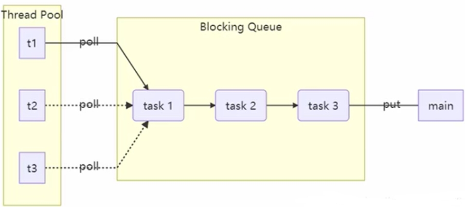
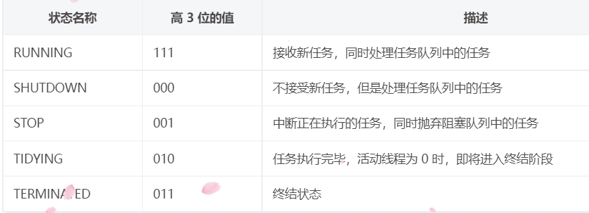
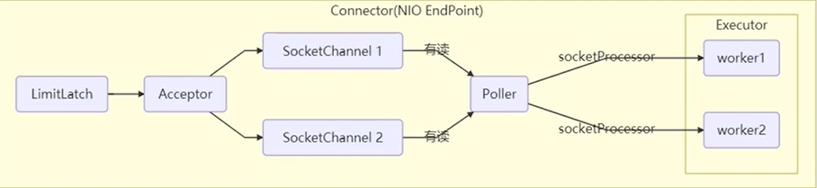
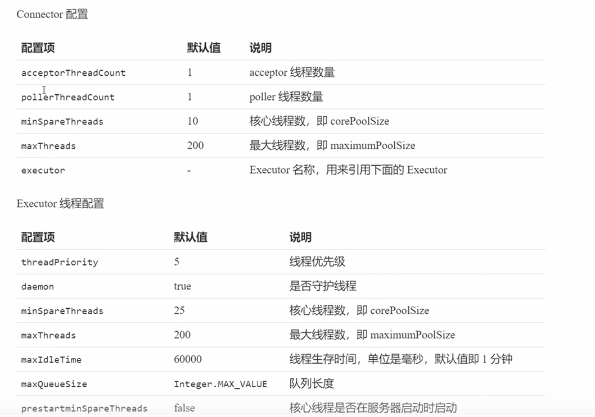
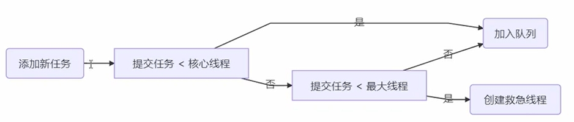

# 1.线程池
线程池提供了一种限制和管理资源（包括执行一个任务）的方式。 每个线程池还维护一些基本统计信息

使用线程池的好处：
- 降低资源消耗：通过重复利用已创建的线程降低线程创建和销毁造成的消耗。
- 提高响应速度：当任务到达时，任务可以不需要等到线程创建就能立即执行。
- 提高线程的可管理性：线程是稀缺资源，如果无限制的创建，不仅会消耗系统资源，还会降低系统的稳定性，使用线程池可以进行统一的分配，调优和监控。

自定义线程池


# 2.ThreadPoolExecutor
## 2.1 线程池状态
ThreadPoolExecutor 使用 int 的高 3 位来表示线程池状态，低 29 位表示线程数量，ThreadPoolExecutor 类中的线程状态变量


线程池状态和线程池中线程的数量由一个原子整型 ctl 来共同表示。使用一个数来表示两个值的主要原因是：可以通过一次 CAS 同时更改两个属性的值

## 2.2 构造方法
```
public ThreadPoolExecutor(int corePoolSize,
                          int maximumPoolSize,
                          long keepAliveTime,
                          TimeUnit unit,
                          BlockingQueue<Runnable> workQueue,
                          ThreadFactory threadFactory,
                          RejectedExecutionHandler handler)
```
- corePoolSize：核心线程数
- maximumPoolSize：最大线程数
- maximumPoolSize - corePoolSize = 救急线程数
- keepAliveTime：救急线程空闲时的最大生存时间
- unit：时间单位
- workQueue：阻塞队列（存放任务）
    - 有界阻塞队列：ArrayBlockingQueue
    - 无界阻塞队列：LinkedBlockingQueue
    - 最多只有一个同步元素的队列：SynchronousQueue
    - PriorityBlockingQueue：优先队列
- threadFactory：线程工厂（给线程取名字）
- handler：拒绝策略

线程池工作方法：
- 线程池中刚开始没有线程，当一个任务提交给线程池后，线程池会创建一个新线程来执行任务。
- 当线程数达到 corePoolSize 没有线程空闲时，这时再加入任务，新加的任务会被加入 workQueue 队列排 队，直到有空闲的线程。
- 如果队列选择了有界队列，那么任务超过了队列大小时，会创建 maximumPoolSize - corePoolSize 数目的线程来救急。
- 如果线程数达到 maximumPoolSize 仍然有新任务，这时会执行拒绝策略。拒绝策略 jdk 提供了下面的前 4 种实现，其它的著名框架也提供了实现。
    - ThreadPoolExecutor.AbortPolicy：让调用者抛出 RejectedExecutionException 异常，这是默认策略。
    - ThreadPoolExecutor.CallerRunsPolicy：让调用者运行任务。
    - ThreadPoolExecutor.DiscardPolicy：放弃本次任务。
    - ThreadPoolExecutor.DiscardOldestPolicy：放弃队列中最早的任务，本任务取而代之。
    - Dubbo 的实现：在抛出 RejectedExecutionException 异常之前会记录日志，并 dump 线程栈信息，方便定位问题。
    - Netty 的实现：创建一个新线程来执行任务。
    - ActiveMQ 的实现：带超时等待（60s）尝试放入队列
    - PinPoint 的实现，它使用了一个拒绝策略链，会逐一尝试策略链中每种拒绝策略。
- 当高峰过去后，超过 corePoolSize 的救急线程如果一段时间没有任务做，需要结束节省资源，这个时间由 keepAliveTime 和 unit 来控制

# 3.Executors
- newFixedThreadPool：创建固定大小的线程池
    - 核心线程数 = 最大线程数（没有救急线程被创建），因此也无需超时时间。
    - 阻塞队列是无界的（LinkedBlockingQueue），可以放任意数量的任务。
    - 适用于任务量已知，相对耗时的任务
- newCachedThreadPool：缓冲线程池
    - 核心线程数是 0，最大线程数是 Integer.MAX_VALUE，救急线程的空闲生存时间是 60s，意味着全部都是救急线程（60s 后没有任务就回收），救急线程可以无限创建。
    - 队列采用了 SynchronousQueue 实现特点是它没有容量，没有线程来取任务是放不进去的（一手交钱、一手交 货）SynchronousQueue。
    - 整个线程池表现为线程数会根据任务量不断增长，没有上限，当任务执行完毕，空闲1分钟后释放线程。
    - 适合任务数比较密集，但每个任务执行时间较短的情况。
- newSingleThreadExecutor：单例线程池
    - 希望多个任务排队执行。线程数固定为 1，任务数多于 1 时，会放入无界队列排队。任务执行完毕，这唯一的线程也不会被释放
- Executors 返回线程池对象的弊端：
    - FixedThreadPool 和 SingleThreadExecutor：允许请求的队列长度为 Integer.MAX_VALUE，可能堆积大量的请求，从而导致 OOM。
    - CachedThreadPool 和 ScheduledThreadPool：允许创建的线程数量为 Integer.MAX_VALUE ，可能会创建大量线程，从而导致 OOM。
    - 其实就是使用有界队列，控制线程创建数量。
    - 此外，除了避免 OOM 的原因之外，不推荐使用 Executors提供的线程池的原因还有：
        - 实际使用中需要根据自己机器的性能、业务场景来手动配置线程池的参数比如核心线程数、使用的任务队列、饱和策略等等。
        - 我们应该显式地给线程池命名，这样有助于我们定位问题

# 4.线程池操作
## 4.1 提交任务 Test04_Submit
- execute：执行任务，执行任务
- submit：提交任务，返回Future
- invokeAll：批量提交任务
- invokeAny：批量提交任务，一个结束，其他取消

## 4.2 停止任务 Test05_Shutdown
shutdown：
- 线程池状态变为 SHUTDOWN
- 不会接收新任务
- 但已提交任务会执行完，包括等待队列里面的
- 此方法不会阻塞调用线程的执行

shutdownNow：
- 线程池状态变为 STOP
- 不会接收新任务
- 会将队列中的任务返回
- 并用 interrupt 的方式中断正在执行的任务

其它方法：
- isShutdown：不在 RUNNING 状态的线程池，此方法就返回 true
- isTerminated：线程池状态是否是 TERMINATED
- awaitTermination：调用 shutdown 后，由于调用使线程结束线程的方法是异步的并不会等待所有任务运行结束就返回，因此如果它想在线程池 TERMINATED 后做些其它事情，可以利用此方法等待


# 5.工作线程模式
定义：
- 让有限的工作线程（Worker Thread）来轮流异步处理无限多的任务。也可以将其归类为分工模式，它的典型实现就是线程池，也体现了经典设计模式中的享元模

饥饿现象：Test06_Starvation
- 固定大小线程池会有饥饿现象，解决方法可以增加线程池的大小，不过不是根本解决方案，还是前面提到的，不同的任务类型，采用不同的线程池

# 6.创建多大的线程池合适
- CPU 密集型运算 通常采用 cpu 核数 + 1 能够实现最优的 CPU 利用率，+1 是保证当线程由于页缺失故障（操作系统）或其它原因导致暂停时，额外的这个线程就能顶上去，保证 CPU 时钟周期不被浪费。
- I/O 密集型运算 CPU 不总是处于繁忙状态，例如，当你执行业务计算时，这时候会使用 CPU 资源，但当你执行 I/O 操作时、远程 RPC 调用时，包括进行数据库操作时，这时候 CPU 就闲下来了，你可以利用多线程提高它的利用率。

经验公式如下：
- 线程数 = 核数 * 期望 CPU 利用率 * 总时间(CPU计算时间+等待时间) / CPU 计算时间。
    - 例如 4 核 CPU 计算时间是 50% ，其它等待时间是 50%，期望 cpu 被 100% 利用，套用公式 4 * 100% * 100% / 50% = 8。
    - 例如 4 核 CPU 计算时间是 10% ，其它等待时间是 90%，期望 cpu 被 100% 利用，套用公式 4 * 100% * 100% / 10% = 40

# 7.Timer类定时执行任务 Test07_Timer
优点：
- 简单易用

缺点
- 所有任务都是由同一个线程来调度，因此所有任务都是串行执行的
- 一个任务异常会影响到后续任务

# 8.ScheduledExecutorService
参考：Test08_ScheduledExecutorService
线程池应用：Test08_NewScheduledThreadPool

ScheduledExecutorService
- 线程数固定，任务数多于线程数时，会放入无界队列排队。任务执行完毕，这些线程也不会被释放，用来执行延迟或反复执行的任务
- scheduleAtFixedRate
- scheduleWithFixedDelay

# 9.正确处理执行任务异常
- try/catch 代码块处理线程异常
- 使用Future封装

# 10.Tomcat线程池

- LimitLatch 用来限流，可以控制最大连接个数，类似JUC中的 Semaphore。
- Acceptor 只负责【接收新的 socket 连接】。
- Poller 只负责监听 socket channel 是否有【可读的 I/O 事件】。
- 一旦可读，封装一个任务对象（socketProcessor），提交给 Executor 线程池处理。
- Executor 线程池中的工作线程最终负责【处理请求】

Tomcat 线程池扩展了 ThreadPoolExecutor，行为稍有不同
- 如果总线程数达到 maximumPoolSize，
    - 这时不会立刻抛 RejectedExecutionException 异常
    - 而是再次尝试将任务放入队列，如果还失败，才抛出 RejectedExecutionException 异常

Tomcat线程池配置：


Tomcat队列实现：


# 11.Fork-Join线程池
概念：
- Fork/Join 是 JDK 1.7 加入的新的线程池实现，它体现的是一种分治思想，适用于能够进行任务拆分的 cpu 密集型运算
- Fork/Join 在分治的基础上加入了多线程，可以把每个任务的分解和合并交给不同的线程来完成，进一步提升了运
- Fork/Join 默认会创建与 cpu 核心数大小相同的线程池


