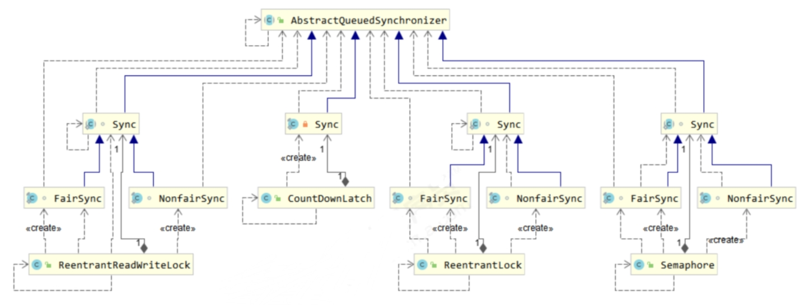

# 1.AQS
## 1.1 概述
队列同步器AbstractQueuedSynchronizer(AQS)，用来构建锁或者其他同步线程的基础框架

AQS与Lock的关系：
- AQS面向锁的实现者
- Lock面向锁的使用者

特点：
- 用state属性来表示资源的状态（分独占模式和共享模式）
    - getState：获取 state 状态。
    - setState：设置 state 状态。
    - compareAndSetState：cas 机制设置 state 状态。
    - 独占模式只有一个线程能够访问资源，而共享模式可以允许多个线程访问资源。
- 提供了基于 FIFO 的等待队列，类似于 Monitor 的EntryList
- 条件变量来实现等待、唤醒机制，支持多个条件变量，类似于 Monitor 的WaitSet

可重写方法：需要修改锁状态
- tryAcquire(int)：独占式获取同步状态
- tryRelease(int)：独占式释放同步状态
- tryAcquireShared(int)：共享式获取同步状态
- tryReleaseShared(int)：共享式释放同步状态
- isHeldExclusively()：当前同步器是否被独占

## 1.2 AQS使用

# 2.ReentrantLock原理
https://zhangc233.github.io/2021/06/12/%E5%A4%9A%E7%BA%BF%E7%A8%8B%E4%B8%8E%E9%AB%98%E5%B9%B6%E5%8F%91%E2%80%94AQS%E3%80%81ReentrantLock%E3%80%81%E8%AF%BB%E5%86%99%E9%94%81%E5%8E%9F%E7%90%86/#ReentrantLock-%E5%8E%9F%E7%90%86

笔记太长，懒得搬，看懂最重要
- 非公平锁实现原理
- 锁重入原理
    - ownerThread所有线程为自己则重入计数加1
- 可打断原理
    - 可打断锁抛出异常
    - 不可打断锁只是重置标记
- 公平锁实现原理
    - 与非公平锁实现差别主要在tryAquire方法
- 条件变量实现原理
    - 每个条件变量对应一个等待队列，实现类是ConditionObject

# 3.ReentrantReadWriteLock 读写锁
当读操作远远高于写操作时，这时候使用读写锁让读 - 读可以并发，提高性能。读 - 写，写 - 写都是相互互斥的
- 代码：Test02_ReentrantReadWriteLock

注意事项：
- 读锁不支持条件变量
- 重入时升级不支持：即持有读锁的情况下去获取写锁，会导致获取写锁永久等待
- 重入时降级支持：即持有写锁的情况下去获取读锁

Test03_GenericDao：读写锁使用示例，缓存

## 3.1 ReentrantReadWriteLock原理
https://zhangc233.github.io/2021/06/12/%E5%A4%9A%E7%BA%BF%E7%A8%8B%E4%B8%8E%E9%AB%98%E5%B9%B6%E5%8F%91%E2%80%94AQS%E3%80%81ReentrantLock%E3%80%81%E8%AF%BB%E5%86%99%E9%94%81%E5%8E%9F%E7%90%86/#%E8%AF%BB%E5%86%99%E9%94%81%E5%8E%9F%E7%90%86-1

# 4. StampedLock 读写锁
该类自 JDK 8 加入，是为了进一步优化读性能，它的特点是在使用读锁、写锁时都必须配合【戳】使用
参考：Test04_StampLock

注意：
- StampedLock：不支持条件变量
- StampedLock：不支持锁重入

# 5. Semaphore 信号量
限制能访问共享资源的线程上限
- 只是限制线程数量，而不是限制资源数

代码示例：
- Test05_Semaphore
- Test06_Semaphore02
- Test07_PoolSemaphore

Semaphore原理：
https://zhangc233.github.io/2021/06/12/%E5%A4%9A%E7%BA%BF%E7%A8%8B%E4%B8%8E%E9%AB%98%E5%B9%B6%E5%8F%91%E2%80%94AQS%E3%80%81ReentrantLock%E3%80%81%E8%AF%BB%E5%86%99%E9%94%81%E5%8E%9F%E7%90%86/#Semaphore%E5%8E%9F%E7%90%86

# 6.CountdownLatch倒计时锁
CountDownLatch 允许多线程阻塞在一个地方，直至所有线程的任务都执行完毕
- 用来进行线程同步协作，等待所有线程完成倒计时。 其中构造参数用来初始化等待计数值，await () 用来等待计数归零，countDown () 用来让计数减一

代码示例：
- Test08_CountDownLatch
- Test08_CountDownLatch02

# 7.CyclicBarrier 
CyclicBarrier和CountDownLatch的区别：
- CountDownLatch的计数器只能使用一次，CyclicBarrier计数器可以使用reset()方法重置，如果出错可以重置并重新执行线程
- CyclicBarrier的其他有用方法：
    - getNumberWaiting()：获取阻塞的线程数量
    - isBroken()：了解阻塞线程是否被中断过(可在异常中获取)

代码示例：
- Test09_CyclicBarrier

注意：
- CyclicBarrier计数需要与线程数相等

