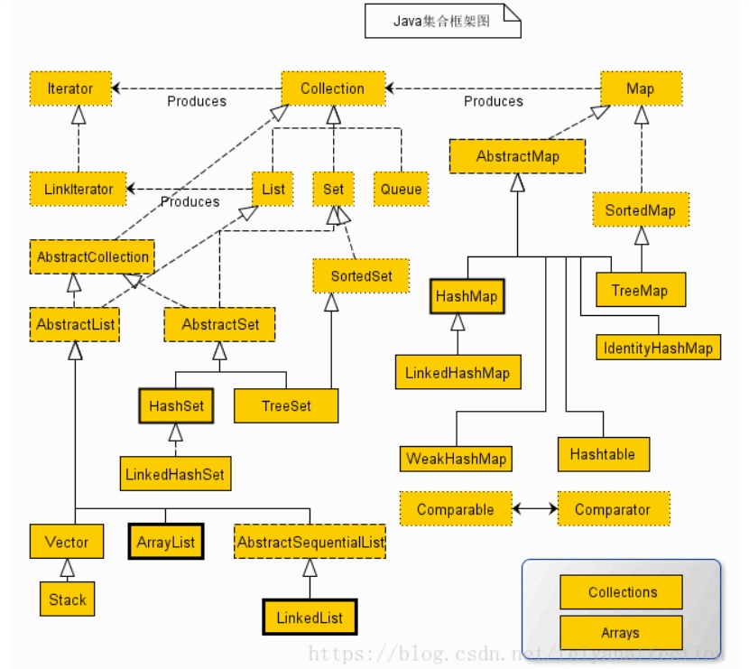

# 结构

# 目录
- Test01_LinkedList
- Test02_ArrayList
- Test03_HashSet
- Test04_LinkedHashSet：有序Set
- Test05_Hashtable
- Test06_HashMap
- Test07_LinkedHashMap
- Test08_WeakHashMap：弱引用HashMap
- Test09_TreeMap
- Test10_TreeSet
- Test11_Vector
- Test12_Iterator：集合遍历
- Test13_ListIterator
- Test14_ArrayDeque：数组双端队列
- Test15_PriorityQueue：优先级队列
- Test16_Stack：栈
- Test17_Properties
- Test18_EnumSet：EnumSet枚举集合,EnumMap枚举映射
- Test19_IdentityHashMap：标识散列映射
- Test20_NavigableSet：子视图导航Set
- Test21_NavigableMap：子视图导航Map
- Test22_CollectionsSync：Collections同步视图
- Test23_CollectionsUnmodify：Collections不可变视图
- Test24_CollectionsChecked：Collections检查型视图
- Test25_BitSet：位集，提供位操作
