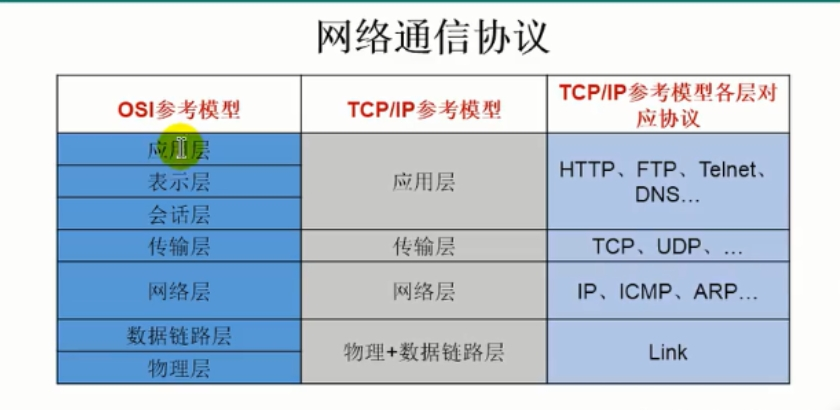
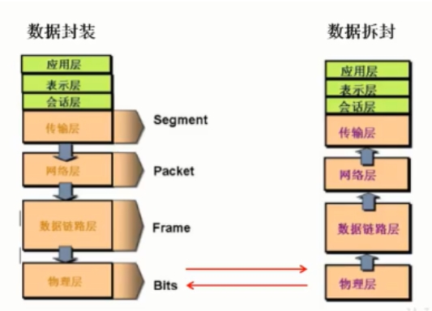
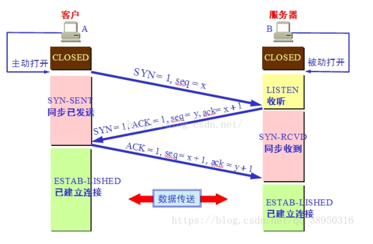
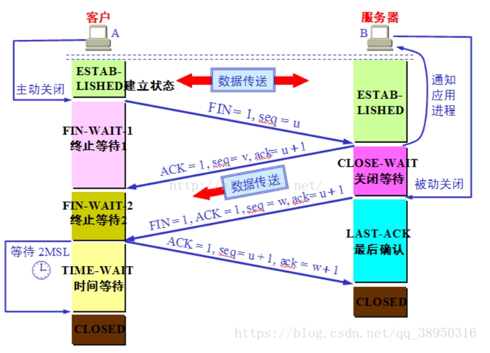

# 1.网络通信协议

数据传输示例:

# 2.TCP
标志位：
- URG（紧急）: 为1时表明紧急指针字段有效
- ACK（确认）：为1时表明确认号字段有效
- PSH（推送）：为1时接收方应尽快将这个报文段交给应用层
- RST（复位）：为1时表明TCP连接出现故障必须重建连接
- SYN（同步）：在连接建立时用来同步序号
- FIN （终止）：为1时表明发送端数据发送完毕要求释放连接
- seq：序列号
- ack：

## TCP三次握手

- 建立连接时，客户端发送SYN包（SYN=i）到服务器，并进入到SYN-SEND状态，等待服务器确认
- 服务器收到SYN包，必须确认客户的SYN（ack=i+1）,同时自己也发送一个SYN包（SYN=k）,即SYN+ACK包，此时服务器进入SYN-RECV状态
- 客户端收到服务器的SYN+ACK包，向服务器发送确认报ACK（ack=k+1）,此包发送完毕，客户端和服务器进入ESTABLISHED状态，完成三次握手，客户端与服务器开始传送数据

## TCP四次挥手

- 第一次挥手：Client发送一个FIN，用来关闭Client到Server的数据传送，Client进入FIN_WAIT_1状态。
- 第二次挥手：Server收到FIN后，发送一个ACK给Client，确认序号为收到序号+1（与SYN相同，一个FIN占用一个序号），Server进入CLOSE_WAIT状态。
- 第三次挥手：Server发送一个FIN，用来关闭Server到Client的数据传送，Server进入LAST_ACK状态。
- 第四次挥手：Client收到FIN后，Client进入TIME_WAIT状态，接着发送一个ACK给Server，确认序号为收到序号+1，Server进入CLOSED状态，完成四次挥手。

# 3.UDP
- UDP是传输层的协议，功能即为在IP的数据报服务之上增加了最基本的服务：复用和分用以及差错检测。
- UDP提供不可靠服务，具有TCP所没有的优势：
    - UDP无连接，时间上不存在建立连接需要的时延
    - 分组首部开销小，TCP首部20字节，UDP首部8字节
    - UDP没有拥塞控制，能容忍一些数据的丢失，但是不能允许有较大的时延（比如实时视频，直播等）
    - UDP提供尽最大努力的交付，不保证可靠交付
    - UDP是面向报文的，对应用层交下来的报文，添加首部后直接向下交付为IP层，既不合并，也不拆分，保留这些报文的边界
    - UDP常用一次性传输比较少量数据的网络应用，如DNS,SNMP等

