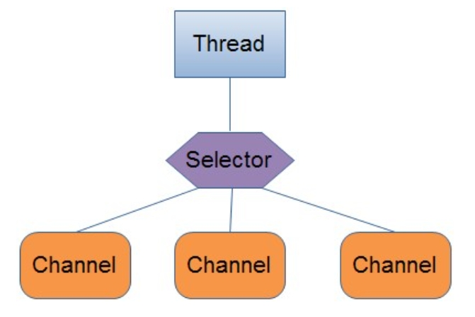
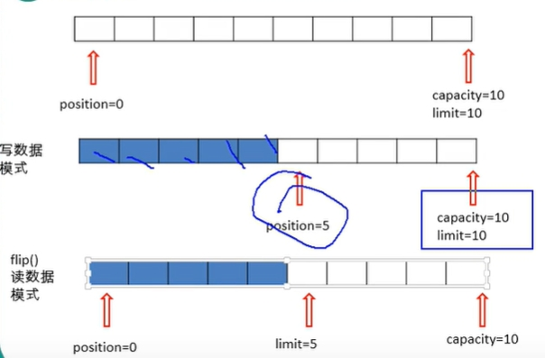
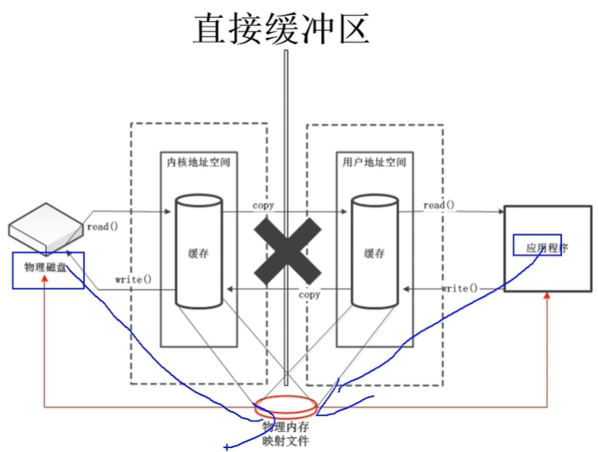

# 1.NIO中的概念
- Channel：通道
- Buffer：缓冲区
- Selector：选择器

# 2.Channel：通道

- Channel和传统IO中的Stream很相似,主要区别：
    - 通道是双向的，通过一个Channel既可以进行读，也可以进行写
    - 而Stream只能进行单向操作，通过一个Stream只能进行读或者写
- channel本身不存储数据，因此需要配合Buffer缓冲区进行传输

常用的通道：
- FileChannel
- SocketChanel
- ServerSocketChannel
- DatagramChannel
- Pipe.SinkChannel
- Pipe.SourceChannel

# 3.Buffer：缓冲区
在Java NIO中负责数据的存取，缓冲区就是数组，用于存储不同数据类型的数据
- `ByteBuffer`：非常重要
- `CharBuffer`
- `ShortBuffer`
- `IntBuffer`
- `LongBuffer`
- `FloatBuffer`
- `DoubleBuffer`

Buffer的四个核心属性：
- `capacity`：表示缓冲区中最大存储数据的容量，一旦声明不能改变
- `limit`：界限，表示缓冲区中可以操作数据的大小(limit后数据不能进行读写)
- `position`：位置，表示缓冲区中正在操作的数据的位置
- `mark`：标记当前的position位置，可用reset恢复mark的位置

直接缓冲区与非直接缓冲区
- 通过allocate()方法分配缓冲区，将缓冲区建立在JVM的内存中
- 通过allocateDirect()方法分配直接缓冲区，将缓冲区建立在物理内存中可以提高效率

# 4.Selector 选择器
Selector 一般称 为选择器 ，当然你也可以翻译为 多路复用器 。它是Java NIO核心组件中的一个，用于检查一个或多个NIO Channel（通道）的状态是否处于可读、可写。如此可以实现单线程管理多个channels,也就是可以管理多个网络链接

主要使用方式：
- 创建Selector：`Selector selector = Selector.open();`
- 注册Channel到Selector：`channel.register(selector, Selectionkey.OP_READ)`

# 5.Pipe 管道

JavaNIO管道是两个线程之间的单向数据连接，有两个通道：
- Sink通道：数据写入
- Source通道：数据读取

