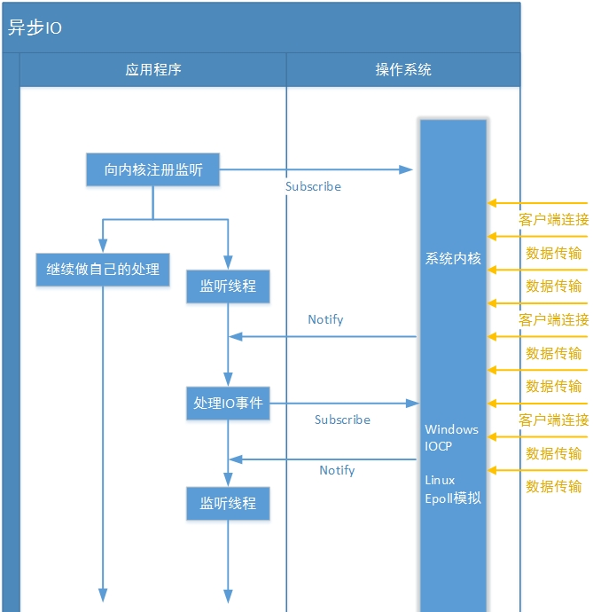

# 1.AIO简介
AIO是异步非阻塞的,也叫做NIO2,jdk7开始支持,主要包含以下接口/实现类：
- AsynchronousChannel
    - AsynchronousSocketChannel
    - AsynchronousServerSocketChannel
    - AsynchronousFileChannel
    - AsynchronousDatagramChannel

# 2.AIO执行流程图

- 和同步IO一样，异步IO也是由操作系统进行支持的。微软的windows系统提供了一种异步IO技术：IOCP（I/O CompletionPort，I/O完成端口）
- Linux下由于没有这种异步IO技术，所以使用的是epoll（一种多路复用IO技术的实现）对异步IO进行模拟

  

