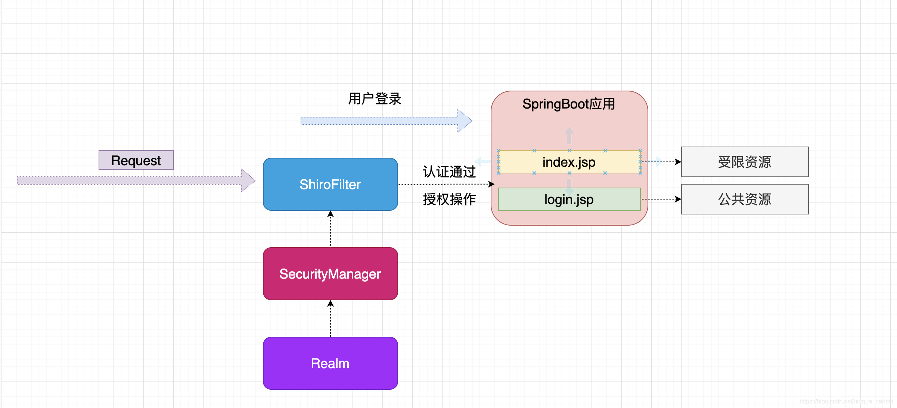

# 1.Shiro核心概念
- Subject：操作主体
- SecurityManager：安全管理器，对全部的subject进行安全管理
    - 通过Authenticator进行认证
    - 通过Authorizer进行授权
    - 通过SessionManager进行会话管理
- Authenticator：认证器，对用户身份进行认证
- Authorizer：授权器，用户通过认证器认证通过后授权
- Realm：领域，相当于datasource数据源，通过Realm获取用户权限数据
- SessionManager：会话管理，不依赖web容器的session
- SessionDAO：会话dao,对session会话操作的一套接口
- CacheManager：缓存管理，将用户权限数据存储在缓存
- Cryptography：密码管理，shiro提供了一套加密/解密的组件

# 2.身份认证
相关对象
- Subject：访问主体
- Principal：主体身份信息
- credential：凭证信息

## 3.授权
- 基于角色的访问控制：RBAC
- 相关对象：
    - Who：即访问主体（Subject）
    - What：即资源（Resource)
    - How：权限/许可（Permission)，规定了主体对资源的操作许可
- 权限字符串：
    - 权限字符串的规则是：资源标识符：操作：资源实例标识符
    - 示例：用户修改实例001的权限：`user:update:001`
    
# 4.整合Springboot步骤
整合思路

1. 引入`shiro-spring-boot-starter`依赖
2. 配置shiro环境
    - 创建配置类 ShiroConfig
    - 配置shiroFilterFactoryBean  shiroFilter
    - 配置WebSecurityManager      web安全管理器
    - 创建自定义realm
    - 配置自定义realm
    - 修改ShiroFilterFactoryBean配置
        - 配置认证和授权规则setFilterChainDefinitionMap
3. 常见过滤器
    - anon：url可以匿名访问
    - authc：url需要form表单登录
    - authcBasic：url需要basic登录
    - logout：登出过滤器
    - noSessionCreation：禁止创建会话
    - perms：需要指定权限才能访问
    - port：需要指定端口才能访问
    - rest：将http请求方法转化成相应的动词来构造一个权限字符串
    - roles：需要指定角色才能访问
    - ssl：需要https请求才能访问
    - user：需要已登录或“记住我”的用户才能访问
4. 认证实现
5. 授权实现

