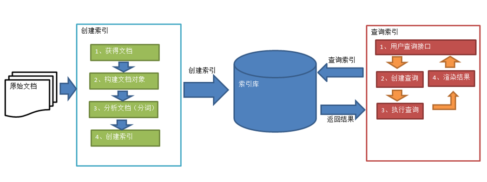

# 1.基本概念
1. 数据分类
    - 结构化数据: 数据库查询
    - 非结构化数据：
        - 顺序扫描法：慢
        - 全文检索：快
2. 全文检索：
   - 先建立索引，再对索引进行搜索的过程就叫全文检索
   - 应用场景：
     
     对于数据量大、数据结构不固定的数据可采用全文检索方式搜索，比如百度、Google等搜索引擎、论坛站内搜索、电商网站站内搜索
3. Lucene实现全文检索的流程

- 原始文档:要索引和搜索的内容
    - 包括互联网上的网页、数据库中的数据、磁盘上的文件
- 索引前需要将原始内容创建成包含域（Field）的文档（document）
- 分析文档得到语汇单元,每个单词叫做一个Term
- 创建索引
    - 对语汇单元索引，通过词语找文档，这种索引的结构叫倒排索引结构,包含两部分
        - 索引：词汇表，小
        - 文档集合较大
    - 
- 查询索引

# 2.目录文档
- TestController:
    - 创建索引
    - 查询数据
    - 多字段查詢
    - 高亮显示
    - 更新索引
    - 删除索引
    - 分页
- Test2Controller
    - 多个索引同时查询
    - 多条件查询