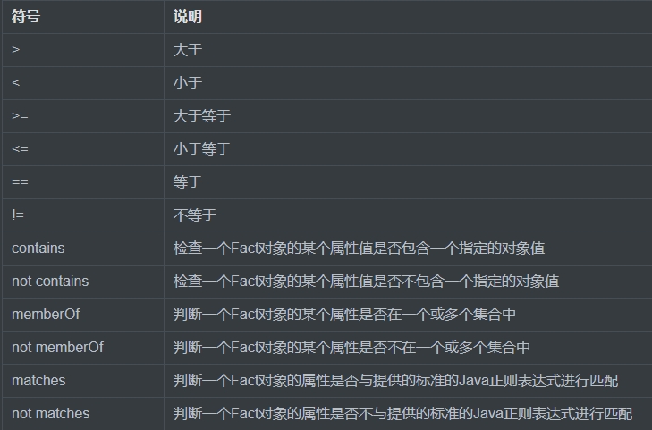
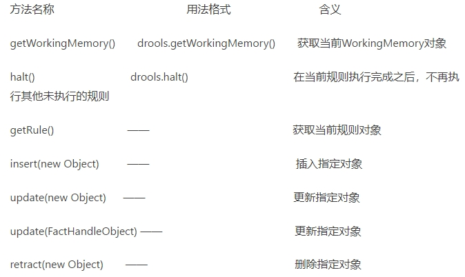

# 1.概念与使用场景
1. 概念：
    - 是一种嵌入在应用程序中的组件，实现了将业务决策从应用程序代码中分离出来，并使用预定义的语义模块编写业务决策。接受数据输入，解释业务规则，并根据业务规则做出业务决策
2. 为什么我们要使用规则引擎
    - 将代码中的if/else抽离出来，不用硬编码，类似于可插拔的if语句块
    - 通过使用决策表，决策表是excel表格，业务人员将业务逻辑写入决策表中，后端开发可以读取决策表得到业务逻辑
    - 可以实现热加载
3. KIE和Drools的关系
    - Drools是KIE的一个子项目
    - KIE还包括UberFire,JBMP,OptaPlanner等项目
4. Drools三种部署方式：
    - Workbench方式。Workbench管理规则库，Executor注册到Workbench，执行规则
    - 直接调用Executor方式。用户自己构建应用网站，管理规则、Executor等信息。通过rest或jms调用Executor执行规则
    - 嵌入式规则引擎
    
# 2.Drools的基本构成
drools基本流程
 - 传递Fact对象(数据)进去，用于规则的检查，调用外部接口，同时还可能获取规则执行完毕之后得到的结果

规则引擎的构成
- Working Memory 工作内存：我们使用只需将数据插入工作内存即可,操作工作内存需要使用Drools API
- Rule Base 规则库：规则文件中的规则会被加载到库中
- Inference Engine 推理引擎
    - Pattern Matcher 匹配器：规则库所有规则与fact比较,成功的放入Agenda中
    - Agenda 议程：存放通过匹配模式后激活的规则
    - Execution  Engine 执行引擎：执行Agenda中激活的规则

概念说明：
- Fact: 传递给规则引擎的对象,从你的应用中被assert进WorkingMemory中的对象beans
 
Drools的API相关：API可以分为三类：规则编译，规则收集，规则执行
- Kmodule.xml的编译
- KieSession：用于与规则引擎进行交互的会话，维护会话状态
    - 无状态StatelessKieSession：隔离了每次与规则引擎的交互
        - 应用场景：数据校验，运算，数据过滤，消息路由，任何能被描述成函数或公式的规则
 
# 3.基本语法
1. 规则文件构成：
    - package: 包名
    - import: 用于导入静态类或静态方法
    - gloable:  全局变量
    - function:  自定义函数
    - query:   查询
    - rule...end：规则体
2. 规则体基本结构：
    ```
        package rules.testword
        //import 导入静态类或方法
        rule "name"　
                //attributes ---->属性
            when
    　　　　    //LHS:条件 这里如果为空，则表示eval(true)
            then
                //RHS:结果
        end
    ```
   - package：规则文件中是第一行,包路径，该路径是逻辑路径
   - attributes：属性，可选
   - rule：规则体，以rule开头，以end结尾可包含多个
   - LHS：条件,pattern,这里如果为空，则表示eval(true)
   - RHS：结果，真正做事情的部分，满足条件触发动作的操作部分，在RHS可以使用LHS部分当中的定义的绑定变量名，设置的全局变量、或者是直接编写的java代码，可以使用import的类

3. 基础语法：
- LHS语法：【绑定变量名：】Object(【filed 约束】),通常变量名以`$`开头
    - 对象内部的多个约束连接 "&&"(and),"||"(or)和","(and)来实现
    - 示例1：$customer:Customer(age>20,gender=="male")
        - customer是Customer类型对象且属性满足...
    - 示例2: 多个pattern,都为true才返回
        ```aidl
          $customer:Customer(age>20,gender=="male")
          Order(customer==$customer,price>1000)
        ```
- 比较：

- 关键字：true,false,null等
- attributes属性: 可选
    - salience:执行的优先级，数字，越大越先，默认0,可负数
    - no-loop：防止死循环
    - date-effective：日期比较小于等于
    - date-expires：日期比较大于
    - Dialect：方言
    - Enabled：是否可用
    - lock-on-active：规则执行一次，避免fact被修改而重新激活规则
    - activation-group：激活分组，相同分组只有一个规则会被触发
    - agenda-greoup：议程分组,只有获取焦点的组中的规则才会被触发
    - auto-focus：自动获取焦点,配合议程分组使用
    - timer：通过定时器的方式指定规则执行的时间
        - 方式一：timer (5s 2s) //含义：5秒后触发，然后每隔2秒触发一次
        - 方拾二：timer (cron:0/1 * * * * ?) //含义：每隔1秒触发一次
     - date-effective：生效时间，当前时间大于该时间触发
     - date-expires：失效时间，当前时间小大于该时间关闭
     - 
        
- 函数：drools常用方法



# 4.Drools高级语法
## 4.1 global全局变量
结构：`global 对象类型 对象名称`

## 4.2 query查询
提供了一种查询working memory中符合约束条件的Fact对象的简单方法：
```
query 查询的名称(可选参数)
    LHS
end
```
- 参考query.drl

## 4.3 function函数
用于在规则文件中定义函数
```
function 返回值类型 函数名(可选参数){
    //逻辑代码
}
```

## 4.4 LHS加强
- 复合值限制in/not in
  - `Object(name in ("张三","李四","王五"...))`
- 条件元素eval
   - `eval(false)`
- 条件元素not
    - 判断Working Memory中是否不存在某个Fact对象
    - `not Student(age < 10)`
- 条件元素exists
    - 判断Working Memory中是否存在某个Fact对象
    - `exists Student(age < 10 && name != null)`
- extends规则继承
    - `rule "rule_2" extends "rule_1"`

## 4.5 RHS加强
- halt:立即终止后面所有规则的执行
   - `drools.halt();`
- getWorkingMemory:返回工作内存对象
    - `System.out.println(drools.getWorkingMemory());`
- getRule:返回规则对象
    - `System.out.println(drools.getRule());`
    
## 4.6 规则文件编码规范
我们在进行drl类型的规则文件编写时尽量遵循如下规范：
- 所有的规则文件(.drl)应统一放在一个规定的文件夹中，如：/rules文件夹
- 书写的每个规则应尽量加上注释。注释要清晰明了，言简意赅
- 同一类型的对象尽量放在一个规则文件中，如所有Student类型的对象尽量放在一个规则文件中
- 规则结果部分(RHS)尽量不要有条件语句，如if(...)，尽量不要有复杂的逻辑和深层次的嵌套语句
- 每个规则最好都加上salience属性，明确执行顺序
- Drools默认dialect为"Java"，尽量避免使用dialect "mvel"
    