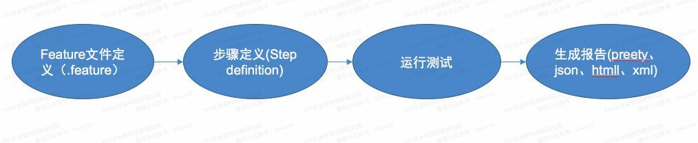
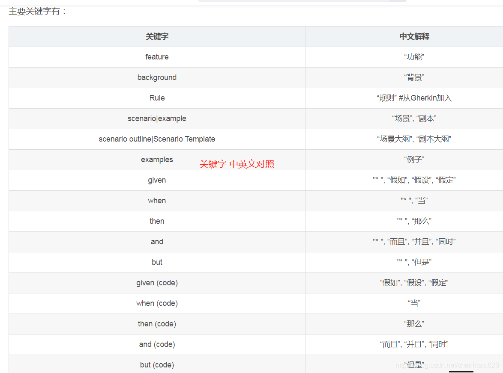

# 1.BDD（Behavior Driven Development）概述
- 行为驱动开发，通过自然语言定义系统行为，以功能使用者的角度，编写需求场景，且这些行为描述可以直接形成需求文档，同时也是测试标准

常用BDD框架：
- Cucumber：基于Ruby编写的自动化测试框架，支持Java和.Net等多种语言
- Behave/Lettuce/Freshen： Python style的测试框架
- Jbehave/ beanSpec ：基于Java编写的自动化测试框架
- SpecFlow：.Net测试框架

# 2.Cucumber简介
## 2.1 基于Cucumber的BDD的测试流程：

-  .feature：定义需求场景及步骤描述
- 步骤定义：步骤描述的具体实现，即可执行的步骤代码
- 运行测试：执行测试用例
- 生成报告：Cucumber支持生成多种格式的测试报告

## 2.2 如何编写feature文件
- feature文件用来描述功能，每个feature包含一个或多个Scenario，而每个Scenario又包含一个或多个步骤描述
- feature文件使用Gherkin语言编写，然后通过注解将Gherkin脚本与实际测试代码关联起来,常用注解：
   - Feature：对需要的简要描述
   - Scenario/Scenario Outline：场景描述，即feature所包含的功能点
   - Given：预置条件
   - When：具体的动作，例如User Navigate to the LogIn Page
   - Then：预期结果
   - And/But：可以与Given、When、Then同时使用，使得step描述更清晰易懂

## 3.使用cucumber
- https://blog.csdn.net/chenhcao628/article/details/105264920/
- 需要添加cucumber-java插件

## 4.cucumber关键字一览

