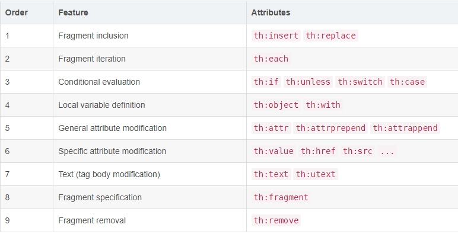

# Thymeleaf常用语法
## 1.标准表达式
### (1) 变量表达式
`${}`表达式实际上是在上下⽂中包含的变量的映射上执行的OGNL对象
- 在Spring MVC启用的应用程序中，OGNL将被替换为SpringEL

${}表达式中还可以使用基本对象和工具类对象。以`#`开头。
- 基本对象
   - `#ctx`：上下文对象。
   - `#vars`：上下文变量。
   - `#locale`：上下文区域设置。
   - `#request`：（仅在Web Contexts中）HttpServletRequest对象。
   - `#respons`e：（仅在Web上下⽂中）HttpServletResponse对象。
   - `#session`：（仅在Web上下⽂中）HttpSession对象。
   - `#servletContext`：（仅在Web上下⽂中）ServletContext对象。 
- 工具类对象：
   - `#execInfo`：有关正在处理的模板的信息。
   - `#messages`：用于在变量表达式中获取外部化消息的方法，与使用#{}语法获取的方式相同。
   - `#uris`：转义URL/URI部分的方法。
   - `#conversions`：执行配置的转换服务的方法。
   - `#dates`：java.util.Date对象的方法。
   - `#calendars`：类似于#dates，但对应java.util.Calendar对象。
   - `#numbers`：用于格式化数字对象的方法。
   - `#strings`：字符串对象的方法。
   - `#objects`：一般对象的方法。
   - `#bools`：布尔相关方法。
   - `#arrays`：Array的方法。
   - `#lists`：List的方法。
   - `#sets`：Set的方法。
   - `#maps`：Map的方法。
   - `#aggregates`：在数组或集合上创建聚合的方法。
   - `#ids`：处理可能重复的id属性的方法
   
### (2) 选择表达式（星号语法）
星号语法`*{}`计算所选对象而不是整个上下文的表达式

### (3) URL表达式
URL表达式的语法为`@{}`。使用`th:href`属性可以对链接进行渲染

### (4) 字面量
字面量（Literals）分为
- 文本文字
- 数字字面量
- 布尔字面量
- null字面量
- 文本符号

### (5) 文本操作
- 追加文本:字符串连接
- 字面替换:对包含变量值的字符串进行格式化而不需要在字面后加+，这些替换必需用|包围

### (6) 运算符
运算符：
- 算数运算符：`+、-、*、/（div）、%（mod）`。
- 比较运算符：`>（gt）、<（lt）、>=（ge）、<=（le）`。
- 等值运算符：`==（eq）、!=（ne）`。
- 布尔运算符：`and、or、!（not）`

### (7) 条件表达式
条件表达式：
- If-then：`(if) ? (then)`。
- If-then-else：`(if) ? (then) : (else)`。
- Default:`（默认表达式）：(value) ?: (defaultvalue)`。

## 2.设置属性
 - 使用`th:attr`属性可以设置标签的任何属性值
 - `th:attrprepend`和`th:attrappend`可以给属性设置前缀和后缀
 - `th:classappend`和`th:styleappend`，用于将CSS的class或style样式追加到元素中，而不覆盖现有属性
 - Thymeleaf支持使用HTML5自定义属性语法`data-{prefix}-{name}`来处理模板
 
## 3.条件判断
 - `th:if`属性可以通过判断一个条件是否满足，来决定是否将模板片段显示在结果中
 - `th:unless`属性则正好与`th:if`属性相反
 - 还有`th:switch`和`th:case`
 
## 4.循环迭代
`th:each`可迭代以下对象：
- 任何实现`java.util.Iterable`接口的对象。
- 任何实现`java.util.Enumeration`接口的对象。
- 任何实现`java.util.Iterator`接口的对象。其值将被迭代器返回，不需要在内存中缓存所有值。
- 任何实现`java.util.Map`接口的对象。迭代map时，迭代变量将是`java.util.Map.Entry`类型。
- 任何数组。
- 任何其将被视为包含对象本身的单值列表

## 5.模板布局
### 5.1 引用模板片段
- `th:fragment`属性可以用来定义模板片段
- `th:insert`、`th:replace`和`th:include`（Thymeleaf3.0不再推荐使用）属性可以引用模板片段
- 通过`th:replace="~{footer}"`可以引用整个html
- `~{:: selector}`引用当前文件模板片段
- 没有使用`th:fragment`属性的片段可以通过id属性来引用

### 5.2 参数化的模板片段
- `th:fragment`定义的片段可以指定一组参数
-  即使片段没有定义参数，也可以调用片段中的局部变量
- 使用`th:assert`可以进行模板内部断言

### 5.3 灵活布局
- 通过片段表达式不仅可以指定文本类型、数字类型、对象类型的参数，还可以指定标记片段作为参数
- 参考`layout-home.html`
- 使用特殊片段表达式`~{}`可以指定没有标记
- `_`符号也可以用作片段参数
- `~{}`和`_`符号可以通过简单优雅的方式实现执行片段的条件插入
- 条件也可以不在参数中进行判断，还在common_div片段的`th:replace`属性中进行判断

## 6.局部变量
- Thymeleaf的局部变量是指定义在模板片段中的变量，该变量的作用域为所在模板片段
- `th:with`属性声明局部变量,可以同时定义多个局部变量
- 局部变量只能在声明的标签内使用
- `th:with`属性允许重⽤在同⼀属性中定义的变量

## 7.属性优先级
- 多个`th:*`属性在同一个标签中的执行顺序由优先级决定
- 

## 8.注释和块
标准HTML/XML注释
- `<!-- -->`

ThymeLeaf解析器级注释
- `<!--/* */-->`在Thymeleaf解析时会将`<!--/和*/-->`之间的所有内容从模板中删除

Thymeleaf专有注释
- Thymeleaf允许定义特殊注释块`<!--/*/ /*/-->`，在Thymeleaf解析时会将`<!--/*/和/*/-->`标记删除，但不删除标记之间的内容

`th:block`标签
- `th:block`标签是Thymeleaf标准方言中唯一的元素处理器。
- `th:block`是一个允许模板开发者指定想要的任何属性的属性容器，Thymeleaf会执行这些属性并让这个块消失，但它的内容保留

## 9.内联
### 9.1 内联表达式
- [[]]或[()]中的表达式为内联表达式，可以直接将表达式写入HTML文本
- 任何在th:text或th:utext属性中使用的表达式都可以出现在[[]]或[()]中。
- [[]]等价于th:text，会转义html标签；[()]等价于th:utext，不会转义html标签
- 通过`th:inline="none"`可以禁用内联

### 9.2 内联JS
- 使用`th:inline="javascript"`启用内联JavaScript
- 内联JavaScript可以通过在注释中包含内联表达式作为JavaScript自然模板
- JavaScript内联表达式结果不限于字符串，还会自动地将Strings、Numbers、Booleans、Arrays、Collections、Maps、Beans（有getter和setter方法）这些对象序列化为JavaScript对象

### 9.3 内联CSS
- 使用`th:inline="css"`启用内联CSS
- `[[]]`会进行转义，会多一个\。不需要转义使用`[()]`
- 内联CSS也允许通过在注释中包含内联表达式作为CSS自然模板，使CSS可以静态和动态的工作

## 10.国际化
1. `resources/i18n` 目录下创建国际化文件
2. `application.yml` 中配置
3. WebConfig 中配置 LocaleResolver

## 11.常用工具类对象
- Dates
- Numbers
- Strings

