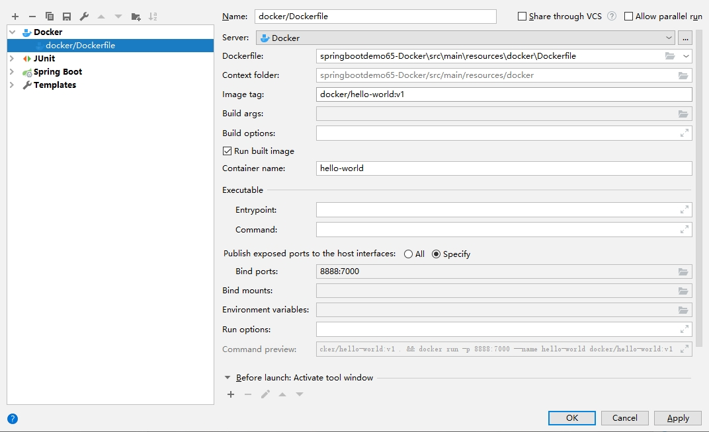

# 参考文档
菜鸟教程
- https://www.runoob.com/docker/docker-tutorial.html

Windows Docker安装 Hype-V
- https://www.runoob.com/docker/windows-docker-install.html

Springboot部署docker
- https://www.cnblogs.com/sgh1023/p/11079003.html

Linux远程发布部署
- https://www.cnblogs.com/boris-et/p/13535030.html
- https://blog.csdn.net/lzp492782442/article/details/103082541

win10 docker部署springboot项目
- https://www.cnblogs.com/Sinte-Beuve/p/11569741.html
- https://www.cnblogs.com/xiluonanfeng/p/11229890.html

# 踩坑
启动报错：
- https://blog.csdn.net/qq_18298439/article/details/91396292

windows wsl1转wsl2 设置默认为wsl2 再下载Unbuntu
- https://blog.csdn.net/weixin_39806603/article/details/111166146
- https://www.jianshu.com/p/f1bef4088bc6

win10 WSL2问题解决WslRegisterDistribution failed with error: 0x800701bc
- https://blog.csdn.net/qq_18625805/article/details/109732122

wsl2 修改默认登录用户为root
- https://www.cnblogs.com/twfb/p/11563387.html

ubuntu安装jdk1.8
- https://www.cnblogs.com/zs-notes/p/8535275.html

xshell远程连接wsl2
- https://www.jianshu.com/p/c1cc66cb1353
- https://blog.csdn.net/qq_42437577/article/details/110664557

wls2 root用户密码 没用,只能用安装时的用户连接xshell
- https://www.jianshu.com/p/e43e11d6ba09

executable file not found in $PATH: unknown
- 8888:7000配置错地方了

no main manifest attribute, in /app.jar
- 缺少spring-boot-maven-plugin插件

# 总结
两种部署方式：
- 将应用和Dockerfile打包到服务器并构建镜像
- 通过maven方式本地镜像化,连接远程docker2573端口并自动发布运行

dockerfile配置

