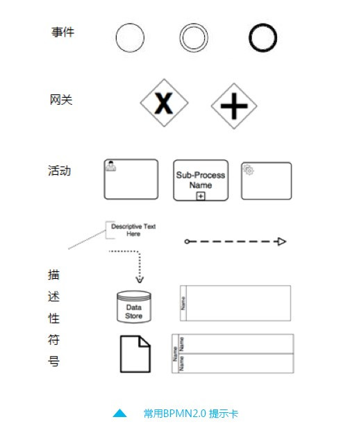

# 1.概念介绍
- BPM：业务流程管理
- BPMN2.0：一种流程建模的通用和标准语言，用来绘制业务流程图
- 工作流引擎：一个用于管理和调度流程的应用程序，可以集成并作为程序框架使用
    - 流程定义的存储，流程的节点与流程条件判断和调度、流向管理、流程实例管理等功能
- 工作流引擎与BPMN的关系：
    - 通过BPMN（业务流程建模语言）来进行BPM（业务流程建模）得到的结果就是业务流程的定义
    - 协调并执行这个流程，记录流程的执行过程和结果的就是工作流引擎

# 2.BPMN2.0概述
常用图形一览(详细)
- https://www.jianshu.com/p/1f80bf211502
1. 一致性：
    - Process Modeling Conformance 流程模型一致性
    - Process Execution conformance 流程执行一致性
    - BPEL Process Execution Conformance BPEL 流程执行一致性
    - Choreography Modeling Conformance 编排模型一致性 
2. 四种基本元素
    - 流对象：包括事件、活动、网关，是BPMN的核心元素；
    - 连接对象：包括顺序流、消息流、关联；
    - 泳道：包括池和道两种类型；
    - 人工信息：包括数据对象、组、注释。
3. Flow Objects 流对象：
    - 事件Events：流程中运行过程中发生的事情，包含三种类型
        -  开始 - 表示一个流程的开始。
        -  中间 - 发生的开始和结束事件之间，影响处理的流程。
        -  结束 - 表示该过程结束
    - 活动Activity：工作或任务的一个通用术语
        - 人工活动
        - 子流程活动
        - 自动活动
    - 网关Gateway：用来处理决策
        - 排他网关 (x) ——只有一条路径会被选择
        - 并行网关 (+) ——所有路径会被同时选择
        - 事件网关 (+) —— 专门为中间捕获事件设置的
4. Data 数据：
    - Data Objects 数据对象
    - Data Inputs 数据输入
    - Data OutPuts 数据输出
    - Data Stores 数据存储
5. Connecting Objects 连接对象：
    - 顺序流：实现实心箭头
    - 消息流：虚线空心箭头
    - 结合关系：点状虚线表示，用于显示活动的输入输出
    - 数据结合关系
6. Swimlanes泳道：
    - Pools池：代表流程中的参与者，用来对活动进行组织和分类
    - Lanes道：泳道里的一个子划分；
7. 子流程：子流程是嵌入在主流程中，可以被主流程或其他流程通过ID调用
    - 只能且仅能包含一个空启动事件
    - 至少要有一个结束事件
    - 子流程中顺序流不能直接设置输出流到子流程之外的活动上，如果需要可以通过边界事件代替。
8. Artifacts工件：
    - Group组
    - Text Annotation 文本注释
9. 图类型：
   - 私有流程
   - 共有流程
   - 组合流程
10. 简单符号表：

      

    