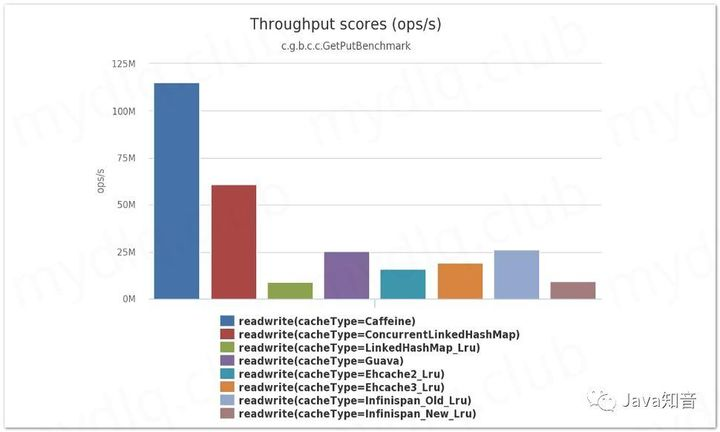
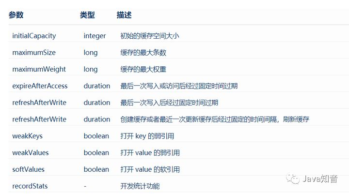

# 1.参考地址
（很全面）SpringBoot 使用 Caffeine 本地缓存
- https://zhuanlan.zhihu.com/p/109226599

# 2.概述
- Caffeine 是基于 JAVA 8 的高性能缓存库。并且在 spring5 (springboot 2.x) 后，spring 官方放弃了 Guava，而使用了性能更优秀的 Caffeine 作为默认缓存组件
- 性能对比：
  

# 3.配置

- weakValues和softValues不可以同时使用。
- maximumSize和maximumWeight不可以同时使用。
- expireAfterWrite和expireAfterAccess同时存在时，以expireAfterWrite为准。

