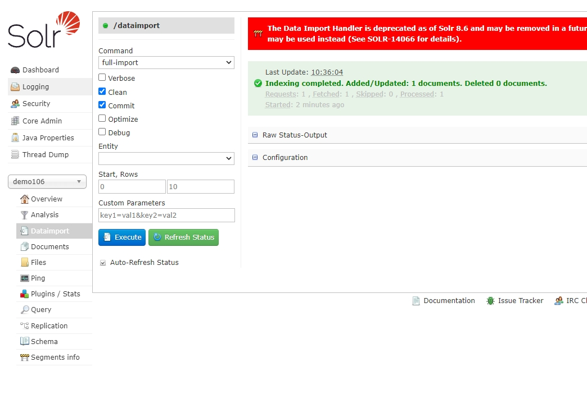
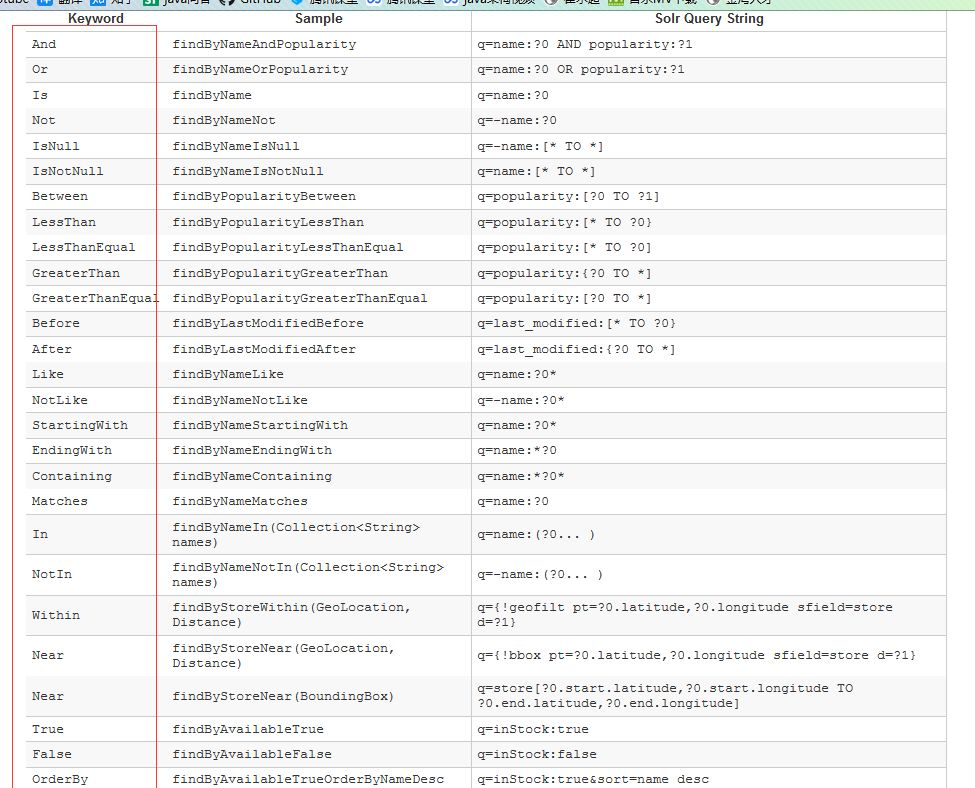

# 1.Solr简介
- 采用Java开发，基于Lucene的全文搜索服务器
- Solr是一个独立的企业级搜索应用服务器
- `solr start` 启动
- `solr stop -all` 停止
- 默认访问地址：http://localhost:8983/solr/

# 2.Slor与ES对比
- 当单纯的对已有数据进行搜索时，Solr更快
- 当实时建立索引时, Solr会产生io阻塞，查询性能较差
- 实时建立索引 Elasticsearch具有明显的优势
- 随着数据量的增加，Solr的搜索效率会变得更低，而Elasticsearch却没有明显的变化

# 3.solr core
- core就是solr的一个实例，一个solr服务下可以有多个core，每个core下都有自己的索引库和与之相应的配置文件。
- `solr create -c "自定义core_name"`

# 4.相关配置
https://www.freesion.com/article/9599623755/
1. 配置ik分词器
   - 下载jar包：`https://search.maven.org/search?q=com.github.magese`
   - 放入`...\solr-8.2.0\server\solr-webapp\webapp\WEB-INF\lib`
   - `conf\managed-schema`下加入：
        ```
           fieldType name="text_ik" class="solr.TextField">
                <analyzer type="index">
                    <tokenizer class="org.wltea.analyzer.lucene.IKTokenizerFactory" useSmart="false" conf="ik.conf"/>
                    <filter class="solr.LowerCaseFilterFactory"/>
                </analyzer>
                <analyzer type="query">
                  <tokenizer class="org.wltea.analyzer.lucene.IKTokenizerFactory" useSmart="true" conf="ik.conf"/>
                  <filter class="solr.LowerCaseFilterFactory"/>
                </analyzer>
            </fieldType>
        ```
2. MYSQL数据导入SOLR
- 将 D:\software\solr-8.2.0\dis t下的两个jar：solr-dataimporthandler-8.2.0.jar 和 solr-dataimporthandler-extras-8.2.0.jar 以及 mysql-connector-java.jar（自行下载）拷贝到 ...\solr-8.2.0\server\solr-webapp\webapp\WEB-INF\lib 文件夹下
- 修改配置文件solrconfig.xml
  在`<requestHandler name="/select" class="solr.SearchHandler">`上方添加:
  ```
  <requestHandler name="/dataimport" class="org.apache.solr.handler.dataimport.DataImportHandler">
  　　     <lst name="defaults">
  　　        <str name="config">data-config.xml</str>
  　　     </lst>
  </requestHandler>
  ```
- 新建`data-config.xml`文件：参考`resources/democonfig`
- 修改managed-schema,添加：存在的不用加
  ```
    <field name="id" type="string" indexed="true" stored="true" required="true" multiValued="false" />
	<field name="username" type="text_ik" indexed="true" stored="true"/>
	<field name="sex" type="text_general" indexed="true" stored="true"/>
	<field name="address" type="text_ik" indexed="true" stored="true"/>
	<field name="host" type="text_general" indexed="true" stored="true"/>
  ```
- 创建数据库表
- 导入数据,之后可在query中查询：

- SolrCrudRepository查询接口如下



