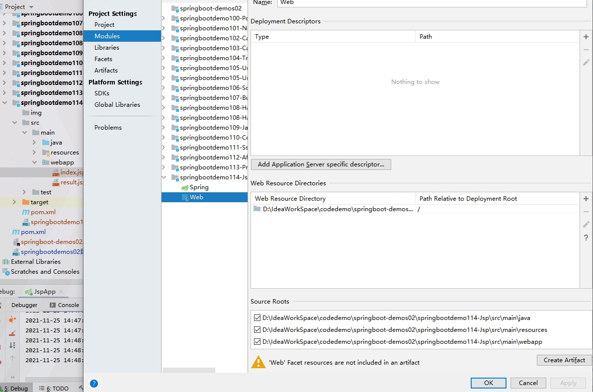

# 参考地址
SpringBoot——SpringBoot集成jsp(主要)
- https://szh-forever-young.blog.csdn.net/article/details/115732826

SpringBoot2.x系列教程17--Web开发03之支持jsp
- https://blog.csdn.net/syc000666/article/details/105087545

项目webapp配置如下：

