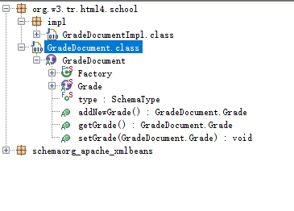

# 1.XMLBeans简介
- XMLBeans 是Apache的一个开源项目主要实现将java对象和XML绑定的功能，类似 JAXB；官网地址:http://xmlbeans.apache.org/index.html。

# 2.使用步骤
使用 XMLBeans 处理XML大概有如下几个步骤：
- a、xml 文件转换成 xsd 文件
    - XML转XSD可以使用XMLSpy等工具来处理，这里使用在在线的转换工具来处理
- b、使用XMLBeans的scomp命令生成对应的jar
- c、把生成的jar导入classpath，解析或生成XML

xsd文件中如果有命名空间，生成的包名是根据命名空间来的；xsdconfig配置不起作用

# 3.生成jar包命令
```
D:\xmlbeans\xmlbeans-5.0.2\bin\scomp -out demo138.jar -compiler D:\Java\java1.8\bin\javac demo138.xsd demo138.xsdconfig
D:\xmlbeans\xmlbeans-2.6.0\bin\scomp -out demo138.jar -compiler D:\Java\java1.8\bin\javac demo138.xsd demo138.xsdconfig
```

JD-GUI反编译生成的jar包代码如下：


# 4. 踩坑
java.lang.ClassNotFoundException: org.apache.xmlbeans.XmlObject
- 缺少xmlbeans依赖

