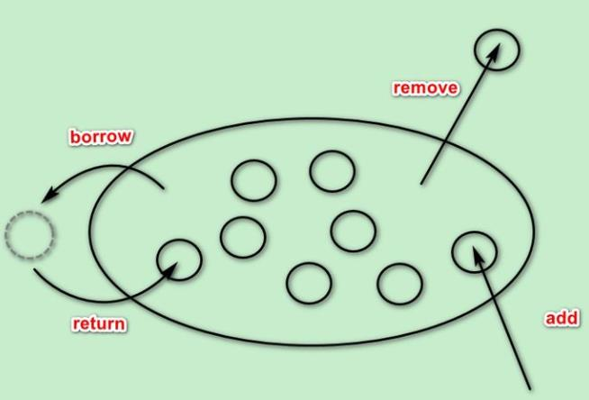

# 1.HikariCP概述
- Springboot2.0以后默认数据库连接池选择了Hikari（性能高）
- Hikari只有130kb大小，速度超快，稳定性，可靠性，但是功能没有Druid多

# 2.hikariCP连接池属性配置选择：
## 2.1 主要配置
- dataSourceClassName：驱动类
- jdbcUrl：数据库地址
- username：用户名
- password：密码

## 2.2 常用配置
- autoCommit：控制从池返回的连接的默认自动提交行为
- connectionTimeout：控制客户端（即您）将等待来自池的连接的最大毫秒数
- idleTimeout：控制允许连接在池中闲置的最长时间
- maxLifetime：控制池中连接的最大生存期
- connectionTestQuery：针对不支持JDBC4的“传统”驱动程序，测试查询
- minimumIdle：该属性控制HikariCP尝试在池中维护的最小空闲连接数
- maximumPoolSize：此属性控制池允许达到的最大大小
- metricRegistry：允许您指定池使用的Codahale / Dropwizard 实例MetricRegistry来记录各种指标
- healthCheckRegistry：该属性允许您指定池使用的Codahale / Dropwizard 的实例HealthCheckRegistry来报告当前的健康信息
- poolName：连接池的用户定义名称

## 2.3 不常用配置
- initializationFailTimeout：如果池无法成功初始化连接，则此属性控制池是否将“快速失败”
- isolateInternalQueries：此属性确定HikariCP是否在其自己的事务中隔离内部池查询
- allowPoolSuspension：该属性控制池是否可以通过JMX暂停和恢复
- dataSource：此属性仅通过编程配置或IoC容器可用。这个属性允许你直接设置DataSource池的实例，而不是让HikariCP通过反射来构造它
- readOnly：此属性控制默认情况下从池中获取的连接是否处于只读模式
- registerMbeans：该属性控制是否注册JMX管理Bean（“MBeans”）
- catalog：该属性设置默认目录为支持目录的概念数据库
- connectionInitSql：该属性设置一个SQL语句，在将每个新连接创建后，将其添加到池中之前执行该语句
- driverClassName：对于一些较旧的驱动程序，driverClassName还必须指定它
- transactionIsolation：此属性控制从池返回的连接的默认事务隔离级别
- validationTimeout：此属性控制连接测试活动的最长时间
- leakDetectionThreshold：此属性控制在记录消息之前连接可能离开池的时间量，表明可能存在连接泄漏
- schema：该属性设置的默认模式为支持模式的概念数据库
- threadFactory：该属性允许您设置java.util.concurrent.ThreadFactory将用于创建池使用的所有线程的实例
- scheduledExecutor：该属性允许您设置java.util.concurrent.ScheduledExecutorService将用于各种内部计划任务的实例

# 3.HikariCP的连接池模型
- 传统模型：
   
- HikariCP模型：
   
- HikariCP主要类：
  
  - ConcurrentBag才是真正的连接池，而HikariPool是用来管理连接池的

