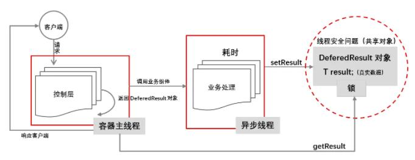

# 1.DeferredResult处理流程

- 类似Future，主线程调用getResult会阻塞
- 返回空DefferedResult对象,则主线程立即释放且处理其他请求

# 2.Callable和DeferredResult区别
- DeferredResult线程是由我们管理。创建一个线程并将结果set到DeferredResult是由我们自己来做的

# 3.不适合返回Callable的场景之一
- A项目将请求提交的数据放入消息队列.
- B项目从消息队列取出数据处理，结果放回消息队列.
- A项目另一个线程一直从消息队列中获取数据,如果获取到了,就返回给之前的请求者.

# 4. DeferredResult异步拦截器 demo03
1. 方式一：实现DeferredResultProcessingInterceptor接口
2. 方式二：继承DeferredResultProcessingInterceptorAdapter接口
3. 超时处理拦截器：TimeoutDeferredResultProcessingInterceptor
4. 需要在configureAsyncSupport配置添加异步拦截器

